# 我們的重製人生

                            木緒なち

				繪者えれっと

			 			人

			生

			01

				Remake our Life!

制作信息
- 作者：木绪なち

- 插画：えれっと

- 译者：许芳玮

- kid

- 图源：流哲不哼太

- 扫图：风

- 修图：kid

- 轻之国度：http://www.lightnovel.cn

- 仅供个人学习交流使用，禁作商业用途

- 下载后请在24小时内删除，LK不负担任何责任

制作者

` Kasou `

## 简介
  我是桥场恭也，一个前途黯淡的游戏总监。因公司破产、企划夭折而回到故乡老家。因为不想再看明星创作者们的亮眼表现，闷闷不乐地睡着之后再醒来，发现自己穿越时空回到十年前的大学刚入学时代！？考上了原本应该落榜的大学，迎接向往的艺大生活，甚至还过着男女四人一起分租的同居生活，玫瑰色的每一天就此展开！我的人生将从这里重新打造——与未来将会超有名（现在还不成气候）的创作者，一起度过的新生活就要开始！尽管如此自信满满地跨出第一步，事情却似乎没有那么顺利……
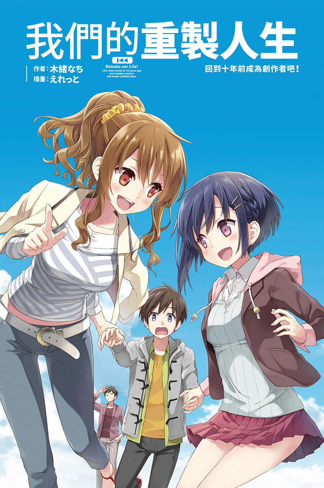

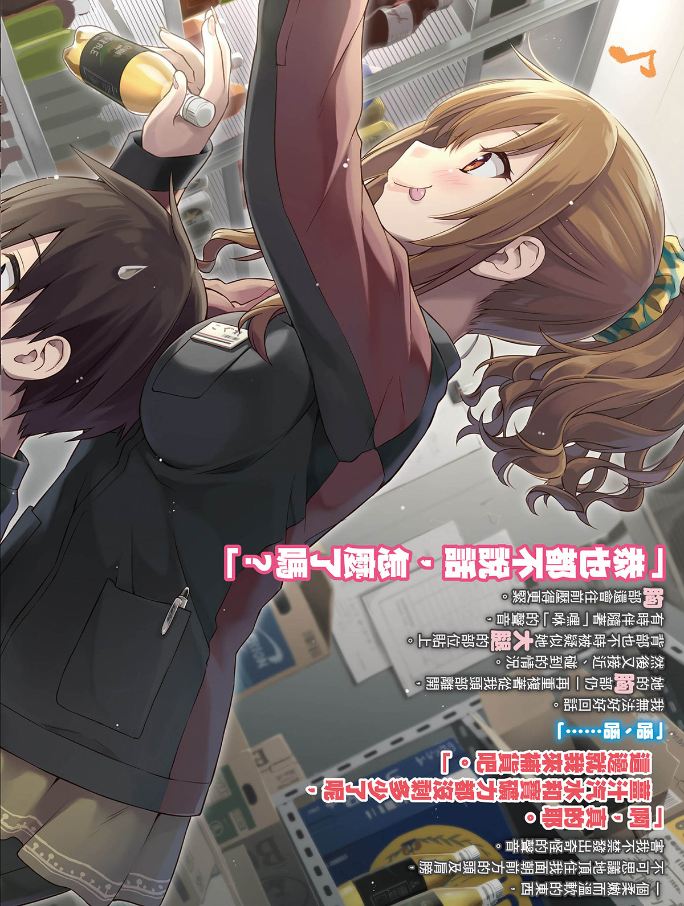

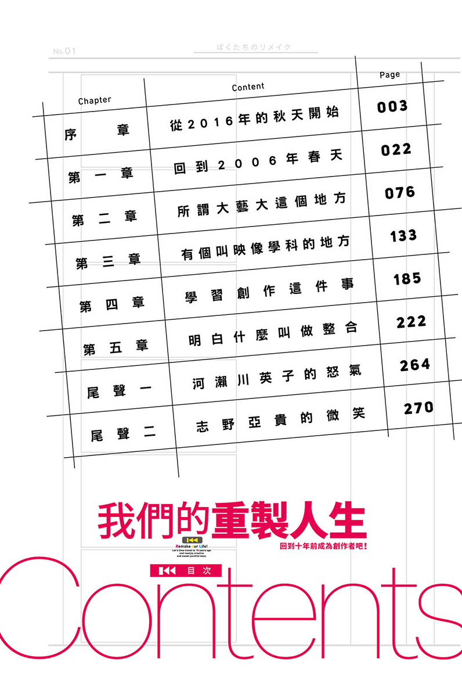

### Contents
- 序　章	从2016年的秋天开始
- 第一章	回到2006年春天
- 第二章	所谓大艺大这个地方
- 第三章	有个叫映像学科的地方
- 第四章	学习创作这件事
- 第五章	明白什么叫做整合
- 尾声一	河濑川英子的怒气
- 尾声二	志野亚贵的微笑

## 序章
### 从二〇一六年的秋天开始
这里是位于埼玉县北部的入间市，在距离车站走路五分钟的住商混合大楼里，我一手拿着电话筒，已经讲了将近三十分钟。

「不是的，你找我也没用啊，我也很想知道社长在哪里。什么？店家啊？以前好像常去螺旋桨通商圈上的酒家，不过因为没钱也都没去了。老家？我想想看，好像是富山还石川的样子，记得大概是在那一带。」

我瞄了眼时钟，已经下午两点了。

「好，好，如果有打电话来我会马上通知。我跟社长几乎没有什么人情义理，都半年没给我薪水了，我还因为没缴房租被房东赶出公寓，三个月前就跑来事务所这边住。是，好的，我明白了，那就先这样。」

喀嚓地挂上电话。

「呼……」

叹气的同时，我朝旁边说话。

「社长，讲完电话了。」

话说完之后过几秒，桌子底下以棉被盖住的某个生物才慢慢开始蠕动。

「哎呀，桥场演技真是精湛啊～！真的是太感谢、超感激！」

身形微胖的大叔钻了出来，高举双手并且满面笑容。

「听说那个人以前是混黑道的，不但长相恐怖，眼睛也从来都没有笑意，我实在是很怕他。之前还说如果我不还钱，就要挖掉我眼珠。」

「社长。」

我故意重重地叹了口气，椅子转半圈过去与社长面对面。处理客户抱怨延期的电话，再转达给社长的人都是我，让人不禁叹气连连。

「也该好好面对了吧？继续这样躲下去，根本没半点好处。」

「我知道！桥场，我都知道！再这样下去只能烂尾收场，也就是抱着大石头与五千万债务一同沉入东京湾！」

「既然知道的话……」

「但是你相信我！如果另一种路线的漫画杂志企划顺利的话，马上就会有三千万入帐的！所以在这之前，我不能被他们找到，不然整个企划就会没了啊！」

「是喔……」

我们这里是一间游戏公司，这位社长则是游戏公司的社长。那为什么会出现漫画杂志这样的字眼？想来一定又是被谁鼓吹的吧。

「这个企划很厉害喔！纸媒和网路媒体同时创刊，这可是史上第一遭！一部作品可以同时在手机和电脑上免费看，而且网罗的资深作家，都是作品曾登上周刊少年 ZUMP的老师！现在才预先登录而已，就已经突破五千人了！」

虽然我没有想看的意思，但他说话的同时径自拿起了平板电脑秀出网站，可是那网页怎么看都像是十年前……不对，是以二十年前的品味制作的，不要说熟悉，根本就是已经看腻的东西，实在只能苦笑。

「社长，这是营利网站吗？」

「营利网站？什么是营利网站？」

我真的很想抱头。

「有合作的出版社吗？」

「没有，一间都没有。」

「有要出版单行本吗？打算怎么获利？」

「只要采取付费会员制度收钱就好啦！」

没有先告知说要收费就开放登录，这些人知道后一定不会用，先撇开这点不谈好了，或许还会因此引发争议。没有想过这种可能性吗？

「太草率了，还是要参考一下现有的收益模式，找出两全其美的方式才行……」

「这个嘛，只要有够吸引人的作品，就有办法解决的啊！」

「就说不行了！」

我夸张地重重拍了下桌子。

「呜啊！拜托不要这样，桌子不是让你这样拍的，使用暴力是不好的。」

「都是因为你这种不好好看清楚又没知识，马上就会被骗又毫无计画的个性，那些认真的员工才通通都辞职的，不是吗？我有说错吗？」

「这种伤人的话，你一定要这么直接地讲出来吗……」

「我就是要讲！我问你，原画师在哪？编剧呢？程式设计师呢？先姑且不管这些好了，就连可以尽力帮我们控管财务，最重要的这位会计相关人员都没有了对吧？本来员工都还在的，现在都跑光了对吧？」

「说得也是……大家都跑了……就只有桥场留下来而已。」

「我是来不及跑。」

「不要这么说，上个月能顺利发行〈小蜜臀！～漂亮女孩儿的屁屁论〉，这都是你的功劳喔！虽然还是一样火烧屁股，但总算还是顺利推出。希望你也能在接下来的新事业，充分发挥这份能力！」

「……还有很多事情得先处理。」

椅子反方向转了半圈，我看向液晶萤幕。

收件匣里，寄给公司的未读信件多得像山一样。

每一封都是作者寄来催款，或是客户联络不到公司的怒骂内容。

「总之，不要再一直追逐梦想了。有想法是好事，但其实身为社长的人，是最需要看清现实的，你明白吗？」

唉，说着我又叹了一口气。

「变成这样我也不愿意，不过还是会继续跟着社长的，至少你要好好面对债务，认真制作下一部作品。」

话说到一半，我一抬起头，这才发现原本在那里的社长已经不见人影。

「这是……咦？社、社长！？」

环顾这一点都不大的楼层，却没有任何人在了。

「那个人是躲到哪里去了啊……」

就在我转头张望了两、三次之后。

「呀——！拜、拜托原谅我！！！」

没出息到令人吃惊的尖叫声，响彻整个大楼外。

我慌忙从座位上起身，从窗户看向外面。

「你这混账是躲哪里去了！没想到来堵堵看，还真的被我们逮到。」

两名穿着一身黑色运动服的男子，从左右两边架住社长。

「不，不是这样的，是因为我们员工哭着来哀求，我觉得他们很可怜才……」

「好好好，我知道我知道，我知道了，那你就乖乖上车吧。」

「我不要！住手！我讨厌上车～～～～～～！！！」

就像被两只铝棒压着一样，社长被丢入白色厢型车后座，碰地一声，车门就这样冷冷地关上。

伴随着沉重的引擎声响起，厢型车载着社长往西边驶去。

即便车身已经消失，排气臭味已经消散，寂静笼罩四周，我仍一直望着厢型车离去的方向。

太阳开始一点一点地没入地平线。

「……这下子，我是真的失业了啊……」

◇

桥场恭也，二十八岁。

在奈良县西边的地方都会区出生、长大，毕业于地方上的私立大学。以成为游戏制造商研发人员为目标，但所有求职都铩羽而归，最后终于被一间汽车用品店雇用当业务，就此开始常换工作的生活。在这之后，因为无法忘怀制作游戏的梦想，而到秋叶原的电玩店当店员，进而受到当时认识的游戏公司社长邀请，在应该要实现梦想的二十六岁，当上成人电玩游戏品牌的总监。

然而，我工作的公司只有社长的梦想堪称伟大，实质内容则是空壳。

说一定会带进公司的知名原画师，才发电子邮件五分钟就人家被回绝，后来我去向当店员时认识的女原画师下跪拜托，结果也因为社长不停乱发性骚扰简讯而半途离开。到头来，社长夸口说有人脉关系的名作家没回一封信就算了，对方还在社群网站上发文写着『收到一封真他妈没礼貌的委托信wwww』。结果找不到作家，就参考社长以创作故事为名的幻想文章，动用所有工作人员来写剧本，并在没有先确认相关软、硬体环境的情况下，就这样开始正式进入制作，因此研发起来也超困难，最后只得将发行日期半年、一年地一延再延。

这就是如绘画般的成人游戏残酷故事，要说这是业界常态，或许也算是吧。

「说实在，那个公司……到底是怎么回事啊……」

员工一个、两个慢慢消失不见的同时，我就得负责消化那些工作。像是原画师离开了，我得想办法临摹出来；如果没人可以接手上色人员的工作，我就得去着色；为了促销商品还得自己画店面文宣海报；或是一边跟影片编辑软体苦战一边想办法生出PV。不管是录音、改编剧本或是专案企划，没有一个环节是我没有碰过的。

然而，最终结果就是游戏没能完成。社长大动作签约的程式却有满满的BUG，到第五次修正终于可以稳定运作，但已经没有人关注这个游戏了。

最后我的钱包里，也只剩下一张五千圆钞票。

用这笔钱买了到奈良的夜班客运车票，立刻坐进车内。

我要回老家。

结果，社长就此再也没回来。到头来，领不到薪水也付不出房租，办公室也被所在大楼退租，走投无路之下，我只能选择回家。

为了道歉而连络的几名业界人士中，也有人向我招手。所以如果想要做下去的话，或许也还是可以继续留在那个圈子里。

可是，我已经完全受够了。

竟然没眼光到只能在那样的社长底下工作，我对于自已的厌恶，远大于在成人游戏产业工作的快乐。

可能也只是累了，但我已经无力做其他打算。

「咦？有通知……？」

这时，口袋里的智慧型手机传来震动。

有封讯息。

是niconico动画传来的。

「啊！九点开始有游戏制作公司的直播。」

多少跟职业性质也有关系，我有订阅几个成人游戏制作公司的社群频道。所以每次只要有新节目就会通知，这次则是身为业界大厂的得胜者软体公司开直播。

一插上耳机没多久，直播就开始了。

「要发表新企划……？这间会有什么新东西吗？」

得胜者软体公司是一间资本雄厚的老公司，身为超级优良的制造商，有三条稳定路线轮流制作软体。

只不过这个稳定换来的问题，就是几乎每次都是固定的创作者和制作阵容，也因此总是被黑粉攻击「缺乏新鲜感」。

不过，这次发表的气氛却不太一样。

「难道这次要走一条全新的路……？」

画面上的留言透露出了慌张与不安，不要说死忠支持者了，似乎就连一般观众也都很惊讶。

「各位久等啦！接下来我们即将发表全新企划！」

同时也是知名公关的满脸胡鬚制作人，带着笑容一宣布，画面随即切换成PV。

明显是砸下大笔预算，结合许多动画的宣传影片。跟我那时候勉强拼凑出的PV，简直是无法比拟的高水准。

「噫！？」

画面开始跑备受瞩目的制作群名单时，我下意识地站了起来。

邻近座位的乘客纷纷诧异地看着我。

但我不管，始终盯着拿在手上的手机。

画面上出现了大大的字幕。

『角色设计：秋岛志野』

『脚本：川越京一』

『主题曲：N＠NA』

接着随即出现大量的留言，几乎满满盖住那些名字。

「不会吧……真不愧是得胜者啊。」

我喃喃自语着，同时一屁股坐回椅子上。

插画家秋岛志野，是比拒绝我前公司的那些知名原画师，段数还要更高上好几位的超有名女性插画家。曾担任过电视动画的角色设计师，前一阵子还开了首次的个展。最近出版的画册，更是我现在最宝贝的收藏。

轻小说作者川越京一，作品《哀虐血腥剑》不仅在这季动画获得最高评价，在以轻小说迷为客层的杂志书中，也连续两年拿下第一名的成绩。最近也跨足一般文艺小说，亦深受好评。

创作歌手N＠NA，因为在nico动的「试唱看看」频道中演唱以动漫和V家歌曲的作品，而开始引爆人气，目前已经正式进军歌坛，连续出了好几张畅销歌曲。演唱会门票炙手可热，拍卖网站上飙破十万日圆更是常有的事情。

我也是他们的粉丝，由秋岛志野担任原画师的游戏，所有周边商品通通买齐是理所当然，就连设定资料集也一字一句毫不遗漏地读过，《哀血》从第一集开始一出新书就买，N＠NA的演唱会也费尽千辛万苦弄到票，奋力摇萤光棒到整只手肌肉酸痛。

简单来说，就是阵容豪华到爆炸的创作团队。

节目上，由刚刚那个制作人胡鬚哥出面介绍了许多令人兴奋的消息，像是已决定要改编成动画和漫画，小说化的部分也经由川越本人确定了，待游戏上市之后就会陆续开始进行。

后面好像还有三个人依序致词的流程，不过到这里我就把直播切掉了。

「唉……」

我错愕地叹了口气。

刚宣布的这三位创作者，不仅是超有名的顶尖等级，他们还有一个共通点。

就是这三人其实除了同年之外，还都是毕业于同一所艺术型大学。

他们从学生时代就已经崭露头角了。同一学年的人除了他们之外，还有许多人才也活跃于第一线，在业界以「白金世代」之称闻名。

「找来白金世代的顶尖阵容制作游戏……这简直是太梦幻了。」

想到我们的原画师还被社长性骚扰而逃走之类的，我不禁因为档次差太多而笑出来。

我从以前就非常喜欢游戏。

小学、国中的时候，每天都跟朋友们沉浸在游戏的世界里。努力存着少少的零用钱，然后全部花在游戏上。深受杰作感动的隔天，总是会在笔记本上写下许多幻想主题的设定，当时也立志将来一定要进游戏公司工作。

可是在现实面前，梦想终究是逐渐淡薄而去，从普通大学的普通学科毕业之后，我才仿佛想起来似地去参加游戏公司的求职考试，但是通通都落榜，等回过神来，自己已经在做并不是特别想做的工作了。

所以能当上成人游戏公司的总监，老实说我真的很开心。

虽然只是个小小的头衔，但总算可以制作向往的那个游戏了。

跟朋友借来在深夜边哭边玩的那个成人游戏。为了买下喜爱的女主角的二手挂画，花光打工薪水的那个成人游戏。贩售活动时在冰冷的雨中排队，直到买到手的那个成人游戏。这回终于轮到自己来做了，终于可以成为制作的那一方了。

但最后，却只落得帮忙社长跑路的悲剧收场。

「不过，这也是……没办法的事。」

虽然是很凄惨的结局，但是那位社长的确也是曾对游戏怀抱梦想的人。所以才会意气相投，还帮忙创立品牌。正因为这样的心情，才会就算只剩下我一人也依然留在公司，不管多辛苦都咬牙拼着让游戏上市。

然而，一切都已经太迟了。

「各位乘客，不久即将抵达静冈。接着将会在休息站休息十分钟……」

广播在车内响起，大家窸窸窣窣地整理了一下，准备待会儿去上厕所。

现在这个时候，那个节目应该正在召开华丽的记者会吧。

日本应该有很多人正在关注三位创作者的发言，想象着完成的游戏，一心一意期待着吧。

相较之下，准备走向休息站厕所的我，却没有任何一个人注意。

白金世代的那三人，还有第二个共通点。

那就是出生于一九八八年。

——他们都跟我同年。

◇

一回到老家，马上就被叫去整理房间。

原来是嫁到东京的老妹美世子，不知什时离了婚，变成单亲妈妈回到这里，现在母子俩想住我的房间。哥哥失业，妹妹离婚，两人的经历只能用波澜万丈来形容。

不过失业的人也没办法说什么，只好不情不愿地开始整理。

「咦？这个，原来放在这里啊……」

一打开原本塞在书架上的一个纸箱，往日时光顿时又在脑海里复苏。

里面有写了一大堆幻想电玩游戏设定的笔记本、认真相信每天画就会进步而维持了五天就没再画的素描本、曾经沉迷的轻小说和漫画。

可是应该存在的东西，却唯独有一样没看见。

「嗯？奇怪……放到哪里去了？」

把纸箱里所有东西都倒出来，还是找不到。不管是桌子里、书架缝隙中都丝毫不见踪影。

当我正伤脑筋的时候，手上的智慧型手机响起。

「奇怪……是电话啊。喂？」

「啊，老哥？拍谢还让你整理房间～现在讲一下话欸赛谋？」

电话那头，是嫁到东京依然维持着关西腔的妹妹。

「可以啊，怎样？」

「就是我在整理行李的时候啊，发现里面有你的东西，怕你会找所以就打电话过来说一声。」

「我的东西？是什么？」

「合格通知。你不是一直很珍惜吗？」

「……对，我找了好一阵子，方便的话再帮我拿过来。」

「贺啊，那就之后再拿给你啰～」

挂上电话后，直接躺到了床上。

我一直看着天花板，这个天花板从高中以来都没变。

「为什么那时候会去考试呢……」

以普通的成绩排在普通名次的我，去参加了好几间关西圈普通大学的入学考试。

……但同时不晓得自己发什么神经，还去报名了完全不同领域的大学考试。

大中艺术大学映像学科，这是知名国民动画导演的母校，也是以漫画家前半生涯为题材的畅销漫画《青之炎》故事背景的舞台；世界级电玩制造商阵天堂里，也有许多研发人员毕业于此校，我就是报考了这样的大学。

这间有别于世间认知的大学，一般简称大艺，据说不仅有很多怪人，还有五分之一的学生会中途退学。刚刚那三位创作者，也是从这间学校毕业的。

考试项目包括分镜和剧本，看着未知的试卷内容令人伤透脑筋。因为我只是报考当个纪念，所以也没特别在意结果如何，但没想到——

「竟然录取了……怎么会……」

对，我不知为何通过考试了。

那时候我当然是非常开心，但因为也考上了排名较高的第一志愿，我就没有选择进艺大念书。

如果当时进了艺大，跟那三人成为同学的话。

「哈哈，还是会一事无成吗？」

当然不是说到大艺就读就一定会出名，但是这种「可能」、「说不定」的想法，对于现在生活像烂泥的我来说散发着魅力。

「……说得也是，如果有去念的话……」

我想象着跟素未谋面的那三人，一起度过学生生活的自己。

互相讨论着创作内容，争论、生气、哭泣或是大笑。

从彼此的作品中接受刺激，自己也因而发愤创作出什么成品来。

然后，然后。

幻想就在此打住。

「所以那又怎样啦……！」

眼窝一热，视线顿时模糊起来。

鼻腔深处也一口气涌上了某种东西。

「都已经来不及了。」

所有事情都在十年前的那一天结束了。

在一切半吊子情况下追梦的结果，造成了现在的我。

也只有那无可救药社长所设立的无可救药游戏公司，愿意接受现在的我。

真的打算拼死拼活努力的，可是却什么都做不到。不管是无视悲惨的条件仍愿意说一起努力的原画师，还有苦笑接受夸张排程的上色人员，我们都无法做到让他们满意。

以半吊子状态问世的游戏，就跟我的人生一样。

「我这一辈子，到底是怎么一回事啊……」

自嘲地笑了笑，再轻轻地闭上双眼。

如果能回到那时候就好了。

回想起考试当时。

那时候妹妹才念国中，也因为我考大学的关系而跟着紧张激动。

每次只要合格与否的通知单寄来，守着邮筒的妹妹就会马上拿来给我。不合格就垂肩沮丧，合格就跟我紧握双手兴奋地跳来跳去，就像是自己的考试一样。

爬楼梯上来的声音响起。

「嗯，不晓得回来了没有……」

听到这说话声我睁开了眼睛。

就在我要伸手拿智慧型手机查看时间的瞬间。

「哥哥！」

随着「砰！」地一声，门打了开来。

「美世子你干么啦，害我吓……你这是什么打扮啊？」

今年二十四岁，育有一个小孩的我妹妹，竟然穿着水手服站在那里。

「嗯？哪有怎样，啊不就制服……」

妹妹回答的口气听起来，好像这很正常一样。

「不是，我的意思是……你在玩角色扮演？」

是前夫有这种嗜好吗？但我从来都不知道有这件事。

「你在耍什么白痴，不管了，你先看这个！！」

无视我说的话，妹妹朝我递出了厚厚的信封。

「恭喜哥哥！你录取了啦！！」

……………………咦？

她的确是有说过，要把夹杂在行李中的合格通知拿来给我。

可是交给我有必要这么大费周章吗？甚至还特别变装？

「你刚刚在电话里……」

我边说边停下找智慧型手机的动作。

智慧型手机不见了。

出现在面前的，是不晓得多少代以前款式的传统手机。

我的脑袋开始混乱起来。

「欸？等一下，等等！」

我再次环顾房间。

床边摆的是映像管电视机，游戏主机是PS2。

原本已经搜集全套的《零之使魔》只有到第七集，书架上也完全不见《学战都市》、《我的朋友很少》等作品的踪影。

我慌张地冲到挂在墙上的日历前。

「……哥哥哩系安怎腻？突然说要考艺大，考上了又变得这么奇怪，还有啊，干么突然变成讲标准语？」

我已经听不见美世子说的话了。

一再涌上的种种异样感，透过最后看到的数字，向我展示了最真实的答案。

「二〇〇六……年……」

## 第一章
### 回到二〇〇六年春天

就在收到令人震惊的合格通知一个月后，我来到大阪府最南边，南河内郡最边缘的地方。

眼前是水泥打造的巨大建筑物。

「大中艺术大学——」

我大声念出写在建筑物最上面的文字。

然后跟从口袋里拿出的学生证比对了一下。

「——映像学科　桥场恭也」

没有错。

二〇〇六年四月，我以大艺学生的身份站在这个地方。

实在不敢置信。毕竟穿越时空这种事根本不可能发生，就算会发生好了，又为何是发生在我身上？

所以，就算让我看到了二〇〇六年的日历，或是传统手机的低画素有多让人难以接受，甚至是妹妹不只衣服，连整个人都变回国中生好了，我依然怀疑这是个超大规模的整人游戏。

可是，当我看到镜子中的自己，我终于开始不得不相信。

「就连自己都变年轻了。」

总之，就是这样。

因为某种缘故，我来到了十年前的世界。

当冲击感逐渐平息之后，我右手拿着刚寄到的合格通知书，然后思考过一遍。

即便后来又陆续寄来了几间大学的通知书，我仍告诉双亲「想去念艺大」。

虽然不知道为什么，但总之人生获得了可以重来的机会。既然这样的话，我想选择跟以前不同的路，我想改变些什么。

尽管双亲一脸错愕，不明白为何上了第一志愿却不去读，最终还是答应我说「就照你的意思去做吧」。

接着，就是四月十一日的今天。

刚在礼堂参加完开学典礼的我，以大中艺大映像学科的一年生之姿，站在教学大楼前。

「所以是……一须贺，要在一须贺的这个红绿灯右转……」

尽情逛过大学校园之后，我走路寻找着不是那么旧，但也不是特别新的一间两层楼木造住宅。

「『北山共享住宅』……是这里吧？」

从老家生驹到大艺所在的南河内郡，交通上稍微有点不便，跟双亲商量过后决定搬出来自己一个人住。不过，毕竟还有个妹妹，对于家境不是特别富裕的我来说，住大厦或公寓套房的负担太大。于是，便决定去找专门租给学生的分租雅房。

「都还没有……任何人来。」

从大学过来走个几分钟，就在随意堆着纸箱的仓库旁看到了那栋建筑。在外头稍微看了一下，没有人在的感觉。

「您好，有人……在吗？果然没有。」

以事先拿到的钥匙进到屋内，就看到除了桌椅之外什么都没有的共用客厅兼饭厅，还有以一扇门隔起的厨房。在那左右两边则是浴室和厕所，个人的房间则分别是在一楼和二楼各两间。

听房仲说，连同自己在内共有四人入住。而且因为通通都是一年级生，感觉心情轻松了一点。

签约的时候就会决定要住哪一间了。

我的房间是在上楼后的二楼右边。

将傍晚寄到的棉被、自己家里用的电视，还有放衣服的三层柜都摆好之后，总算看起来有点房间的样子了。

等家具都定位好已经深夜时分，周遭陷入一片漆黑。

「呼——剩下的再慢慢弄就可以了吧。」

我打开半路上买的优酪乳喝着。

一个人生活容易饮食不均衡，要好好摄取乳酸菌或是纳豆菌。当我准备开始租屋生活时，父亲只有叮咛这么一件事。

因为在十年后的世界，身体曾一度失去健康，让我愿意坦率接受那样的啰唆。

「其他人都还没到啊……」

如果有参加开学典礼就是今天会进来，如果没有的话，至少会在新生说明会之前，那应该就是明天会到才对。话虽如此，却没有任何人抵达的迹象。

「话说，我是艺大生了啊……」

没有说话的对象，而且今天也没什么事情要做了。我看着从口袋拿出来放到桌面的学生证，真实感逐渐涌了上来。

我跟白金世代的那几个人站在同一个起跑点上了。

当然，现在只是进了同一间学校而已。但这毕竟是孕育出那么多知名创作者的学校啊。毕业的时候，或许我也已经抓住了什么机会也说不定。

「说不定，我还能跟秋岛志野、川越京一和N＠NA一起弄些作品出来啊！」

我的确很好奇为何会发生穿越时空的情况。或许表面上看起来很冷静，但其实不是，我只是怎么想也想不通罢了。是卷进了谁的野心之中吗？还是什么未知的灾难？当然不是那个人生已经走投无路的我，对原本的世界还有所留恋。到底应该要做什么，只要一想这个问题就没完没了。

总之，现在我很开心自己还能拥有不同的未来。

「呼……好困……」

因为参加开学典礼和搬家跑来跑去的关系，身体比想象中还要疲累。

把喝了半罐的优酪乳放在枕头边，我钻入刚铺好的棉被里。

不知不觉中，便已进入梦乡。

自从回到十年前之后，在要睡觉的瞬间都会顿时有点害怕。

害怕一起床，说不定会听到坏心眼的萝莉神在我旁边咬耳朵说：「好啰，真是场美梦对吧！不过很抱歉！回到成人游戏公司倒闭，变成失业人士回到老家的人生才是正确答案！回去原本的时代吧——☆」，然后回过神发现，妹妹的儿子坐在我肚子上喊着：「舅舅，跟我玩！」类似这样的现实在等着我。一想到这些，我就有点害怕。

不过实际上，不管是白天睡觉或晚上睡觉，都没有从二〇〇六年回到二〇一六年，渐渐地也不再抗拒睡觉这件事了。

「唔……」

因为窗帘还没有寄到，直接承受早晨阳光的眼睛一阵疼痛。

而且今天的预定行程只有新生说明会，本来也没必要早起……我揉着惺忪睡眼，看见眼前的光景。

「………………」

「……………………咦？」

这画面我有看过。

在那个该死的过去里。身为企划者的社长，也不管那是二〇一六年上市的游戏，都什么时代了，还一再拿用到烂的场景套用。而眼前的光景，就像是当时制作的第五张事件CG。

【CG005】

场景：主角面前，躺着一个熟睡的女孩。在清晨阳光照耀下显得圣洁。

服装：衣服半敞，胸前春光微泄。

「唔哇啊啊啊啊啊～喔喔喔呜呜喔喔喔！！」

当意识到这是现实情况的瞬间，我大叫出声并跳了起来。像这种时候，果然都会发出这样的叫声吧！？」

「哈啊……？已经早上了？」

女孩子「呼啊——」地打了个可爱的哈欠，轻轻摇了摇头，再直勾勾地往我这边瞧过来。

「吱～～～～～～！」

紧盯的眼神简直像要钻出孔一样。

「那、那个……」

距离来说的话大概十五公分吧，一张女孩子的脸庞就近在眼前。

刚睡醒的眼神还有些迷蒙，眼睑略为半闭着，但即便如此眼睛也可说是大得过头了。鼻子小巧适中，以及那微开的唇瓣。虽然比起女大学生，那稚嫩的脸庞和身材还比较像国中生，但我敢肯定地说没有任何不满。

「好可爱……」

我不禁轻声喃喃说道。

顿时，她的脸往旁边一转。

「好渴。」

接着若无其事地拿起我喝剩的优酪乳——

「等、等一下！？」

没让我有阻止的时间，只见她一口气喝进喉咙里。

「唔咕、唔咕，噗哈～嗯，早上果然就是要喝优酪乳咩～！」

「还『嗯』咧……」

不晓得是不是嘴巴没闭紧，女孩子的脸上和胸前都沾到洒出来的优酪乳。

原本应该是一般向CG的，这会儿却变成了情色场景。

同时我也注意到了女孩伟大的胸前，与她的脸蛋和娇小身材毫不相符。等等，冷静下来。她会在这里就表示她才十八岁，几乎可说是犯罪……应该不至于，因为我现在也是十八岁。

「那、那个你是……」

「咦？啊！我还没自我介绍捏齁！」

女孩子这时充满活力地迅速站起身。站起来果然也还是很娇小。

「我来自福冈最西边的糸岛……呃啊？」

就在她准备摆出什么姿势的时候，踩在床垫上的脚下一滑，整个身体飞了起来。

「危险！」

我立刻就伸出手……但是——

「哎呀！」

「哇啊！」

我就这样「正面」抱住了摔过来的她。

「噢噢，二楼也有房间耶。」

「这里就是另外两个人的房间吧。啊，好像有人在耶？打开那边看看喔？」

听到房间外传来说话声，接着房门就被用力打开来。

「啊耶？」

「呜哇！」

「这……」

「怎样……」

我觉得老天爷真的很坏心，没有任何说明就让我回到十年前，然后又马上把非我所愿的成人游戏场面化为现实场景。

「听、听我说，不是这样的，我只是睡在这里而已，然后早上一起床就突然看到这女孩子睡在我身边！」

「啊就棉被还没寄到，想说来借用一下咩。」

我紧张兮兮的样子，女孩则悠悠哉哉地，两人的说明显示出相当的温度差。

「你觉得这样可以解释你现在胯下有张女孩子的脸，然后你们两人还甜蜜拥抱的情况吗……？」

进到房里来的两人当中，一名辣妹模样的女孩子，以一副看到脏东西的眼神睥睨着我们。

「而且还有白色混浊液体……以一名男性来说，你还真是厉害。」

男生那位莫名地点头佩服着，他肯定是误会什么了。

「这是优酪乳啦！还有她会这样，只是因为刚刚跌倒罢了！」

「好的好的，你们本来就只是一起睡觉而已～」

「看吧，果然误会了！」

「你这家伙还真有一套！」

「就说不是你们想得那样了！」

「我们没有想什么啊～」

啊啊，如果是这个场景的话，不管是几KB的版本都能赚到钱吧……

◇

在这个早晨事件过后，我总算是成功解释了来龙去脉。

接着，还有大学的新生说明会要参加。为增进彼此情感交流，在那之前大家先各自做了自我介绍。

「我是桥场恭也，来自奈良县。请多多指教……」

「叫你的姓好？还是要叫名？」

对面的辣妹模样女孩直率地问道。

「啊，我想……就叫名字吧。」

「了解～那就叫你恭也。」

怎么好像光是被叫个名字也能心跳漏拍。

毕竟是被本该小自己十岁，不久前还是高中生的女孩子这样称呼嘛……

（以那种店的服务来看，这可是要收不少费用的。话说回来，竟然跟女生一起分租住共享公寓，真不敢相信……！）

还以为一定是四个男生一起过着脏乱的生活，所以这组合对我来说，实在是出乎预料。而且还是两男两女的均衡状态，至于是什么均衡，就姑且先不讨论了。

「像这样子，莫名地觉得现充对吧。」

就在我脱口而出之际，两个女孩子同时疑惑地歪起头。

「现……充……？」

「那是什么意思？」

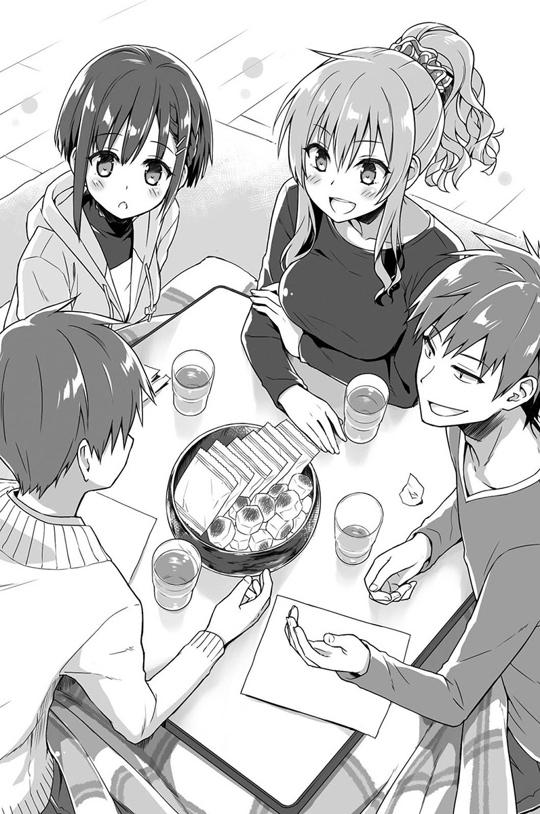

「呃……啊！」

这时我才惊觉自己说错了什么话。

虽然记得不是很清楚，不过现充这个字眼被广泛使用，好像是还不到十年的事情。

「这个嘛，所谓的现充就是……」

就在我慌张想说明的时候。

「现充，就是指现实生活过得充实的人对吧？」

另一位男生迅速补充说明。

「什么啊，我都没听过。」

「这字眼最近在2ch之类的很常看到，就是现实生活充实人们的简称。不过恭也，看来你还满爱用网路的。」

「呃、呃嗯，还好啦，差不多。」

……真是幸好，刚好是这个词刚冒出不久的时候。

虽然这次多亏有人救援，但是看来往后要讲流行语的时候，还是要小心一点比较好。

「啊，接着换我是吧，呃……」

身旁眼神凶狠的家伙，一边搔着头一边说起话来。

「我叫鹿苑寺……贯之。我的姓超～长的，所以就叫名吧，就这样。」

鹿苑寺贯之……话说回来，这名字感觉很威。

贯之身材高挑修长，是很适合穿长袖T恤和窄管牛仔裤的男子。头发比我短一些，修剪得整整齐齐。

要说他是帅哥也没问题，但就是美中不足在眼神凶狠，又加上表情冷淡这点。

「哇——！好酷，感觉是会在教科书上看到的名字。」

右边的娇小女孩子瞪大眼睛地说着。

「我懂你的意思，姓氏最后如果有个寺字，感觉顿时变得有威严。」

对面的辣妹也做出类似的反应。

「我这姓氏没什么好讨论的，好了，该换下一个了。」

大概是没有觉得特别吃香吧，贯之催促着下一位自我介绍。

「嗯？喔喔，是我啊。」

辣妹赶紧坐好。

「我叫小暮奈奈子，是滋贺县人，往后多指教啰。」

第一印象让我还烦恼往后要怎么跟这个人相处，没想到自我介绍还满一板一眼的。

淡咖啡色秀发在脑后扎成一束，并绑上风格强烈的发圈。五官立体，凤眼感的眼睛略显严厉，然而容貌的确可以说是个美女无疑。

「你的姓是那个意思吗？因为有点不良少女……噢噗喔喔！」`注`

`注：小暮发音为「KOGURE」，字面上是带点灰色之意，有行为举止偏差的含意。`

贯之的玩笑还没开完，小暮的拳头就以漂亮的角度挥上他的肚子。

「你这家伙，没有人在别人自我介绍完几秒后，就拿那个人最不想被开玩笑的部分来讲的啦！！」

……啊，所以果然很在意啊。

我和娇小女孩都因为她突然的出手而一时愣住，小暮见状慌忙解释：

「我、我们校规很松，染头发也不会说什么的，而且当然不是只有我特别不良，我是说真的啦。」

你刚刚说了「只有」喔。

除了小暮以外的所有人，大概脑中都浮现出，回荡在深夜田园风景中的喇叭声以及鸣笛噪音吧，不过并没有人特别说出这件事。

「总、总之请多指教了，小……」

「拜托大家，统一叫我奈奈子吧。」

就在要叫出她的姓氏时，那充满魄力的眼神就瞪了过来。

这个瞬间，小暮这个姓已经消灭在我们之中。

「好了，轮到我了咩。」

娇小女孩子清了清喉咙。

看她还略带一点乡音，想来应该是从很远地方来的孩子吧？

「啊——在你说名字之前，我有个问题。」

贯之突然插话进来。

「什么咧？」

「就是……你大学是跳级来念的吗？真正到底是几岁？」

一道手刀以迅雷不及掩耳的速度，劈向不正经说笑着的贯之的喉头。

「咕喔！」

「真的有读到高中毕业的好咩！突然说这是什么话，这位小哥！」

娇小女孩生气鼓起的脸颊好像松鼠一样。

「你看看你，惹人家生气了吧。」

奈奈子风凉笑着。

「怎样啦，你们看她这么娇小，不会多少有这种想法吗？」

老实说，我一瞬间无法否认贯之的说法。

「好，重新打起精神……」

不久前还是货真价实女高中生的女孩子，昂扬地挺起了胸膛说：

「我的名字叫志野亚贵，来自福冈的糸岛。」

「志野亚贵……？好奇怪的名字喔。」

「会吗？第一次听到有人说我名字奇怪捏。」

女孩露出一脸意外的表情。

「是喔，可是不觉得志野亚贵听起来，有点像男生的名字吗？而且……」

正要把异样的感觉说出口时，

「喔——我知道了，嗯，」眼前这位志野亚贵便先露出微笑。「你应该是搞错了吧。」

「搞错了？」

「志野是我的姓，亚贵是名，我就叫志野亚贵。」

「喔……」

所有人露出懂了的表情点点头。

「果然会误会捏，因为我的名字就只有短短四个音。」`注`

`注：志也亚贵连名带姓写作「SHINOAKI」，在大阪常用在男生名「信明」、「东明」。`

会马上察觉大家觉得奇怪的点，应该也是因为至今有出现过类似的情况吧。

「那大家都是怎么叫你的？」

奈奈子问道。

「这个咩，有人会叫我的名，不过最多人叫的应该是全名吧。不过反正机会难得，而且大家好像也都是叫名而已，那也叫我亚贵好了。」

「…………」

除了她之外的其他三人，互相讨论似地点点头。

「叫志野亚贵就好吧？」

「志野亚贵好了。」

「叫志野亚贵比较好」

「喂，都没有好好听人家讲什么捏！？」

本人怎么争取也没用，叫全名这件事就这么定了下来。

◇

「话说我们都是映像学科也太巧了吧。」

走去大学参加新生入学说明会的途中，贯之一脸不可思议地说着。

「不过多亏这样，我们就能互通资讯了。我想大概得要先选语学的课，然后再配合看怎么样。」

如果让第二次当大学生的我来说的话，这算是很幸运的事情。因为大家课程内容相同，能轻松交流上课内容与考试范围，出席点名时还可互相掩护。

「嗯～你知道得还真清楚呢……话说回来，这里真的是大阪吗？还可以听到牛的叫声耶。」

「跟老家没什么不同捏～」

「说是大阪，也是在县的边境了，毕业自大艺的作家在散文里也有写到，这边感觉真的很乡下。」

「是喔，像什么？」

「像是门口立了块令人印象深刻的招牌，上面写『小心虫类！』」

「……我要不要回家算了。」

走在乡间路上，奈奈子和贯之抱怨这、抱怨那地，志野亚贵则拿着狗尾草挥舞，还开心地用鼻子哼歌。

不过当然，向前走的三人也是期待着新生活吧。以前第一次参加开学典礼时的自己也是一样。然而，现在的我所怀抱的期待更是多出好几倍，也很紧张。不晓得会遇见什么样的同学，会有什么样的课业在等着我。

无论如何，就在一步步往前走的同时，目的地已经映入眼帘。

「啊，到了到了。」

看到建筑物五分钟后，人就已经来到大学门口。

「啊——对喔，考试的时候有看过却不记得了」

站在门口，贯之有气无力地说着。

「感觉爬完之后会超累的……」

奈奈子发出了有如从地狱深处传来的声音。

「就好像要到最终魔王前，都会遇到比较多的困难那样捏……」

就连志野亚贵都觉得害怕。

简称「艺坡」的大中艺术大学名产耸立眼前，这是我第二次面对了。

手扶梯什么的通通都没有，爬上这条险峻坡路之后，就会抵达我们所要去的校舍了。

◇

「入座位置是按照学号顺序。请对照门口发给各位的一览表，坐在写有你号码的位置。」

映像学科的说明会，是在可以容纳两百人的大教室举办。

「我们的号码是分散开来的。」

「好像是耶，看来没有办法坐在一起了。」

「呃，恭也是三十二，我是十五，志野亚贵是二十三……鹿苑寺是一〇二，离我们好远——」

「欸，我说过要叫我的名吧！」

「你刚刚也叫了我的姓啊，一次还一次！」

「好了好了，你们两个都别吵了……」

在门口吵架实在不好，总之先把他们安抚下来。

「呼啊～人超多的耶，这里所有人都是同学吗？」

没错，人数的确是比想象中来得多。差不多有一百三十人吧？

「反正没时间了，就先坐到位置上吧。结束之后一起吃午餐？」

「可以啊，那就在门口集合？不晓得学生餐厅是不是已经可以去吃了。」

「应该可以吧？还有既然都来了，想好好逛一逛校园。」

「嗯，嘿咩～」

决定好等一下要做的事情之后，大伙儿便分别坐到了自己的位置上。

教室内的情况乍看之下跟一般普通大学相同。偏差值没有特别高，但也没有很低，当然也不是所有的学生都怀抱着梦想和野心，回想起彼此交会着不知该看向何处的视线。

可是，就算教室本身跟分发的手册很像，学生们却是全然不同。

明白地说来，环顾四周的每一个人，看起来通通都是带有一些个人特色的模样……不知道该说是如同自己所期待，还是什么的。总之，即便是像奈奈子他们，都还算是比较普通的类型。

「三十三 ……是这里吗？」

「啊，嗯……嗯！？」

看到走来自己身边的男子，我不禁发出怪声。

「哈……太帅了，终于来到艺大了！」

这身高大概有一百九吧？一身强壮肌肉，紧贴着肌肉起伏的T恤上，以毛笔字写着「腕力」。比起艺大，这位的模样怎么看都比较像是体大的学生。

「你叫什么名字？」

「我、我吗？我姓桥场，桥场恭也。」

「桥场啊，我叫火川元气郎，多多指教喔」

「……元气郎？」

「对，就是充满元气的那个元气，再加上一郎、二郎的郎，元气郎。很好笑的名字吧？所以我绝不会忧郁或生病的，哈哈哈！」

不是只有外貌，鹿苑寺也好、志野亚贵也好，名字深具特色的人也太多了吧？

真不愧是艺大。这就是所谓的艺大吗？这个环境容易聚集充满个性的人，这点是无庸置疑的吧。

「桥场你是因为想拍电影才来这里的？」

「电影？没有啊，并不是特别因为这样来的。」

不过仔细想想，毕竟这里是映像学科，一般会这样想可以说是很自然的事情。

「这样啊，那不然是电玩吗？还是动画？」

「嗯，我喜欢电玩。希望哪天可以尝试创作RPG。」

「喔，我也喜欢电玩。像我小的时候爱快打旋风2爱得要死耶！还有超级实况野球之类的也是。」

看来很热衷格斗游戏和球类游戏，就连喜好都跟给人的印象一致。

「不过，其实我比较喜欢实际运动身体的活动。你高中的时候也有做过什么运动吗？」

「没有，很少。不过我喜欢看比赛，像是棒球比赛那种的。」

「棒球啊！我也常当棒球队的助手喔。可惜去年无法晋级甲子园……秋季大赛上，也很遗憾没能见到传说中的内藤勇气！」

「内藤……喔喔，那个毛巾王子。」

「毛巾……王子……」

对方露出摸不着头绪的表情。

……糟了！那是在二〇〇六年的夏季甲子园，因为拿毛巾擦汗才有的绰号，目前这个时间点还没有这回事。

「啊，没事，那是另外一位选手。内藤啊，很令人期待耶。」

「对！他一定会当职业选手的，美国大联盟应该也进得去吧！」

「哈哈……说得也是。」

在接下来的夏季甲子园，他将和人称阿实的北海道绝对王牌投手相互较劲，他的确会大展身手。到大学打棒球也是担任王牌的角色，并且也会风风光光地进入职业球团……可是，另一位阿实在美国大联盟洋基队拿下超过十胜，相形之下内藤则是在职棒历经一番苦战……

「好，到时候我们在一起去看球赛吧。你应该是阪神球迷吧？还是欧力士球迷？我是福冈软银鹰，再过不久齐藤和巳就会变成王牌，今年很令人期待呀。」

记得齐藤和巳好像在今年严重受伤……

「的、的确如此。职棒每年都有吸引人的话题真不错，像是达比修挑战美国大联盟，还有既是王牌投手又是四棒中心打者的二刀流……」

「二刀……流……？」

该死，这目前也还没发生……！

「假、假如有很会投球，同时又能做好打击的选手，那可就厉害了对吧……类似像这样的……」

「不可能、不可能！这种像漫画情节的事，不可能会出现在现实生活中的！」

「哈哈……说得也是。」

该怎么说呢，想想未来还真是不得了啊。

就在我们闲聊的时候，学生们也陆续到齐了。

不晓得大家是不是因为上了艺大很兴奋，总觉得气氛相当欢乐。

接着，告知九点整的钟声在教室里响起。

「接下来，大中艺术大学映像学科，二〇〇六年度迎新说明会即将开始。首先，有请学科长佐佐井老师上台致词。」

原本坐在一旁的矮小老人站到了讲台上。

简介手册上也有出现这个人，记得应该是广告业界的大咖人物。

「欢迎各位来到映像学科。那么，关于本学科呢……」

学科长开始娓娓介绍起大艺映像学科。

像是原本是以东艺电影公司的导演为中心所设立的学科，因此现在也主要以电影制作为教育主轴，一年级、二年级几乎都是团体作业等等之类的说明。

反正大致上的内容都跟简介手册里提到的差不多。

「电影制作啊，不晓得要做些什么。」

身旁的火川不解地歪着头。

我同样也是满满的疑惑浮上心头。

「那么接下来，就请负责术科的加纳副教授来跟各位说说话。」

看来莫名年轻的套装女老师站到了讲台上，接棒佐佐井老师。

在麦克风前站定位的瞬间，加纳老师露出微微一笑。

「恭喜各位新生来到这里～！我是加纳，负责各位的电影制作实作课程。接下来四年还请多多指教。

加纳老师以仿佛最后还加个爱心符号般的平易近人语气，开始了她的致词。

（这名老师是怎么回事……）

她的声音之甜美，就像是介绍全新动画作品的年轻声优一样。

「那个，我们现在开始进行调查。可以请各位举手作答吗？」

突然间就作起了问卷调查。

整个空间顿时开始变得莫名自由。

「你们当中有没有想成为电影导演的人？」

还满多人举手的。

「好，接下来是有没有人想当编剧？」

这也有一定的人数。

「那动画创作者呢？」

举手的人数跟第一题差不多。

接着又陆陆续续提到许多职业，像是游戏设计师或行销企划、CG艺术家等等。

所有人一边低声交谈，一边恣意说着未来的理想职业。

原来如此，对于茫然思考的未来图像，老师向我们举出了具体实例，让我们了解原来还有那样的职业，让大家稍微画了一下美好的蓝图。

（啊啊，像这样的情况，就如同我心里所想象的艺大一样……）

连我自己的思绪，也开始驰骋在从事制作电玩游戏的想象里。

「嗯——很好很好很好……」

老师微笑看着大家，却突然间用力瞪大眼睛。

「好了，现在大家注意听我说！！」

语调突然拉高的声音怒吼着。

「惊！」

「咦？怎、怎么了……？」

学生们大概是吓到了，也发出短促的惊叫。

和乐的气氛顿时一变，现场寂静无声。

犹如舔舐大家反应般地看了一会儿后，老师静静地从架上拿下麦克风说道：

「很好，各位都听清楚啰？去年映像学科的毕业生有一百三十五人。」

跟今年入学的人数差不多。

「在这些毕业生当中，你们觉得有多少人，是从事他们当初入学时说想做的工作……？」

大家面面相觑。

「好，那个金发的你说！」

「咦？咦咦？我吗！？」

奈奈子突然被用力一指。

「大概……四十人？」

「错————————！！答错了！！！！」

老师略为抢快地宣布着失败。

「四十人啊……嗯嗯，如果有这么多人的话就太美好了～嗯嗯。」

刻意显露悲伤表情的同时，又频频地点着头。

「正确答案是……八人。从事动画监制有两人，编剧两人，三个人去了有名的电玩公司。而当上导演的就只有……一人。」

会场内一阵哗然。

这样的数字明显太少了。真、真的是这样吗？

「来说说钱的部分吧。」

老师的声调又更低沉，表情也一口气转为严肃。

「人类会肚子饿，会想睡觉，会想去厕所。既然要维持社会生活，就还得穿衣服，为了遮风避雨也会想要有个家。」

老师将外套脱掉，挂在麦克风架上。

「食、衣、住，正因为这些都是人类所需，所以无疑都要花钱去买。但是电影、动画和电玩游戏……这些呢？就算没有也不影响吧？」

她坐在通往讲台的阶梯上，然后双腿交叉。由于裙子还满短的，尽管这种时间点不太合宜，但实在让人不由地小鹿乱撞。

「所谓娱乐，是在许多条件都满足了之后，才开始会有需求的。简单来讲的话，就是排在较低顺位的东西。浪费时间，你们还为了做这种东西特地来读大学，这已经超过异想天开的程度，根本是白痴啊。」

教室内出现一些窃窃私语的声音。

「接下来，你们将用四年的时间学这些蠢事。不过就算学了，也不会特别获得什么执照，也不会有什么保证。就像我刚刚说的，也没有办法保证就业……」

说完这些话，老师淡淡一笑。

「不过……」

「就算白痴好了，做得好终究会变成商品。如果够独特，那就有其价值。以那样的东西为目标吧，反正既然要当白痴的话，那就要当没人到得了的领域的白痴。」

「……如果可以做到那种程度，你们说不定也变成天才，毕竟事情都是一线之隔。这里面有多少人可以变成那样……我非常期待。」

「我就讲到这里。」

教室内仍旧是一片静悄悄。仿佛什么事情都没发生过一般，负责司会的男性站到讲台上，开始公式化地说明。

「接下来将针对上课方式做解说。请翻开选课单和学生手册——」

◇

一边聆听接着讲解的选课说明，我的脑海中一边回想着刚才老师说的话。

（是我太天真了吗……）

仔细想想，这个业界总之就是一道窄门。其实没有几个人可以声名大噪变成名人，这件事跟电影、动画或是电玩一点关联都没有。即便这一届被捧为白金世代，却也不是每个同年龄的人都可以大放异彩。而这一点，已经由原本在未来的我做了最好的证明，不是吗？

就如同老师所说，娱乐如果没有需求的话就毫无价值，人们会以衣食住为优先。

既然都来到这里学习这些事情了，就得要学到能力，打造出比衣食住更有魅力的东西才行。

（要好好努力才……行……）

一开始就沮丧的话，什么事情都开始不了。总之，得往前迈进才行。

说明会继续进行下一个部分，老爷爷佐佐井学科长再次站上讲台。

「呃——接下来，我想请每个人来自我介绍。就从学号一号开始……我想想看，就说些跟映像学科有关的内容，像是讲自己喜欢的电影导演好吗？」

听到佐佐井学科长的话，学生们骚动了起来。

（什么，电影导演啊……）

听他这样说，我实在很伤脑筋。

电影本身我是会看，毕竟也多少跟工作有关。

但是对于导演的名字，老实说并没有记得几个。

「好的，那就麻烦学号一号的赤城同学先来。」

就在我陷入焦虑的时候，自我介绍开始了。

「我是一号，赤城裕太。欣赏的导演是马丁史柯西斯。」

「啊，我也喜欢这导演」、「史柯西斯喔，感觉聊得来」，同学间发出这样的应和。

（谁啊……）

然而，我已经满脑子问号。

「我是二号，井川早苗。很喜欢小津安二郎导演的作品。」

「五号宇田浩一郎。导演的话……山姆毕京柏和柯恩兄弟。」

「九号，小野隆。我相当推崇木下惠介导演的作品。」

（呃？这些到底是谁……不管是日本人或外国人我没一个认识的。）

我深切地后悔着，开学前至少也该要要查查维基百科，看一下电影导演的名字的。呃……对，这时代查维基百科应该算是满普遍的事情了。

就在我搜寻记忆，看看有没有记得什么人的名字时，

「十号，河濑川英子。」

一道俐落的好听声音，从我眼前的位置响起。

我不禁抬起头。

姓河濑川的女孩子，是有着一头长卷发的美女。姣好的五官配上冷淡……应该说是锐利的视线。

不过，她介绍完自己的名字之后就没讲话了。

（奇怪？难道这孩子也不太知道电影导演吗？）

虽然这样讲很没出息，但如果是这样的话，我就多了些同伴了。

但没想到——

「我喜欢的导演……因为太多了，没办法只举出一、两位。」

她先做了这样的开场白。

「如果是以前的日本电影，我很崇拜冈本喜八导演充满节奏感的呈现，八零年代以后的话，石井聪亘导演的疾速奔驰感也让我相当感动。但如果要说到近代，我觉得还是内田贤治导演那经过精密计算的作品最棒了。至于西方电影……」

接着开始讲我依然没听过的导演，还列举出他们的特色。

「好了，我已经知道你很清楚，到这边就可以了。不然其他人会很可怜喔？」

加纳老师插话进来打断。

「……好的，不好意思。」

感觉好像还听到微微咂嘴的声音，不过河濑川仍是就此打住。

（……所以她刚刚一时的沉默是因为这样啊！）

觉得自己因为抱着坏心眼的期待，所以被狠狠地摆了一道。

「哇，那个人懂很多耶。」

隔壁的元气郎也打从心底佩服。

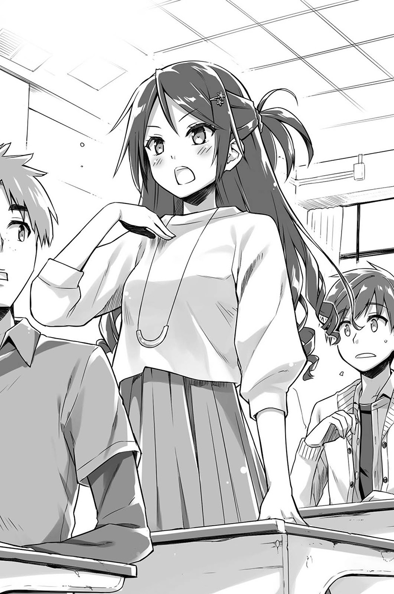

另外还有好几道尊敬的目光，从其他位置朝她投射过来。

「十五号，小暮奈奈子……导演的话，喜欢宫崎骏导演，就这样！」

（啊，可恶！被说走了！）

剩下没几个的名单里，动画巨擘就这样被奈奈子抢先说走了。

（算了，没关系，既然这样就说押井守……）

我虔诚祈祷着，希望不要失去另一位库存名单。

「我是二十三号，志野亚贵～」

莫名柔软的声音回荡场内。

「导演、导演，我想——呃——」

志野亚贵左右歪着头，脸上明显写着「没有」的表情。

（啊，这家伙应该真的就是不知道。）

跟刚刚河濑川那种「准备」式的沉默不同，她真的就是一副不知道的模样。

（志野亚贵，你就不要再挣扎了，老实说「不知道」吧……）

「那个——我喜欢王贞治总教练，软银鹰的那个。」

注：由于导演和总教练在日文中都写作「监督」，志野亚贵误以为两者是一样的。

志野亚贵一说完，在场所有学生全都假装滑了一跤。仔细一看，就连老师当中也有几个人歪了一下。如此配合的反应，让人有种果然身处关西的感觉。

「奇怪？这两个是不一样的吗？」

志野亚贵一边纳闷着一边坐下。

在瞬间的静默之后，下一位学生仿佛什么都没发生过似地，继续做自我介绍，回到原本的流程。

然而，会场内刚刚都还充满对河濑川的尊敬，却在志野亚贵的发言之后倏然一变，转为「来了个不得了的人」如此的好奇心。

「……那个人是怎么回事，明明是来读映像学科的。真夸张……」

坐在前面的河濑川英子碎碎念着。

看来这一届，会是相当混沌杂乱的聚合体了。

◇

「好了，那就来庆祝我们同居生活开始……」

奈奈子高高举起装有可乐的杯子

「干杯！」

「干杯——」

「干杯！」

「噢！」

其他三人也同样跟着举杯。

在新生活说明会结束后，大伙儿想说机会难得就干脆一起喝一杯。

「大学生干杯的话，不是应该要解除禁酒令吗？」

贯之一边摇着装了汽水的杯子，一边看向奈奈子。

「你这个未成年在说什么，至少在这个家里，大家未满二十岁之前都不能碰酒！」

「要是在mixi上引来网友批评，那是很可怕的！」

奈奈子与志野亚贵看着彼此点点头。奈奈子明明外表看起来是那副模样，可是个性却意外地一板一眼，是个好孩子呢。

「还真古板，算了，反正我也不能喝酒，喝什么我都没差就是了。」

贯之无所谓似地仰头喝下汽水。

「恭也，你干么表情这么严肃啊？」

「啊，没有啦……」

我表情看起来有那么凝重吗？

「只是在想说，今天说明会讲的事情还满严厉的。」

再加上本来处于正兴奋的落差感，还有老师的表现也令人感到震撼，整场内容扎扎实实地刻画在心上。

想必就连贯之或是其他人，无疑也都多少受到了冲击吧。

「是啊，当下的确想说怎么突然就发狠了起来。」

贯之一边喀嚓喀嚓地咬碎柿之种花生米果吃着，一边说道：

「你接下来还有四年的大学生活要过，目前先当个轻松的大学生也没关系吧？好不容易才获得暂缓出社会的时间。」

「这样说也是没错……」

是啊，之前念私大的时候，前两年也是玩得很尽兴，就算换成是艺大，应该也没有多大的不同才对。

「谢啦，感觉心情比较轻松了。」

「真的吗？太好了。那我想问你一个问题。」

「问题？」

贯之将嘴巴凑近我的耳边问道：

「你要哪一边？」

「什么哪一边？」

「我意思是志野亚贵跟奈奈子，你想要哪一个啦。」

贯之突然开启出乎意料的话题。

「呜啊！？」

「总之呢，看今天早上的情况，我想你应该是选志野亚贵，不过既然你说那是误会，那么奈奈子也有可能是你的菜。这件事，我想先弄清楚。」

「…………」

我看着坐在前面的两人。

「志野亚贵啊，你犯那是什么错误，老师是在问喜欢的导演，你怎么会回答王贞治呢？真不敢相信。」

「我就对导演什么的没兴趣咩，所以根本不晓得——奈奈子你知道喔？」

「唔……不，并没有，我也完全不认识……就是这样。」

两个女孩子融洽地边笑边说。

再次细看，两人都非常可爱。目前也没有特别觉得个性上有哪里不好。

（啊，对喔。原来是这样，这也是理所当然的。）

先前在大学时，我跟恋爱沾不上边。后来也都没机会交到女朋友，后来也就不再想了。就算眼前有可爱的女孩子，也丝毫没有会跟自己有所关联的真实感。

「怎么了？你们干么不说话地看着我们？」

「没、没事。」

我慌忙别开视线。

「怎么样？就你的感觉来说，你喜欢哪一个？」

「今天才见到面，想回答也没办法啦。」

……话虽如此。

毕竟是才刚做自我介绍的人，要问我喜欢哪一型，老实说还真讲不出来。而且，其实根本是二十八岁的大叔跟十八岁的女孩子啊。

「什么啊，原来是这样，我还以为你已经确定目标了。」

然而不可思议的是，贯之很干脆地就结束了话题

「不然，贯之对哪个有意思？」

「我？没有，没特别对谁有意思。」

纵然想要用同样问题回敬对方，却仅得到只能说扫兴的冷淡回答。

「原因跟我一样吗？」

「嗯……怎么说，还不太了解她们这点当然也是有，但最主要是因为我对恋爱没有兴趣。」

「嗯？」

大学一年级说这种话，未免也干枯过头了吧？

「你为什么……」

不晓得贯之是不是因为已经达成目的了，只见他若无其事地打开眼前的袋装饼干，猛地开始大快朵颐起来，像是要打断我的问话似地。

「总之，这样一来我就知道不用特别小心，这样放心多了。」

（大概遭遇过什么事情，毕竟贯之人又长得帅。）

可能是不想被问到这种事，那我还是别多管。

「啊——！贯之干么想吃掉我的花生米果咧！」

「什么？这是志野亚贵你的吗？谁说的啊！」

「我说你啊，小包装都是一人分配一袋，这是常识不用说也知道吧！恭也你也晓得吧？」

「咦？啊，嗯，我刚有想说是不是这样。」

「恭也你这混蛋！背叛个屁啊！这时候就应该站在男生这边啊！」

就算意识到对方是女生，也丝毫不手软，尽管这份嚣闹不到一分钟。然而遭受池鱼之殃的同时，我沉浸在些许的感慨之中。

啊啊，当大学生真好……

◇

共享住宅的生活就这样揭开序幕。

首先是了解所有人的意愿，决定好打扫和煮饭的值日生……进行到这里之前都没什么特别的问题。

「啊——！！」

开始生活的第三天。

第一条麻烦的导火线，由志野亚贵点燃。

「怎么了？志野亚贵，叫这么大声？」

仔细一看，志野亚贵泪眼汪汪地瘫坐在煮饭的地方，一个写有「志野亚贵专用」的纸箱前。

「我、我的『金贺呷』……被吃掉啰啦……」

「『金贺呷』是什么？」

接着听到后面传来一道愉快的声音，回答了我的问题。

「那个啊，就是只有北九州才有卖，很有名的超好吃豚骨汤头泡面……咳噗！」

就连表情也异常地满足。为什么他会有这样的反应，原因随即揭晓。

「贯之，你擅自吃了我的『金贺呷』对呗！」

「因为我没有东西可以吃啊，而且我也另外放了『揪爱呷』进去不是吗？」

「那个是酱油口味滴啊，根本不一样咩！」

「又没关系！那也是巴鲁斯食品的杰作耶！」

「有关系！贯之你根本不知道，『金贺呷』对九州人来说有多重要捏！」

看来是贯之随便吃掉了志野亚贵从老家带来的食物，而且还是很宝贝的东西。

「还给我！」

「哪有可能啊！」

就算继续争吵下去，感觉也没有解决的可能。毕竟又不可能从嘴里再吐出来，然后这地区又没有在卖的话……

「我说你们两个。」

就在我不得不插嘴阻止的瞬间，隔起客厅与浴室的那扇拉门，喀拉喀拉地打开了。

「我已经听说整件事情了！」

是刚刚去洗澡的奈奈子。

有如一尊大佛屹立该处，一出浴就随即对贯之开炮。

「快点道歉，贯之！随便吃别人的食物，是共同生活绝不能做的事！这是犯罪喔！」

「啊……唔哇……」

可是我们现在实在没那个心情讨论，因为眼前奈奈子的模样令我们更在意。

大概是因为慌慌张张就冲出来，奈奈子的上半身就只穿了胸罩而已。

（好……好大……）

看见那对大到简直像犯罪的胸部，我连声音都发不出来。

她的身材之好，甚至要让人嘲笑起那些写真女星。而且穿起衣服时那样纤细的身材，却有着让人出乎意料的雄伟。

「那个，奈奈子……你可以发火，但是要不要先看一下自己的胸前？」

同样处于失神状态的贯之，回过神后说道。

「啊？你说我胸前怎么样……」

奈奈子一听更生气，但是。

「咦！……奇、怪……？」

总算察觉了，她的上半身这会儿明显变得通红。

「呀啊啊啊啊啊！！！！！」

然后，瞬间就逃离现场。

「为、为什么！我明明穿着T恤才对啊——被看到了啊啊啊，好想死——！」

更衣处随即传来悲痛的声音。她说的T恤，是掉在更衣处入口的那件吧。

「……总之就是这样，『揪爱呷』也很好吃的喔？」

「这才不算数咧！下次你再吃的话，一碗要收你一千日圆喔！」

这起事件就这样呈现微妙的未解决状态，于是我们也就制定了「不可以没问过就吃掉别人买来的食物」、「非常宝贝的东西要用签字笔写上名字」的新规定。

共同生活的麻烦事还不只这一桩。

「昨天真是有够累的……」

志野亚贵和贯之（还有莫名卷入其中的奈奈子）的食物骚动隔天，我从大学回来之后，想说要来好好泡个澡。

准备好热水后先待在客厅消磨一下时间，看准适当时机后，光溜溜地用力打开浴室的门。

「啊！」

「噎！」

我大概花了三秒钟。

才搞清楚已经在水里的桃红色物体是什么。

「呜哇啊啊啊啊啊啊啊啊啊啊啊！！！」

想当然，我又拿出比刚刚更加强劲的力道关上门，迅速穿好衣服。

对于我的慌张完全不当一回事，浴室里面传来志野亚贵悠哉的声音。

「啊哈哈，我就想说很奇怪捏～才想要来泡澡，浴池就已经放满水，我就觉得好幸运，原来是恭也同学放的水咩。」

「啊、啊哈哈，是、是啊。」

「恭也同学对不起，我一时糊涂就进来泡了。」

「不会，没关系，我没有看到什么比较要紧，你可以放心！」

我撒了谎，其实看得还满清楚的。

像是个子娇小却有着丰满的胸部，还有大腿到屁股的线条，另外像是那个不该看的地方有颗痣等等，实在是看到太多不该看的，简直到了不妙的地步。

可是……

「咦？啊啊～没关系啦，你马上就把门关起来了咩，没问题的啦～」

看来志野亚贵爽快地原谅了我。

（唉……话说回来，不管是上次的奈奈子也好，还是志野亚贵也好……）

本来也觉得一起生活的话，是有可能当个不小心吃到冰淇淋的幸运色狼，但没想到竟然这么快就成真。

可是，嗯，果然年轻真好。十几岁的孩子，皮肤的弹性是如此地……

「不，先不说这个了……」

对现在的我来说，眼前比较要紧的是得先处理另外一个威胁。

「……应该有很多需要跟我解释的吧？」

眼前有另一名女孩子，带着熊熊怒火站在那里。

「……一般来说，起码在还没打开浴室门之前，就会知道有人在里面吧？你是故意的吧！？」

「不、不是的，我刚在放空根本没注意到！真的！痛、好痛！可是……好软喔……」

被勒头锁喉当然是很痛，但如果是奈奈子动手的话就不只痛了，我的脸紧紧地贴在她的胸前，整个人已经陷入不知道该反省还是该兴奋的状态了。

这个男女混居的共享住宅生活，对男性来说充满了致命的诱惑。

我再次感慨。

啊啊，当大学生真好……

◇

大概过了一个礼拜左右，每个人拿手的事情也大致定下来了……应该是说，开始清楚知道其他三人的家事能力有多低劣。

到头来，像煮饭和打扫之类的我都全扛，贯之则是负责劳力活和丢垃圾，奈奈子则跟我轮值煮饭（她煮的饭勉强还能吃），而志野亚贵的话……因为没有特别擅长的项目，所以就当大家的帮手。

接着这天，猜拳输了的两名男性，在大家一起吃完晚餐后负责收拾。

「贯之，你对猜拳很不在行耶。」

「你少在那边，自己也输了还敢说？」

我在三次决胜负的猜拳中，漂亮地以直落三惨败，所以跟贯之在这边争也没用。

「这个是志野亚贵的吧？」

擦着桌子的贯之，拿起遗留在桌上的橘色小袋子。

「啊，我想应该是，记得好像有看过。」

我一回答，只见贯之把小袋子轻轻地抛了过来。

「反正你们都住二楼，你拿去给她吧。」

「啊，嗯。」

楼梯爬到一半，我回想起贯之在入住那天晚上所说的话。

「不过，志野亚贵还满可爱的啊。」

不是只有长相和个性，还有像是明明来念映像学科，却不太知道映像方面的事情，或者是几乎可说是生活白痴，以及有点异于常人等等……甚至莫名脱线之类的。

奈奈子当然也是个好女孩，但是当她男朋友应该很辛苦吧，因为一下子就会挨揍。

如果是志野亚贵的话，会让人涌上保护欲。看她那个样子，会不禁把她当作是需要保护的对象。不过基本上，她本来就是小我十岁的女孩子。

更遑论这座大学里还有像那种严厉的女老师存在，就像是玩生存游戏的地方。

「喂，志野亚贵你在里面吗？」

敲了敲门，却没有得到回应。

不过竖耳仔细听的话，隐约可以听到房间内传来一些声音。

「人在房间里吗……？」

可能是戴着耳罩式耳机或入耳式耳机在听音乐吧。

我静静地打开门，走入房间里。

「志野亚贵，你忘了这——」

活在世上，很少有说不出话来的时候。

就如同字面所述，因为没有那么多事物会让人瞠目结舌。

遇上这类的事物，大概会说吓一跳或者发出呜哇这样的叫声，也可能是好厉害、太帅了等等的赞叹词，基本上都是适用的。

所以，我等一下会客观地「描述」，那当下让我说不出话来的事情。

「志野……亚贵……？」

成山的大本书籍占满房间，油画水彩皆有的画布和图画纸、素描本形成了一座森林。画具堆成一片几乎连站的地方都没有的草原。里头全被跟「绘画」有关的所有东西占据了。

房间里，只有绘图板的笔尖发出的沙沙声回荡着。持笔者浑身散发着热气。绘图笔敲得用力、敲得沉重。原本娇小的持笔者，背后明显飘出异样的气息。

电灯没有开，但房间里是有照明的。那是来自电脑萤幕的光。二十吋的液晶萤幕上有一幅画作正在进行，色彩如跳动般飞舞着。

那是一张关于少女的图像。

在整片的向日葵田中，有一名微笑的少女。

少女带着略显苦恼的表情，以双手按住快被风吹走的草帽。连身洋装的裙摆稍稍飞起，没晒到太阳的大腿显得白皙，美得仿佛发光似地——就是这样的一幅画。

我静静地把小袋子放下后，不出一点声音地关上门，离开到房间外。

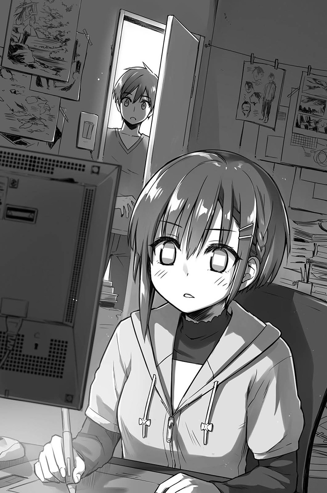

带着踉跄的脚步，打开自己近在眼前的房门，瘫倒似地跌进到里头。

我躺在昨天铺了之后就没收的棉被上。

「哈哈……哈哈！」

笑声自然地从喉咙溢出。

不管是她有在画画这件事，或是倾注了多少的心力，我通通都不知道。唯独亲眼看见那惊人的态势，让我吓一跳是真的。被那无法想象是跟我同年龄的气势所震撼，我什么话都说不出来了。

可是让我为之语塞的理由，却有另一个更主要的原因。

「太酷了……竟然就在我身边……」

桥场恭也有一本比任何东西都宝贝的画册。

那本名为〈向阳花〉的画册，收录了该位画家一路以来的许多插画作品。而该画册的封面，则是十年前的学生时代画的作品。应该不可能看错，就是几分钟前自己才刚在电脑萤幕上看到的，站在向日葵花田中的少女那幅。

一直以来，自己不是都惦记着读同一间大学这件事吗？那么即使就出现在身边了，应该丝毫不意外才对。尽管如此还是会觉得对方是离自己相当遥远的存在。

但是，朝思暮想的人似乎就在比我想象还要近，几乎可以听见呼吸声的地方了。

     Akishima Shino。
    ——秋岛志野

我直到现在才察觉，那个名字就是改自志野亚贵这个本名而来的。

## 第二章
### 所谓大艺大这个地方

共享住宅的生活终于逐渐稳定下来，大家也开始上课，就在生活周期规律起来的两个礼拜后。

上学愉快，同居生活也很热闹，虽然没有什么不满，但唯独有件事情怎么样都想找方法解决。

那就是钱不够用。

虽然出社会十年仍称不上富裕，但还是跟作为学生的现在不同等级。虽然老家会给生活费，可是光靠这笔钱并无法自由自在地过，所以我决定要去打工。

话是这么说，但我不想做太困难的工作。打定主意去附近的便利商店后联络对方，然后就带着履历前往——

「欢迎光临——！」

纵然已经是深夜时分，仍对上门的我微笑打招呼的这名店员，那张脸孔我非常熟悉。

「呃！你、你为什么会来这里？」

营业用微笑顿时变成错愕的表情。

「奈奈子才为什么穿着制服……？」

这间连锁超商朵森，店铺大多是在西日本。

大艺周边也开了不少间，不少学生要打工也会选择去朵森应征。

「哈哈……没想到房子已经租一起，就连打工也一起……」

奈奈子莫名有感触地喃喃自语着。

「咦？所以奈奈子你也是在这里工作？」

「就是你看到的这样啊，到今天刚好做一个礼拜了吧。」

其实也才刚搬来没多久，应该说手脚还挺快的嘛，真的是很有行动力的家伙……

「……虽然现在说这个不适合，但你听我说。」

「什、什么事？」

「这里的老板叫前田五十一。你打过电话应该知道。」

「应该知道，就是那位老爷爷吧。」

「对，他今年七十八岁。说是因为父亲生他的时候已经五十一岁，所以就取名为五十一。」

「这样啊……」

「这种事无关紧要啦！」

奈奈子自己说的话自己吐槽。

「本来今天排我和老板两个人上班，但是就像你看到的，现在只有我一个人在忙。」

「该不会是……年纪大了身体不好之类的原因？」

在我话还没说完前，奈奈子就用力地拍我的肩膀说道：

「既然你的观察能力这么好，来穿上休息室里的制服，再过来这边找我！完毕！」

「好啦，我知道了，你不要拉我衣服，奈奈子！」

我就这样被强行带到员工休息室了。

◇

不同于日光灯照得明亮的店面，休息室有些昏暗、寂静。随意找了张折叠椅坐下，就见奈奈子从后头走出，手突然伸了过来。

「来，给你，店长给的。」

「啊，谢谢……」

拉开递过来的罐装咖啡拉环，稍微喝了一口。

在因四处奔波而疲惫的身体中，甜甜的滋味漾了开来。

「老板还好吗？」

「应该还好。都有支援来了，我想没问题吧。总之我叫他先休息三十分钟。」

结果后来，变成只有我跟奈奈子两个人处理深夜的店务。

尽管是客人比较少的分店，但一进来就马上被交付陌生的工作，身体还是挺有负担的。

幸好店长回到工作岗位，一名叫樱井的资深店员也赶紧前来，我们终于得以休息。

「啊——不过真是帮了大忙，谢谢啊。」

「不，别这么说。虽然有点辛苦，但也因此能记住工作内容。」

在之前的学生时代，说打工也只是去小钢珠店，这次来超商可算是真正的初体验。

毕竟也还不可能站柜台收银，所以就都让我负责商品的陈列。

「奈奈子，你以前有在超商打工过？」

工作的时候，奈奈子展现出灵巧的机动性，让人想不到她才来一个礼拜。

「嗯，在老家有做过两年左右。因为我读的高中是可以打工的。」

「难怪。」

如果是有经验的人，反应会这么俐落也是可以理解的。

「呼～话是这么说，但一直站着也是很累的。」

奈奈子也坐了下来。

而因为她用力一坐的关系，胸部瞬间也跟着软软地摇晃了一下。

（虽然之前就想过，但她的胸部真的好大……）

从刚刚就觉得制服好像很紧。

看起来很有舰Colle`注`鹿岛的感觉。

`注：二〇一六年LAWSON便利商店和「舰队收集」合作的活动中，穿着店员制服的鹿岛挂轴引发抢购热潮。`

不过在二〇〇六年的现在说这些，对方大概也不会懂吧。

「恭也？你从刚刚就一直看着我……怎么了？」

「不，没什么。话、话说回来，志野亚贵跟贯之不用打工啊。」

我赶紧换个话题。

没错，都没有听那两个人提过这种事。不过看起来，也不像是有很多生活费的感觉。

「贯之的话我不清楚，应该多少有在打工吧？」

「奈奈子也不清楚啊……」

已经跟我们住了一阵子了，但贯之的作息时间总跟我们对不太上。

最多也只能偶尔跟我们吃晚餐，算是四人当中来历最不明的人。

「志野亚贵好像有申请奖学金喔，而且她有说自己不太适合打工。」

「也是，感觉不太适合。」

无法想象志野亚贵带着那样的气息俐落工作。

不过有申请奖学金啊……十年后会有迟缴还款的问题，但似乎就现在来说还不是什么话题。

「说到这个，志野亚贵老是窝在房间里对吧，到底在做什么啊。」

「咦？」

「没有在打工，学校没课就马上回来，你不会很想知道她平常到底在干么吗？」

「啊……」

「恭也，你知道些什么吗？」

「呃，就是……」

想要说明，却又打住念头。

那天晚上，我所看见的光景。

秋岛志野——不，志野亚贵画画的模样。

自己震慑于那副鬼气逼人的模样及画作内容的事情，再次浮现脑海。

「不，我也不太知道。不过你想想看，她应该是有一、两个兴趣吧？」

「嗯——对啊，应该是吧。突然开始独自在外生活，而且她又是从那么远的地方来，希望不要觉得孤单才好……我只是这么想而已。」

我并没有对任何人提起，志野亚贵画画的事情。她本人好像也没有对谁说，而且感觉好像也不是可以随意说出口的事情。

奈奈子也没有再继续追问，不过她真的是贴心的孩子，深思熟虑的性格跟那外表背道而驰。

话说回来，为什么奈奈子会来读大艺呢？

她应该也是抱着什么想法才来的才对，但是都还没听她说过。

「啊，果然。是不是没有补饮料？」

「对，我现在就去补。」

「喔？那你再告诉我少了多少～」

我站起来，往饮料架走去。

茶饮和汽水几乎都是剩两到三瓶的情况。

「剩满少的呢。」

我蹲下来，从后面的纸箱里拿出宝特瓶补到架上。

「那么，我也来帮忙。」

后头传来奈奈子的声音，让我清楚知道她正走过来。

「好，谢……这！？」

一个柔嫩而温软的东西，不可思议地顶住我面朝前方的头及肩膀，害我不禁发出奇怪的声音。

「啊，真的耶。姜汁汽水和宝矿力都没剩多少了呢，这边就我来补货吧。」

「唔、唔……」

我无法好好回话。

她的胸部仍一再重复着从我头部离开，然后又接近、碰到的情况。背部也不时被疑似她大腿的部位贴上。有时伴随着「嘿咻」的声音，胸部还会往前压得更紧。这是什么情况啊，如果是店里的特别服务，是要做到什么程度啊。

明明有源源不绝的冷气窜出，我却在身体始终如火烧一样的情况下，一直默默地补充着饮料。

「恭也都不说话，怎么了吗？」

「啊，不，就是——那个……」

「哦，这里空间比较狭窄，可能身体都会一直碰到你，抱歉啰。」

「那还真是……谢谢你。」

至于谢什么，就姑且先不管了。

松软、轻柔的触感和温度不停地袭来。

（啊……糟糕，我一瞬间失了神。）

已经无法专心补充饮料，整副精神全放在背上。

「好了——这样就补得差不多啦。」

几分钟后，天国阿莎力地关门了。

还没完！本能如此地朝我怒喝，我迅速地看了一下并告知奈奈子说：

「啊，左边还有没补到的呢。」

「喔，那这边也让我来吧。」

松软、轻柔之类的天国又再次开启大门。

（不行……这我真的不行了。）

如此过度的幸福感受，甚至让我觉得是不是会就这样死去。

◇

结果，打工一直持续到早上，我们到清晨六点值完班终于自由。

「辛苦了！」

就在朝日晒得我眼睛直眨的时候，奈奈子以充满活力的声音对我说道。果然年轻……不对，现在的我也是年轻人。

「你也是。很累吧……」

「不会，抱歉耶，突然就让你开始上班，会不会很累？」

奈奈子一脸愧疚的样子。

但其实，她才是一直负担较多工作的那方。

微笑招呼客人的同时，还要下订单、陈列商品及补充热食，这样忙碌之中，她依然保持充沛的精力。

「不会，反正回到租屋的地方也没事做。」

「这样啊，那就好～」

奈奈子放心似地说着。

像刚刚说出口的慰劳也是，基本上是个很会照顾人的好孩子呢……

虽然那副辣妹模样有点像不良少女，但其实就是一般正常的漂亮女孩子。

「对了恭也，等一下有时间吗？」

「嗯……是没什么事情。」

「那这样的话，要不要去卡拉OK唱个一小时？」

她突然这么提议道。

「可是我不太会唱歌耶。」

「啊，那不然钱我付，你可以听就好。」

就算十年前，个人卡拉OK也随处可见，不晓得为何奈奈子很坚持要两人一起去。

「奈奈子喜欢唱歌吗？」

「超喜欢的！！」

完全是秒答。

既然都讲成这样了，我也没有理由拒绝。

隔着近邻大学的富田林车站对面，有间包厢式连锁卡拉OK。

由于只有那间是二十四小时营业，我们便毫不犹豫地进到里头。

「太好了，是Joymusic的系统～他们曲目比较齐全。」

奈奈子一进包厢，就随即开始翻起歌本找歌。

「你都唱什么歌？」

「就一般的J-POP啊？还有动漫歌曲也算常唱，像是……」

奈奈子一边输入几首歌的曲号，一边开心地举出几首歌名。

「你一个人就不会来唱歌吗？」

「嗯，不觉得那样很孤单吗？一个人唱歌的话。」

「说得也没错……」

「不管唱得好听或难听，要大家一起同乐才叫卡拉OK，我是这么认为的。」

真不愧是老手，对于机器的操作相当熟悉。她将回音和虚拟空间特效关掉，也取消了导唱。

（奇怪？关掉回音不是高手才会做的事情吗？）

瞬间，胸口开始砰咚大响。

我想起前几天志野亚贵那件事。

看这个情况，该不会演变成奈奈子也是唱歌好听到如传说级般，而我就在今天与野生高手相遇了吧……！

◇

（呜哇……）

在曲目进行当中，我始终处于吃惊状态。

除了被她突然用巨大音量开始唱起歌吓到之外，颤音让人发抖，仿佛耳边低语的气音使人心头漏拍，还有不知在何时换气的肺活量，更是教人惊讶。

如果没有葬送这些优点的疯狂走音，我想她的歌声一定会非常感动人心。

简单用一句话来说，奈奈子歌唱得并不好。

而且可以说豪迈到令人惊讶的程度。

第一首唱的动漫歌，是从选秀会脱颖而出的新人歌手的歌曲，以高难度技巧著名。

一开始我还惊讶她偏偏选了这首歌来唱，接着就想说，应该是很有自信的关系吧……

不过当然这只是唱卡拉OK而已，只要带着满满的感情唱喜欢的歌曲，就算唱得难听也可以炒热气氛。

（不……可是这实在……）

然而，如果要评比奈奈子的拙劣度，就是五个选项中唯独一项数值特别低，像这种该怎么说呢，就是相当遗憾的感觉。

「呼～好久没唱歌了，果然觉得很痛快～」

唱完一首歌，奈奈子暂且放下麦克风。

「奈奈子的音量真不是盖的。」

总之要找到赞美的点有点困难，就先从最没问题的部分讲起好了。

「真的吗？大概是因为我在老家的时候，奶奶会弹民谣，从小就常要我唱的关系。」

如果从小就扯开喉咙出声唱歌的话，会有这样的音量倒也能理解。

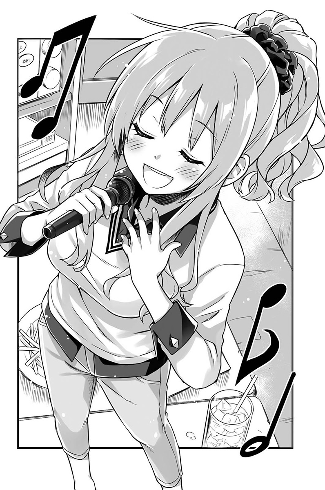

「你现在还会唱民谣吗？」

「会啊，把船～拉～上～岸～……」

她突然开始认真唱起民谣，那音量又让我吓一跳。

不过，音准还是一样跑掉了。

「我其实也可以继续唱下去的。可是唱到一半奶奶说『你可以多唱一点其他的歌』，所以我就没再唱了。」

奶奶讲话的方式太感人。

「你喜欢唱歌吗？」

她一听便用力点点头。

「嗯，很喜欢。所以才会像这样三不五时来唱卡拉OK……但因为老是自己一个人来实在太孤单了，就忍不住找你一起。」

奈奈子不好意思地这么说着。

「……我唱得很难听吧。」

又突然接着自己点出问题。

「呃？啊，也不是……」

事情突然发展太快，我不禁慌了手脚。

「很糟糕对吧，从以前就因为爱唱歌而一直在练习，但就是走音这点调整不过来……」

原来她自己也有发现啊……

这反而让想替她掩饰的我羞愧了起来。

「如果只有我自己唱，也不知道到底要修正哪里，所以偶尔就会想要别人来帮我听……」

奈奈子抱歉地瞄了我一眼。

「……所以，我想拜托恭也一件事。」

「拜托？」

「虽然想要修正唱不好的地方，但因为我这个样子，使得越来越少朋友愿意陪我一起来。」

尽管这么说，对奈奈子很抱歉，但是感觉继续听下去，的确连自己的音准都要失控了。

「所以我很希望你能像这样陪我来唱歌，就算是偶尔也没关系……可以吗？」

唔……

我顿时为之语塞。

虽然说奈奈子人很好，聊天也很开心，可是像这样一直陪她来唱歌，也是满累的一件事。

但话说回来，这时候拒绝人家好像也很没道义。

「嗯，好啊。如果你觉得可以，我没问题。」

「真的？太棒了～那之后打完工就再拜托你啰！」

奈奈子好像真的很开心，只见她高兴地用力拍着我的肩膀。

「嗯——今天也唱得很尽兴……」

离开卡拉OK出来到外面，背对明亮天空的奈奈子伸伸懒腰。

我则不停地在脑海里，进行着将刚刚听到那些走音的歌曲，转换成正确音准的作业。

（现在终于知道，为什么奈奈子的朋友后来都不愿意陪她来唱歌了……）

这果然会影响到自己的唱歌方式，我想应该是会吧。

「今天多谢啰，恭也。」

「咦？不会，没什么。」

「我总觉得啊，在恭也面前唱歌很放松。要说是不会紧张嘛，好像比较接近可以自然唱出来的感觉……」

姑且不论音准的问题，奈奈子的确看起来唱得很自在。

「我继续努力的话一定会进步的，在那之前就拜托忍耐一下，好吗？」

对方都这样请求了，我还能怎么样。

其他部分倒是都满好的，如果再加上良好的音准，真不知道会到什么程度。就当作牺牲我微弱的歌唱力，来提升奈奈子的歌唱实力吧。

「啊，对了。」

我想到一个方法。

奈奈子的愿望是希望有人听她的歌声，她渴望着进步。

而正因为我知道未来的趋势，所以才能给她适当的建议，不是吗？

「如果奈奈子开始对唱歌有自信了的话，就录音上传到网路吧。」

「上传到网路……？」

奈奈子表情惊讶地问着。

「对，上传到像是YouTube或一些影音网站，就可以让其他人听……」

我一解释，就看到奈奈子的脸色顿时唰地变得惨白。

「不、不不行不行不行，这种事当然不行啊！就已经唱得这么差了，要是放到网路上，一定会被批得很惨的啊！恭也，你是怎样？就这么想让我伤心吗？」

「不，不是这样，我是说进步之后啊。」

「我才不要呢！YouTube是全世界的人都看得到耶，要是把自己唱的歌放上去，根本赤裸裸显示自己的爱现，这绝对会很尴尬！」

……对喔，十年前的时代风气还是这样。

「那这样好了，如果出现只有日本才有的影音频道，可以更轻易地将自己唱的歌上传的话，到时候要不要来试试看？」

「只有日本才有……？但现在没有这种东西吧？」

嗯，不过大概今年年底或明年就会出现了。

「我只是假设。如果有的话，就抱着轻松一点的心情试试看吧。用一种『试唱看看』的感觉来做。」

「试……试唱看看啊……」

虽然奈奈子对于我的提议，露出一脸的不情愿，不过——

「嗯，如果是像这样的话……我可以考虑看看。」

「好，那就决定了！就把这当作目标，努力练习吧！」

「等一下，你不要擅自决定啦！！」

奈奈子生气地反驳着。

不过从她的表情和说法，感觉并不是真的讨厌。

如果在别人面前唱歌不是难事的话，那么也一定会有想让更多人听见自己歌声的欲望。

在不久的将来，niconico动画出现，影片和声音档放上网路的难度减低之后……

就算是奈奈子的歌声，也应该会有更多人想听的，然后透过累积经验，歌说不定就会唱得越来越好。

到时候奈奈子的想法，也一定会有巨大的转变。

◇

不是只有映像学科比较特别，应该说整个艺大的课程与其他一般大学截然不同。

首先是通识课程。

很多大学都把第二外语列为必修，但大艺除了部分学科之外，并没有这样的规定，学生也不用非得修历史或文学不可。而课程本身限制宽松，有些没有考试，仅采计出席分数，或是以给学分为前提。

这样的环境对于到高中都不擅长念书的「一般」学生来说，简直就像天国一样。

「本来日语已经讲得不怎么样了，要是再多学个外文，可能会更痛苦～所以我才想要来这间大学咩！」

这是某个女孩子的发言，为了维护本人的名誉，名字我就不说了。

可是——

一旦换成专业科目，果然就会被满满的专业知识用力攻击。

「摄影机有很多种类，以底片来说就有八毫米、十六毫米、三十五毫米、七十毫米。摄录机则有八毫米、S-VHS、Beta、VHS、BETACAM、U-Matic、DV，最近又新增加了HDV的规格。」

「当需要用好几个画面去呈现一个场景时，在摄影机与被摄体的关系当中，就有一条不可跨越的界线。这条线就称之为假想线。」

「拍摄玻璃或水面的时候所产生的反射，就要使用偏光镜来消除，但这时候可别忘了我们还有二•五的滤镜，所以要调整曝光到二或二分之一。」

终于到前一阵子，原本应该还在学文法和二次方程式的学生们，开始认真上起了这样的课程。

老实说，我一头雾水。

拿着从英语直接音译过来的难懂手册，还有列出满满数值与表格的教材，马上就让刚入学的一年级生，吃了一记强烈的文化冲击。

……为什么摄影机是采英式发音的Camera，而不是常听到的Kamera呢？

今天是映像相关科目中，最重要的剧本课上课的日子。

「那么，我们就开始这堂剧本创作理论课。」

满头白发加上太阳眼镜，隐约散发着压迫感的老教授站在讲台上。

本来我对他一无所知，但是去谷歌搜寻了名字之后，发现是资深日本电影导演，而且是屡屡获奖的人物。

而事实上，跟上次一样坐在我前面，对电影知之甚详的女孩子——河濑川什么的，就是正用闪闪发亮的眼神紧盯着讲台上的老爷爷。

（看来是很厉害的人吧……）

尽管是已年过七十的姿态，依然口条流畅并神采奕奕地不停写着板书，那副模样实在充满气魄。

（而我这边的话，也是啦，要说厉害是也满厉害的。）

另一方面，坐我旁边的那个人——

「速～～～～嗯～～～～吼～～～～嘎～～」

有一位视线凶狠的学生，才开始上课五分钟就睡着了。

「贯之，你这样会被骂，不要打呼啦。」

我看不下去，连忙出手摇醒他。

「嗯……？已经下课了？」

「你睡昏头了啦你，才刚要开始耶。」

「喔……这样啊。」

从右到左，贯之的目光迅速地扫过黑板上的字。

「嗯，那等一下再说。」

话一说完头又低垂下来，比刚才稍稍克制一点的鼻息声再度响起。

「我不管你了喔……真是的。」

我叹了一口气，同时把视线移回黑板的方向。

昨天深夜，贯之突然来我房间。

「我找到一份很厉害的打工喔，总之钱多得吓人，真好。」

他眨着闪闪发亮的眼睛，一直要拉我去做那个打工。

「就是眼药水的药物实验，做一个礼拜就三十万日圆喔，三十万！是写真学科的学长介绍我去的。」

药物实验，眼药水，超乎常理的报酬，学长介绍。根本是可怕条件达满贯八千点的打工。

「你不要做啦，那种打工绝对不好的啊。」

「没问题，就跟你说了很安全！而且也会签契约！」

「让我看一下契约。」

从贯之手上拿过契约，看了一下。

开宗明义就写着类似『无论发生什么都无异议』的语句，光看就觉得头痛。

「总之，我还是先不要好了。」

「干么这样啦，真无聊。那我就自己一个人去喔。」

贯之说完后就这样离开，再回来的时候已经早上了。所以当然会想睡觉了。

「我回来了。」

毫不掩饰困意的贯之，带着一脸不满的表情，将事情从头到尾告诉正在吃早餐的我们。

听他说是一去到集合地点，发现打工人员已经十分足够，多出来的人便临时被那个派遣公司带去做些简单的搬运工作。

那份工作似乎是相当常见的黑心打工，要人家不停搬重物的结果是只给七千五百日圆。

「总之我要来睡觉了。」

「你在说什么，九点开始有必修课耶。」

「那我就去课堂上睡。」

虽然庆幸贯之保住眼睛，但代价是累积出肉体的疲惫，这样让他根本很难去上第一节课。

（不过，还好也只有板书而已，之后再讲给他听就好了吧。）

看来这位老先生的教课方式，就是一直写一直讲，我们一直记就对了。

「好，接着我来说说写剧本时的必备要素。」

老先生一个劲儿地在黑板上写着单字。

号称『剧本十大要件』的这些内容，条列着写电影与电视剧剧本时的必备要素。

『发展』、『宿命』、『宝物』、『决心』、『感动』、『高潮』、『落幕』、『主题』。

一口气写完前述这些之后，老师开始一个个解说起来。

「所谓的发展就如同字面上的意思，情节会怎么样发展，就会带动场景有所转变。」

老师一边举出现实中的作品和场景，一边解释哪幕与他所讲的东西有关。

不过可惜的是我一概听不懂，但前面津津乐道的学生们不时发出「原来……」之类的理解回应。

「那么，在此想要请各位思考一件事。」

突然间，老师停下说明并环视大家的脸孔。

「我刚刚只有举出八个要件，但明明说有十大要件，各位不觉得奇怪吗？」

所以接下来就是要……

「剩下的两个要件，有谁可以回答？」

呜哇，不会吧。

（完全想不出来……会是什么啊？）

就算老师说是必备要素，但我对于剧本的技术用语只知道起承转合那些之类，刚所提到的十大要件当然也是第一次听到。

「有没有人——」

「我！」

在老师点名之前，一只手毫不犹豫咻地举起。

「不错喔，很积极。你是……」

长卷发美少女站起来说道：

「我是河濑川英子。其中一个没写到的要件，是『乱流』对吗？」

她继续说明。

「所谓的乱流，就是意想不到的发展，或是显示出男女主角的失败。不管是再完美的人，如果没有缺点和失败的话就不有趣了。因此要在故事情节中展现这一面，并使角色们克服以成就一出戏剧，这就是我的想法。」

就在教室瞬间陷入静默之时。

「答对了，无可挑剔。」

老师微微一笑，并于黑板上加写『乱流』这一项。

「哦哦！」教室内充斥着这样的赞叹声。

（好厉害喔……竟然说中了。）

我回想起说明会上，她那滔滔不绝的自我介绍。

「那剩下的另外一项，你也可以回答吗？」

「另一个我就让给其他人作答。都由我独占也不太好意思。」

「你还真是有趣，也满坏心眼的。」

「您过奖了。」

听见两人的一来一往，所有学生都笑了。

这样一来，只会让接下来回答的人出糗而已。

不要叫到我……我在内心双手合十祈祷着。

「好，就那位在后面睡觉的同学！你来回答。」

老师的手直直地指了过来。

学生们的目光一口气全看了过来。

「嗯……咦？」

伴随着睡迷糊的语气，贯之抬起了头。

「恭也，怎么了？我怎么觉得好像被叫到了？」

「不是好像，是真的点到你了，你看前面。」

我要贯之看看黑板。

「看来你现在要开始上课了。」

听见老师的话，教室又响起了笑声。

贯之这会儿终于注意到，往自己身上集中的视线。

「这是那个吗？就是点名要我回答的意思？」

他以悠哉的语气说着终于察觉的事情。

「没错，剧本的十大要件还少一个，你现在被点名回答剩下的最后一个。」

「啊，原来是这样。」

贯之轻点着头并注视着黑板。

不管怎么看，都不像回答得出来的状态。

「？」

「我看你是不知道吧？要投降就说……」

贯之并没有让老师半激将似的话语说到最后。

「『敌对角色』。」

贯之突然间不知道说了什么。

「咦？」

「啊，对了，都是统一用两个字是吧，那应该就是『反派』。」

贯之搔了搔头，继续用着懒洋洋的声音说道：

「如同字面所示，就是作品中与主角为敌的东西。不管是人物也好组织也好，心理创伤或精神层面的东西都可以。如果以黑板上那几样来说的话，就是站在抢夺『宝物』立场之类的，这样应该比较好懂吧。我觉得这是很重要的东西，可以让故事直到最后都保持紧张感……觉得怎么样？」

大家听到贯之的话都呆住了。

「……这样的发展就是叫做『乱流』啊，干得好，你答对了。」

这时，老师一个人用力地点点头。

「好喔。」

贯之一坐下来就没再说什么，继续开始钓鱼。

（……贯之到底是什么来头啊？）

我重新端详着有着凶恶眼神的友人。

虽然说的确有不知其底细的地方，但突然间被点名就能准确说中剧本要素，而且还摆出一副「这没什么大不了」的模样，很明显就不是等闲之辈。

（这家伙也是「白金世代」的其中一人吗……该不会是吧……）

就像是志野亚贵让我感觉到她将会有惊人的未来，这名大无畏睡倒课堂上的男子，也让我有相同的感觉。

「那家伙到底是怎么一回事，明明就一直在睡觉，太不可思议了……」

然后，还有另外一个人。

被夺走这整场主角宝座的河濑川英子，正以愤恨的目光看着贯之，就跟新生说明会上看着志野亚贵的眼神一样。

（这孩子异常的竞争心态……真不知是怎么一回事，伤脑筋。）

◇

「就跟你说这没什么啊，只是刚好以前有读过，照书上看到的说出来而已。」

贯之手捧着猪排丼饭狂吃猛吃，同时一脸烦躁地回答我。

「碰巧剩下的是我记得的，才有办法回答，要是其他的我就没办法，那个真的刚好，刚好啦。」

「话是这么说，那个时间点可以滔滔不绝地说出来，还是很厉害啊。」

见我这么兴奋地说着，奈奈子和志野亚贵也都赞同。

「就是说啊，要是我的话，就算解释给我听，我也想不出任何一个。」

「老师也吓了一跳对咩，没想到这样也可以答对～」

虽然大家不停地称赞，但贯之倒没有特别开心的模样，一口气扫光碗中的食物。

「嗯，那我先去打工了。」

贯之简短地说完后便走出食堂，踩着悠哉的脚步离开。

「……他是不是好像心情不太好？」

明明大家都在称赞，他大可不必这么冷淡的。

「一定是不习惯收到赞美，看他那副样子。」

「是吗？」

「对啊。大概会自己在我们看不到的地方开心，一定是这样。」

奈奈子「嗯——」地伸了个懒腰。

「那我也先告退一下，今天还要上夜班。」

「啊，嗯。」

「慢走。」

我跟志野亚贵一起目送奈奈子离开。

虽然说课业方面表现不突出，但是奈奈子已经交到不少朋友，也开心沉浸在大学生活里的样子。

「大家都很努力捏～我也要好好努力才行啰。」

「唔、嗯。对啊。」

虽然说我点头回应志野亚贵的话。

但我心中，已经将她和贯之划分为同一类。

（反正将来会变成神级插画家，我们层次完全不同。）

眼前伴随着簌簌声开心喝着草莓牛奶的模样，跟前几天鬼气逼人的样子完全连不起来。

因为是来自十年后的世界，所以我认为自己比其他人更具优势，抱持着绝对是比较有利的想法。

但是，明明我至少也曾以专业人士的身份处于娱乐前线，然而所获得的知识却派不上用场。反而只是更加突显出，自己连基础都不懂的窘境。

我不禁开始思考，是不是到头来才能或念书才是比较重要的，更胜于经验。

「唔……」

我低头陷入沉思。

每个人都好厉害，在这当中只有自己是毫无作为的平凡人。

我有办法跟上大家吗？内心的不安无止尽涌现。

「你怎么了咩？」

「咦？」

不知不觉中，志野亚贵直盯着我的脸瞧。

「啊，不，没什么。」

「嗯～那就好。」

志野亚贵微微一笑。

「欸、欸，恭也同学？」

「嗯、嗯？怎样？」

志野亚贵轻轻笑了笑后，随即揪住我衣服的下摆，用力把我拉了过去。

「如果你等等没别的事的话，可不可以陪我一下？」

「嗯？是、是可以啊……」

「那就走吧。」

志野亚贵应该没有想要打工，会是什么事呢？

虽然觉得奇怪，但我还是决定，陪同站起来往前走的志野亚贵过去。

从校舍林立的宽阔道路拐进旁边的小路，回到校门口附近有一栋建筑物，里头都是文化类型社团的社办。

志野亚贵带我来的地方，是学校的社团大楼。

「哦——有很多社团捏，从哪里开始看好呢……」

她开心地说着，并看向一间间深具特色的社办。像这个时期，还有很多社办的门上依旧贴着招募社员的公告。

「果然是艺大，每间都在展现自己的风格。」

光是一块招牌，就有手写的啦、木雕的啦，或者是以染布呈现等等，变化相当丰富。

「都是因为感冒，害我没能参加到社团招生博览会！我要连同没看到的都好好补回来～」

在大艺，一入学就会马上举办社团新生招生博览会。

许多社团会在礼堂的舞台上卖力宣传，有兴趣的新生会在博览会上决定好想去的社团。但如果不幸没能参加的话，就得日后自己到社办大楼参观、选择。

大艺的社团数量可不是开玩笑的多，新生争夺战也一年比一年激烈。那些热烈的表演看的时候是很有趣，但其中也有几个太过偏向个人嗜好，让人莫名其妙的奇怪社团。

显然志野亚贵，不太可能会参加那种。

「啊，恭也同学！」

志野亚贵再次拉了拉我的衣服。

「你看那里！社办里面有铺榻榻米！」

看向她说的那边，原来是在成排社办当中，有间特别奇怪的房间。

从门口窥看这间榻榻米社办，可以看到里头有许多看似有点危险的武器。不仅如此，被立在墙边的榻榻米上头，还刺着几个棒状或菱形的飞镖。

「喔……那是忍术研究会。」

「忍术？」

「据说世界上只有两间学校有忍者社团，而日本就只有大艺这里有。」

记得在招生博览会时，元气郎认为这是值得关注的运动性质社团，并跟我说了这些事情，我也现学现卖地照着说明。

「这样啊……是很稀奇的社团。」

志野亚贵发出赞叹。

仔细一看，在社办前面进行重量训练的学生们也穿着忍者装，实在是很不可思议的画面。

原来元气郎喜欢这种犹如真正从异世界转生的社团啊……

「那——这个人也是忍者吗？」

「哪个？」

志野亚贵指着走廊前方，一名男子正在地上匍匐前进。

他发出奇怪的呻吟，脸上流着涔涔汗水。

不过倒是没有穿忍者装。

「……这应该单纯是倒地不起吧？」

「咦、咦咦咦！？」

两人随即慌慌张张地冲到男子身边。

「那、那个，你没事吧？」

男子穿着皱巴巴的连帽上衣和破到不行的牛仔裤，有一点……不是有一点，是非常狂野的打扮。

一摇他的身体，他便发出「唔、嗯～」的呻吟声。

接着，左看右看地环顾四周。

「……你对自己的体力有信心吗？」

对，他是这样问我的。

「什么？」

「我现在非常累，简单来说，就是没办法靠自己的力量回到社办，所以躺在这里呻吟，我是在想如果你有体力的话，希望你可以帮忙喊声出力并出借肩膀，将眼前这位写真学科五年级生•桐生孝史带到社办。」

这些话非但不是简单来说，甚至是将愿望都具体描述出来了。

「幸好我对体力还有点自信。」

「那就拜托你，我是真的已经动不了了。」

……败给他了。

「志野亚贵，呃……」

「别担心，你不用在意我。毕竟这位小哥看起来也是很辛苦咩。」

虽然参观社团的时间没多久便告终，志野亚贵却仍露出甜甜的笑容。

「不好意思。那就，呃……桐生学长。」

「喔，你愿意帮我吗？」

「对啊。你要去哪一间社办？」

我让学长靠在肩膀上，朝他指示的方向前进。

「抱歉，很重吧。」

「不会，一点也不重。」

坦白说，我丝毫不觉得有重量感。

我知道学长乍看之下很瘦，但没想到实际把他撑起来却是惊人的轻。

「喔，就是这里，麻烦去这里的二楼。」

社团大楼的最边边，还有一栋看起来像是新盖的崭新建筑物。

「这么远的地方也有社团捏。」

志野亚贵一脸稀奇地看着。

从正面入口爬上楼梯，一间没有挂牌子的社办好像就是目的地所在。

「到门口就好吗？」

「不，进去里面……让我在里头的椅子上坐下。」

进入约五坪大的社办，我让桐生学长坐到房间中央的椅子上。

室内到处都是画布，有描绘着色彩缤纷的几何学图样，也有一些实景风景画，作品没有什么一致性。

「哇——好有艺大的气氛。」

志野亚贵似乎已经完全陶醉在那些画作中。

「真的是帮了我一个大忙。多亏有你们，我总算可以回到这里。」

松了口气的桐生学长向我们道谢。

「不客气。那我们就先走啰。」

话说完，就在我们转身准备离开社办的瞬间。

到刚才都还有如烂泥的桐生学长，突然精神抖擞地站了起来。

「捕捉到新社员了——！！！！」

「欸？」

「啊？」

学长一说完那句话，便看到人从社办各个角落冲了出来。

「太好了，干得好啊社长！连续三年被削减社团经费的悲剧也终于……唔唔！」

「今年终于可以不用跟隔壁社团借社员了！那样好悲惨又真的很悲哀啊……」

「这样今年又可以继续撑下去了！啊！还有女孩子耶！好爽！好可爱！」

「你不要说什么好爽啦，这样新生会怕耶！你读哪一科？美术？平面图文？如果是舞台艺术的话，我可以跟你说很多东西喔！」

在一头雾水的我和志野亚贵面前，这些人在高喊三声万岁之后，你一言我一语地开心说着话。

整整过了一分钟左右的时间，我才终于搞清楚。

「我被设计了……」

原来这个状况是他们策画的陷阱。

◇

「我真——的！非常抱歉——！！！」

桐生学长略显夸张地趴在地板上道歉。

旁边那些刚刚一直大声嚷嚷的学长姊们，这会儿也都垂头丧气地缩起身体坐在那里。

「不要这样，你们这么慎重道歉，反而让我觉得可怕。」

桐生学长用力抬起头。

「所以你愿意入社啰！？」

「这是两回事。」

「果然还是不愿意嘛！」

然后头又再次往下重重一落。

刚刚上当之后，我有点大声地提出抗议。

因为觉得这样不合理，而且也觉得再继续下去，会卷入对方强势的步调当中。

话说回来，这个社团的名称似乎叫做美术研究会，简称美研。原本是由非美术类学科的学生所成立，主要由较少接触绘画或设计的学生们，进行跟美术相关的活动。

即便是在大艺，这个社团似乎也是以历史悠久闻名，不过近年来都苦于社员人数减少的问题。现在包括桐生学长在内有五个人，刚好是可以被大学承认为社团的人数，而目前面临着社办要被收回的危机。

「因为啊，非美术类学科的人本来就大多对绘画没有兴趣，而就算是美术类学科的家伙，也都被课业追着跑，平常根本不想看到绘画之类的。在这样的情况下，就都没有人要入社了啊！？」

「这关我什么事啊！」

……不过他说的状况，我的确是可以理解。

如果是普通大学，必然会有一定数量的人对绘画有兴趣。在此前提之下，这种美术类型社团就有其存在的意义。

可是这里是艺大，是课业上需要全心全意绘图，并以此为评价基准的学校。好不容易才有的空闲，自然是会想拿来做别的事情吧。

「拜托你啦！你同时参加其他社团也没关系，只要在学校将社团经费拨下来之前的这段时间入社就好！」

被拜托到这种地步，就连我也不禁有点同情起来。

「唔——怎么办？」

我问身旁一直看着画的志野亚贵。

「嗯，我是也可以入社啦。」

「真、真的！？」

桐生学长抬起头。

「咦？真的要吗？」

「反正学长姊们看起来也不像坏人咩。」

这些前辈们顿时开始沸腾起来。「你听到了吗？她说我们看起来不像坏人」、

「明明我们看起来这么怪」、「这孩子人太好了吧」。没错，我也觉得她人太好了。

「而且，我喜欢看很多不同人画的画。」

「啊……」

原来如此。

我本来觉得非美术类型学科里，对美术有兴趣的学生应该算是稀有种，不过志野亚贵完全就是这类型的人。

「我知道了，那我也加入。」

「真假！？你愿意吗？」

「只、只不过，只是暂时加入喔！之后我可能会换社团！」

「太棒了！」

学长姊们开心地发出比刚刚更大声的欢呼。

「这样好吗……」

望着随即开始准备迎新趴的学长姊们，多少还是会感觉有点不安。

美术研究会的迎新趴，在距离不到一小时后就开始了。

活动会场就在社办大楼的后面山丘上，已经喝得面红耳赤的桐生学长，手里拿着杯子率先开口。

「那么接着，我们就来欢迎桥场恭也和志野亚贵入社吧！」

「干杯！！」

高举杯子，派对正式开始。

「真的是～感谢感谢。这样也保住了我身为社长的面子，没有比这更开心的事情了。」

桐生学长开心得要哭出来似地，但模样根本诡异得让人知道是演技。

「我话先说在前头喔，真的只是暂时的喔？」

「我知道，我知道啦。嗯嗯，我懂我懂。」

这说法毫无可信度，还用力地拍着我的肩膀。

得小心这个人……

「呵呵，恭也同学……干么一脸恐怖的表情咧？喝咩？」

「呃？要喝的话也是喝可乐……喂，志野亚贵，你脸凑太近了。」

心情超好的志野亚贵，从旁边黏了上来。

因为是在极近的距离对我说话，脸颊感受到她的呼吸害我吓了一跳。

即便这么近看也仍像孩童般的肌肤上，一个斑都没有。那纯净夺走了我的注意力。再加上从半开的嘴唇散发出甜美的香气，更是令人……

「……喂，你在喝什么！」

当我察觉到那明显就是酒精的气味时，便从志野亚贵手上抢走杯子。

杯子当中，明显装着不同于开水和乌龙茶的东西。

「拜托，桐生学长！这杯饮料！」

「嗯？」

「嗯什么嗯！你在志野亚贵的杯子里倒了什么啊！」

「开、开水而已啊……」

「有标签上写着纯米大吟酿•八贤的开水吗！喂！」

桐生学长早就已经逃开了。

「这杯饮料不能喝咩？」

「不行。等一下你都要给我乖乖喝水。」

换一杯装了开水的杯子，递给志野亚贵。

「桥场学弟我问你，你是读哪个学科？记得好像是映像？」

刚刚说「好爽」的姊姊走上前来，言行举止很豪迈，服装也很豪迈……不对，是曝露程度莫名地高。

「是、是的，没错……那个，学姊叫什么名字？」

「樋山友梨香，工艺三年级。我是做陶瓷艺术的～」

陶瓷艺术……对喔，这里还有这样的学科。

「那个，我可以问一个问题吗？」

「可以啊，什么问题？」

「所谓的陶瓷艺术就是……就是有转盘在转的那种吗？」

当我终于还是凭着印象问出口时，樋山学姊便一副早就等我问的模样。

「很好很好，果然就是会问到这个。你等我一下喔。」

只见她把杯子一放，迅速地站起身。

「看过来，樋山友梨香要为各位表演空气转盘～！」

话都还没说完，她就像受访者一样双手高举，开始做出眼前仿佛有转盘在动的手势。这时候应该还没有开始空气吉他之类的热潮……？

「嗯～果然像是在这个部分呢～身为创作者会想带入自己的坚持～」

甚至就连受访者回复问题时，那自我感觉良好的模样都表演出来了。

「不错，樋山，很会喔！」

「果然是你的专业！」

的确是很精彩，不过看这样子，难不成她的专业是表演吗？

「音乐学科二年级，杉本三树雄！本人要演唱《橡果滚呀滚》！」

体格壮硕的音乐学科学长站起来如此宣布。

「橡果滚～～～～呀～～～～滚～～～～橡～～～～～～果～～」

一边以美声男高音热唱《橡果滚呀滚》，一边从迎新趴的山丘上滚下斜坡。

「杉本的歌声很赞吧。」

不知道什么时候表演完转盘的樋山学姊，下了如此的评语。

「是很赞。」

「那是可以在音乐会上演出的水准喔。」

「的确是很赞没错。」

我只听到从他滚下去的地方，传来充满震撼力的《橡果滚呀滚》。

是唱得很好，但感觉会让人做恶梦。

周围充斥着喝采和爆笑声。不知不觉间，除了社员以外的人也都自然地凑了过来，怎么想都觉得人数好多。

「我说啊，今年多亏有你们才能再举办迎新趴，太好了，谢谢。」

一位帅得过分的小哥过来跟我搭话。就是刚刚在社办，最后跟我说话的人。

「啊，不会……那个学长怎么称呼？」

「我是柿原将，舞台艺术学科三年级。」

「舞台艺术是在做什么的呢？」

「做什么啊……那不然我示范给你看看好。」

柿原学长跟刚才樋山学姊一样把杯子放下，去到稍远处站好后，用力吸一大口气……突然当场莫名地不停旋转起来，开始转来转去跳舞。

「柿原是读舞蹈课程的。」

樋山学姊以陶醉的眼神，凝视着那像是舞蹈之类的表演。

「这、这样啊。」

动作俐落，明显就跟一般外行人水准不同。

先不论这是否适合在聚会上表演，但他的技术的确让人觉得不同凡响。

「怎么样，桥场！这就是舞台艺术的动……想吐噗！」

原先还在不停来回旋转舞动的柿原学长，声音突然变得怪异。

「啊，柿原已经不行了，今天怎么那么快啊！」

身旁的樋山学姊本来还是陶醉的眼神，忽然间就冷静下来了。

「请、请问，不行是什么意思？」

「你看就知道了，看吧。」

「呕呕呕呕呕呕呕呕呕呕呕呕呕呕呕——」

「呜哇哇哇哇哇哇哇哇！！」

我听她说完后一瞧，柿原学长已经完全变身为边转圈边呕吐的地狱人偶了。

「来了！柿原的拿手好戏旋转呕吐！」

「这个表演没出现，我们美研的聚会就不能开始对吧～」

「那、那个，不用去帮他吗？柿原学长一副快死的样子！」

「没问题没问题，他吐完之后会自己清干净，然后又会继续喝、继续转的。」

「这哪里没问题啊！」

「看起来好有趣捏！我也来旋转看看好了咩～」

「志野亚贵你给我在那边坐好！桐生学长拜托你，就说不要再往她杯子里倒酒了！还有樋山学姊，拜托你不要抱着我啦！」

◇

天色已经昏暗的校园内，到处都有人在聚会喝酒。直到迎新时期结束之前，似乎都会一直是这种状态。

看着手表上的时间已经过午夜十二点，我离开了学校。

「这是什么迎新啊，被欢迎的人根本就很倒楣。」

我背着发出规律鼻息声的志野亚贵，嘴里埋怨着乱来的学长姊们。

走在春天的夜路气温恰到好处，至少舒服的感觉让人好过多了。

不同于校舍方向传来的喧嚣，这条小路无论空气或声音都显得宁静。

「嗯……？奇怪，我睡着了？」

我听见背上传来声音。

「早啊。」

我一回答，背上的生物便把脸埋进我连帽上衣的帽子里。

「唔……头好像还昏昏沉沉地捏……」

「当然啊，你喝了那么多酒就是会这样。」

我苦笑着的同时，回想刚刚志野亚贵的行为。

结果后来，志野亚贵扎扎实实地喝了相当程度的「水」。

就在我紧张不安时，志野亚贵则变成一边傻笑一边正大光明地坐在上位，由男性学长们倒「水」给她的情况。

宅宅系公主这个词，是什么时候开始出现的啊……记得好像也有社团破坏女这个形容词。

「不过学长姊们人都好好，真开心。」

志野亚贵用悠哉的声音说道。

「是啦，人都不坏……应该吧。」

虽然明显都是一些做的事跟讲的话都很怪的人，但倒也不是坏人。

没有人勉强我或志野亚贵喝酒（虽然说桐生学长满怪的），就这方面来说感觉还满规矩的，或者应该说是还满乖的社团。

不过算了，反正也愿意让我同时去参加别的社团，总之加入或许也是有好处。

「恭也同学。」

忽然传来这么一声。

志野亚贵以不同于刚才的清醒语气叫着我。

「你最近有什么困扰的事情吧？」

「咦？」

在意想不到的时间点，而且是被意想不到的人说中心情。

她怎么会察觉呢？

的确，在看过志野亚贵那个模样之后，我思考了很多。不过竟然这么明显吗？连这位志野亚贵都能察觉。

「呵呵～你一脸我怎么知道的表情捏～」

是从回答发现到我的忐忑不安吗？志野亚贵窃窃笑着。

「唔，那你是怎么知道的？」

我小心翼翼地问道。

「你很少讲自己的事情，而且一副成熟的模样，应该是说都只会担心别人，因为你有这一面，所以我就观察了一下咩。」

我心跳稍微漏了一拍。

大概是跟从十年后的世界来到这里也有关系，我看大家的感觉都像是在看小朋友一样。奈奈子是比较有像大人一点，志野亚贵则就像个小孩子。但是我无意将这样的态度表现出来，更从来没有想过会有人察觉。

尽管对方可能是一种直觉，但还是被发现了。

而且还是被我认为像小孩子的志野亚贵。

我内心多少有点不安了。

「是难以启齿的事情吧？」

「呃……也不是这么说。」

「既然这样要不要说说看？说不定我可以理解喔。」

那就恭敬不如从命，我开始娓娓道来。

我提到贯之和周围的人都很厉害（至于看到志野亚贵画画的事情，我还是无法说出口），相较之下，自己什么都不会的心情。

竟然能这么坦率地说出来，就连我自己都很惊讶。

「这样啊……好意外捏。」

「为什么意外？」

「我觉得恭也同学是会很多事情的人，一点都不晓得你也会有这种烦恼咩。」

「很多事情都会？哪有……」

我才意外自己有这样的评价。从志野亚贵的角度看来不一样吗？

「我想想，比如说……贯之早上都起不来！」

「我知道，最近都是我硬把他叫起来拖去学校的。」

「而且什么家事都不会做，只会烧开水。」

「我知道，所以被排除在煮饭轮值之外嘛。」

「老是搞不清楚哪一天该丢什么垃圾。」

「我知道，我偶尔会去拿回来。」

志野亚贵用力点着头。

「这些事情，恭也同学全部都会。」

「呃，嗯……可是这些技能跟艺大的课业都毫无关联耶？」

我终于说出口了。

「……但是生存就是很重要的事情哟。」

志野亚贵在这个时候，做出莫名沉稳的回答。

「什么都不会的人，就会拼命寻找自己会做的事情。所以，我认为那些恭也同觉觉得很厉害的人，一定也是拼命想办法找自己能做的事情。」

我感觉到她的身体瞬间变得滚烫不已。

那热气从相接触的背上，传到整个身体。或许志野亚贵只是随口说出来，但那话语已经在我心中沸腾，动摇着我。

「或许，是吧。」

努力挤出这么一句，脑海里又浮现出那个情景。

志野亚贵那一心不乱坐在萤幕前画图的模样。

如果拥有什么的话，抓住就好了。可是如果什么都没有，那就只能去寻找。

贯之也一定拼命地在寻找着什么吧。

然而现在的我，并没有那么做。

「恭也同学是很能干的孩子捏，就是这样。」

志野亚贵又恢复原本的语气。

听起来就像是在安慰小孩子的口气，害我不禁笑了一下。这样一来，立场可就反了。

「那就感谢……等等，噎？」

随后感觉一道轻柔放在我头上，让我不禁发出惊呼。

「好孩子……」

志野亚贵的手轻柔地抚摸着我的头。

略烫的温暖手掌，包覆似地来回抚着头。

明明应该只有头部才有接触的感觉，但全身却仿佛温暖了起来。

「……志野亚贵。」

双亲在我高中的时候离婚。

由父亲抚养的我，就此没有再见过母亲。

孤单与敏感混杂的情感，志野亚贵就这样温柔地承接了。

我也就自然地——

「谢谢。」

向志野亚贵道谢。

「嗯……」

不晓得是不是听到我的声音感觉放心了，那摸头的手就这样缓缓地垂了下来。

很快地就开始听到背后传来睡着的鼻息声。

我加快回到租屋处的脚步，脸上迎着春风，忽然抬起头望向夜空。

庆祝新生入学的樱花瓣，在风中飞舞着。

「我能做什么呢？」

回到十年前，选择一条跟过去不同的路，来到了艺大。

话虽如此却没有一样会的技能，也不知道自己做什么才好。

然而我却仿佛觉得，似乎已经找到入口了。

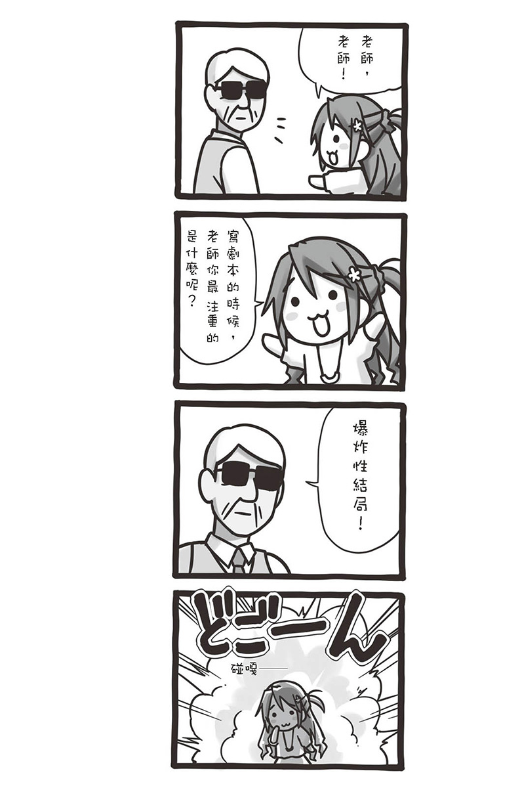

## 第三章
### 有个叫映像学科的地方

大学的课程是每周每周循环，但并不是都在同一个时间点开始。会按照学校方面或是老师方面的情况，其中也有在学期快要结束的四月才开始上课的。

就在我们一年级生好不容易适应大学生活的时候，必修课中唯一还没上课的课程开始了。

「好，大家都到了吧。」

加纳老师站在讲桌前，微笑地环视学生们。

「那么接下来，对你们来说将是首次实战演练的综合实习一开始上课。」

老师以宏亮的声音如此宣布。

「……不晓得会是怎样的课程喔。」

奈奈子有点不安地喃喃说着。

「不过既然说是实习，应该就是让我们做一些东西吧。」

贯之似乎并不特别在意，扭动着脖子发出喀拉喀拉的声响。

「那位老师胸部好大捏～肩膀不会酸痛咩？」

志野亚贵到底在看哪里啊？

「话说回来，奈奈子不会肩膀酸痛咩？」

「你、你突然问这什么问题啊，志野亚贵！」

……志野亚贵，刚刚这问题问得有点漂亮喔。

「加纳老师啊……」

然而在这四人当中，最不安的就是我。

毕竟这位老师，是在入学没多久就让我们梦想和理想破灭的人。

像今天的实习也是，不晓得又会突然说出什么话来。

（……但如果这样就畏缩的话，什么都做不成的！）

我轻拍脸颊打起精神。因为老师同时也是愿意提醒我们，想要拥有成就并没有那么简单的人，就当作是反而更令人期待的事吧。

「所谓的综合实习一这个课程，除了电影、影像的制作之外，主要是要让各位了解最重要的事情。」

老师在黑板上写下『导演』、『技术』、『表演』、『制作』。

「理论有百百种，不过这些是我认为『制作影片所必需的四大架构』。接下来，我将一个一个进行说明。」

老师接着拿起红色粉笔，把导演的部分圈起来。

「首先是导演。这是负责统筹制作的部门。这个部分嘛，我想你们应该都懂。不仅是作品的总负责人，也是任何事情都得站在第一线的角色。无论是赞赏或批判，都会全部集中在这里。而像剧本和副导演的职责，基本上也包含在这里头。」

「接着来讲技术。这个部分包含的内容，像是摄影、灯光和声音等制作影片时不可或缺的技术面。不管少了哪一个，都会对作品产生极大的影响，平常上课只会睡觉的人，之后就会知道痛苦喔？」

「再来是表演，也就是所谓的演员。从分配角色到演技、画面呈现出来的表情和声音、时间的感觉……虽然技术部分也涵括这些，但除此之外还得要深度挖掘人的内心层面不可，光是这点就让这个部分稍微棘手一点。不过当然，能好好投入其中时的喜悦，反而格外别有滋味。」

「接着下来。」

老师开了头之后又打住，然后把最后的『制作』圈了起来。

「这个就是你们最陌生的部分了。如裹面衣般的制作流程……这一块就是负责生产与执行。还有这个，我之前好像也有告诉过你们了……」

老师在『制作』二字底下，写上了『擦屁股』。

「这个部分总之就是集麻烦事于一身。像是做拍摄的准备，明明联络好了演员却没来、工作人员没来，或是来了之后又吵架，接着以为他们和好了，却发现竟开始恋爱，分手之后又互相仇视攻击；或是状况不好无法发挥演技，好不容易终于可以开拍了，想要晴天的画面，乌云却出现然后下雨……总之，只是简单讲一下而已就有这些状况了。」

学生们当中，发出了「哇——」的声音。

没错，做成人电玩游戏的时候也是一样，制作面的工作相当辛苦，进行动画制作的时候也是，总之就是常听人家说很痛苦。

「以上就是针对四大架构所作的说明。那么在我们这堂综合实习一的课程——我希望你们先分好四个人一组，然后各自负责一个架构。」

教室内顿时骚动起来。

「接下来到暑假的这段时间，你们各组要制作出一段三分钟的影片。这就是这堂课的必修课题。」

这回，叽叽喳喳的骚动转为喧闹。

（什么？一下子就要我们做影片吗……）

明明什么专业的知识都还没教我们啊。

「你们想要认识的一组也可以，交给我来分组也可以。十五分钟后，已经分好组的，就推派一个代表来告诉我。那么，现在就先各自解散找组员吧！」

◇

教室里的喧闹声始终未见平息。

有人很快就去找感觉可以当组员的人，也有些人乏人问津，很快就去找老师商量了。

在这当中，我们对于分组这件事毫不费吹灰之力。

「我们恰巧四个人刚刚好。」

贯之安心地呼了口气。

「我好担心被分配到跟一些莫名其妙的家伙一组。」

其实看看周遭，刚好找齐四个人的组别还满少的。大致上都是二、三人的团体，很多都不知道该跟谁分成一组才好。

「有什么意见吗？如果对于我负责导演部分不满的话，那我们现在就来比看谁的知识丰富啊！」

忽然之间，河濑川就跟同组的成员争吵起来。

「……真恐怖。」

「那女生超有干劲的。」

贯之缩了缩脖子，奈奈子则被吓到似地说着。

「因为对电影很有爱的关系吧……啊，那我们也来决定每个人负责的部分吧。」

没错，虽然说分组成员一下子就可以确定了，但要怎么分配工作，目前完全是未知状态。

「我都可以喔。」

贯之很快地就把自己的选项说出来。

「我也……都可以。」

接着奈奈子也说了。

「等等！我不要那个，就是演员以外都可以！唯独演员我没办法！」

「咦？为什么咧？奈奈子，之前上课的时候，你明明表现得还不错捏。」

志野亚贵不可思议地发问。

「我就说不要了嘛。上次那个其实真的很尴尬耶！」

前阵子我们上了演技演出理论课。

就是透过亲自实际表演，以了解演员的心理层面与表现方式，是还满有趣的课程，而奈奈子在该课堂上，呈现出了让老师赞不绝口的演技。

当时要表演的场景是这样子的。

场地中有个半圆形的舞台，人要在舞台上一边找找看有没有人在，一边从圆形的中心点往外侧走去。

因为只有要求一边讲拿到的台词一边走路，大家也没有多作设计，就只是直直走过去，或是没有分配好台词，到最后才一次讲完等等，都没有比较亮眼的表现。

但是在这当中，唯独奈奈子一个人充分使用了整个半圆形舞台，并且也出色地统整了台词。

其他学生纷纷发出惊叹，各位熟悉的那位河濑川也表现得不错，却完全被奈奈子比下去，一如往例地悔恨收场。

话说回来，当事者本人呢……

「不，那个……我国高中的时候都是在话剧社，而且因为以前唱民谣，也很习惯开口了，就是，呃……」

发表感想时从头到尾都非常害羞，截然不同于她那大方的演技。

……不过啊，幸好没有需要认真唱歌的场景。总而言之，受到大家赞美她也是满高兴的，这也是不争的事实。

「我也觉得奈奈子适合担任演员……对吧，贯之？」

「是啊，我也赞成……在哪里？究竟在哪里？出来，到底在哪里啊？拜托你，赶快现身、咕噢！」

就在贯之模仿奈奈子演戏的瞬间，心窝吃了对方手肘一记。

「你很烦耶！我是不会答应的喔！」

奈奈子把头扭向一旁，感觉糗到极点一样。

伤脑筋，还多事地揶揄人家，贯之也真是的……

「不过，那个表演真的很好。听到的时候也吓一跳，我觉得奈奈子是最适合负责演员的人选。」

我坦率地说出想法。

「唔……唔唔……不要逼我……」

奈奈子已经面红耳赤却仍试图抵抗，虽然说认识的时间还不长，但至少知道她不讨厌被人夸奖。

「那不然就当作先暂时这样……好吗？」

「好……好吧，是暂时，暂时喔！」

虽然她不高兴地嘟着嘴巴，但这件事总算定下来了。

「那，我就负责技术部分吧。」

志野亚贵也跟着说出意愿。

「人家一直好想玩玩看摄影机和灯光之类的捏～」

「这样啊，那就志野亚贵负责技术部分吧。」

以我个人来说，我也想知道志野亚贵会画出怎样的分镜图。

而且专业技术类的职务，感觉也很适合志野亚贵的特质。

「好的，那剩下的怎么分配？」

贯之朝我丢出问题。

「我希望贯之可以当导演……还有写剧本。」

我提出自己想到的建议。

「我吗？」

「对啊，课业上的知识也很充足，想说应该很适合。」

像是之前上课也一样，贯之在各种情况下公开展现过他对剧本的了解。

不过本人是不会把自己拿手的事情讲出口的类型，这点比奈奈子还严重。

「我是觉得那没什么啦？」

「我认为你很厉害。所以可以吗？」

「这个嘛，嗯……好，我知道了。不过撇开导演的部分不说，我对剪接或统筹之类的事情一窍不通，这部分由恭也来处理如何？」

统筹啊……

不过，毕竟最重要的还是贯之的剧本，其他那些就变成是由我来处理的形式，应该是可以吧？

「如果这样你就愿意接下的话，那我没问题。」

「好，那就都决定好了。嗯，总比负责制作要来得好……」

虽然贯之是有条件的答应，但也仍是接受了。

「呵呵，怎么想都觉得没有生活能力的贯之，无法处理制作方面的工作对吧？」

奈奈子打从鼻子哼笑地说道，贯之随即站起来。

「『在哪里？究竟在哪里？出来，到底在哪里啊？』」

「你要是再讲这个，我就连演员都不当了喔！！」

「你自己也没有像你说的那么会做家事啊！」

「好期待奈奈子的表演捏～」

在大家吵吵闹闹的时候，我坦然地接下自己的任务，却在这当中涌上异样的感觉。

制作。回想起来，在从事成人电玩游戏产业时，我也是担任类似这样的角色。

不过，或许没有什么拿手专长的我，最适合这样的定位也说不定。

「我是北山团队的代表，桥场恭也。」

因为已经分好组，便由我代表去加纳老师的研究室报告。

「北山」这个组名，是因为我们也没有想到比较特别的名称，所以就决定干脆拿共享住宅的住处名来用。

老师迅速地翻阅着申请书。

「你是负责制作？」

老师问道。

「是的，由我负责。」

「这样啊，那这样应该会有很多苦差事喔。」

「嗯，是还好……毕竟我也没有其他适合的职位。」

导演是贯之，技术是志野亚贵，演员则是奈奈子。

看看这样的决定，我认为是非常适当的分配。

「桥场你是用消去法……在每个人都分配好位置之后，才当剩下的制作吗？」

老师直直地看着我。

「对……不、不过，所谓的制作不就是这样吗？」

由什么都不会的人来担任这样的角色，这无论哪个行业都是同样的情况吧。

就算是成人电玩游戏也一样，不会画画不会写文章的人，担任总监或制作人算是常态。

所以本来也无意说那句莫名的话……

「好吧。那在下下礼拜上课之前把企划书交过来。」

「企划书吗？」

「对，想要拍什么样的作品，想要在哪里拍摄……细节都要写在企划书里面。」

老师交给我一叠讲义。

「桥场，制作这个角色可不是消去法喔。」

「咦？」

「你做了就知道。总之，加油吧。」

老师说完后轻轻挥了挥手，要我离开研究室。

（那是什么意思呢……）

老师不也在上课的时候，说制作就是擦屁股的角色吗？其功能就是收集所有引爆争议的事情，想办法以某种形式带过。

这就是离所谓的「创作」最遥远的一个位置，不是吗……

「唉呀！」

就在我一边思考着一边打开门来到走廊的同时，正好跟准备进入对面房间的河濑川撞个正着。

「对、对不起。」

我连忙道歉，河濑川也没特别在意的样子，只是一直盯着我。

「……桥场恭也。」

「咦？」

……奇怪？为什么知道我的名字？

不可思议地想问她的时候，河濑川开口这么说了。

「你那组全是一些讨人厌的家伙呢。」

「……嗯、咦？」

也太突然了吧。

河濑川将我逼到墙边，继续以攻击性的语气发言。

「不知道为什么要来读映像的志野亚贵！上课只会睡觉，回答却屡中红心的鹿苑寺贯之！还有一副轻浮样，却展现过人演技的小暮奈奈子！」

……好厉害。她牢牢记住了所有成员的全名和特色。

这女孩子到底是什么样的人啊？

「然后，还有毫无存在感的桥场恭也！」

「什么？就只有我一个人是这种评价？」

看来身处个性派集团当中，我是以多余的形象被记住的。

「呃，那个……所以你到底想说什么？」

好不容易才能回问她问题，河濑川如此回答：

「……我不会输的。」

「你说什么？」

「唯独像你们这些人，我是绝对不会输的。从一开始到最后，我会一直跑在最前面的。」

她用力地瞪着我。

「电影，是不容小觑的对吧。」

撂完要说的话，河濑川就走进了研究室。

但是——

「咦？」

当我还在疑惑怎么不到五秒的时间又走出来时，她突然靠近我。

「你、你……擅长机器方面的东西吗？」

「啊、呃？」

「会用手机吗？」

「这个嘛，算是还可……」

我话都还没说完，她突然把自己的手机递到我面前。

「这、这个，我、我想看刚刚寄来的简讯，可是不知道该怎么看……」

然后用柔弱的声音寻问，跟刚刚的气势截然不同。

「……好，我看一下。」

总之我就先接了过来，检查起她的手机。

「你这手机里面，不要说刚刚寄来的了，根本超多未读的耶！」

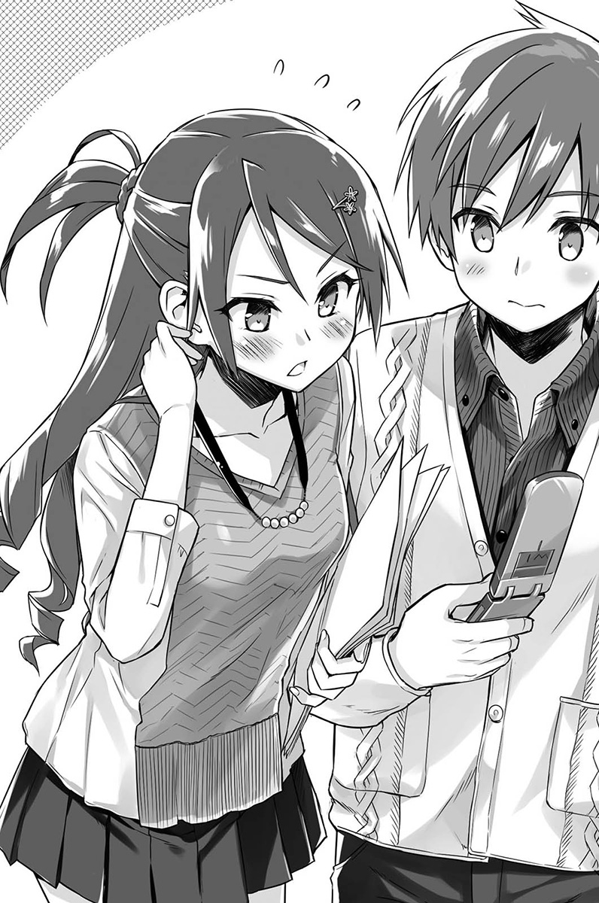

我仔细一看，未读的简讯件数已经多到无法显示完全了。

「因为从我开始用就都没打开过……」

「不是啊，这样还会造成生活上的困扰。」

「不会啦，反正只有我爸或我姊会传而已。」

自暴自弃地说完后。

「你念一下最新的那封。」

「我？可是看别人手机里的简讯总是不太好吧。」

「没关系啦！反正也没有什么不能讲的秘密。」

拿她没办法，我只好照做地打开讯息。

「上面是写『看讯息。还有电话也都要接　MISA』，这样可以了吗？」

「明明马上就会见到面的，还真是啰嗦……嗯，我知道了。」

见她手伸了过来，我便将手机还给她。

「……谢谢，耽误了你的时间不好意思。」

坦率地道谢和道歉后，也规矩地低头致意。

「啊，不客气。要不要我教你怎么看讯息？」

「不用了，反正平常我也不太会看。」

果断拒绝后，河濑川再次打开研究室的门，走入里头。

「……这到底是？真奇怪。」

几乎是第一次打照面就突然露出一副挑衅的态度，不知道到底是怎样。然后没多久，又突然拿自己的手机要人家读简讯，而且意外地有礼貌。

「真是莫名其妙啊……不过算了，感觉也不是个坏孩子。」

无论如何，在我心里「河濑川英子」这个名字和那强烈的个性，再次深深刻画在我脑海里了。

◇

登记好组别，我们姑且先到总是空荡荡的第二食堂，简称二食的地方会合，准备一起想企划案要怎么写。

「然后，这些是相关讲义。」

我拿出加纳老师给的资料。

「参考这里写的题目，写下长约三分钟影像作品的企划案，这就是综合实习一的功课。」

贯之看了看讲义的封面。

「主题是『时间』。所以是要能在三分钟内，表现出时间流动感的作品——吗？」

「欸？就这样吗？」

奈奈子惊讶地凑近讲义细看。

「嗯，除此之外什么都没写。其他就只剩下注意事项和借器材之类的事情而已。」

「虽然说什么内容都可以，但反而有种不知道该做什么才好的感觉……」

「这题目感觉很困难捏。」

四个人一起对着讲义陷入沉思。

「简单讲是时间，不过也不知道这是指怎样的时间……对吧？」

贯之注视着时钟说道。

「是早上？还是中午？或是晚上？而且也没有提到是多久的时间。」

奈奈子看着食堂外的猫咪。

「而且到底是不是指人类的时间也不知道，也有可能是动物的啦、昆虫的啦，或者也有可能根本不是生物。」

「原来如此，还有像是建筑物或工具等等所度过的时间。」

「老旧工具的历史或背后故事，感觉也可以做捏，嗯。」

讨论了一阵子后，四名成员一齐同声叹息。

「但是，只有三分钟的表现时间。」

「真的是只有捏……」

没错，「时间的流动」说长可长，但影片规定的时间却是惊人的短。

「这个作业还满故意的。」

贯之皱起眉头沉吟道。

「提到时间的流动就会需要长一点的表现，可是规定的时间却很短……」

我们试着寻找讲义上有没有漏看的资讯。

然而，不管怎么看就只有刚刚那些语句而已。

「我知道了！如果用快转呈现，你们觉得怎么样？」

奈奈子一脸想到好主意的表情。

「这样的话就可以塞很多内容，配上音乐，感觉可以轻松地完成……」

「话是这么说没错，可是看着不停变动的画面，要说有『时间流动』的感觉，也是有点微妙吧？不过，是可以感受到流动的速度感也说不定。」

贯之似乎不太赞成。

「这、这种事，不做做看也不晓得吧？」

不知道奈奈子是否因为提议被否定而不太服气，只见她如此出言反驳。

但话说回来，由于看起来也没有能够加以反驳的理由，她似乎也无意再继续推这个提议。

「所以才是作业咩……」

听见志野亚贵以伤脑筋的笑容喃喃说出的这句话，众人全都只能不甘不愿地点点头。

◇

大艺只有一年级生有必修体育课。

一开始觉得都大学了还要上体育课，不过因为也很少有机会活动身体，所以意外地还满期待的。

更不要说在烦恼困难课业的时候，还可以作为转换心情的管道。

「一定就是要让我们伤脑筋，才会出这种作业的。」

贯之投出了曲线悠缓的球，进到我的手套里。

这天体育课的项目是棒球。

贯之和我在等待轮到自己上场打击的空档，互相传接球以消磨时间。

「果然真的是会这样吗？」

我投出的球则稍微有点往右偏。

贯之伸长手轻轻松松地接住，他的运动神经或许意外地好也说不定。

「我想是吧？因为我们进艺大根本还不到一个月啊，脑袋才刚塞进一些齿孔啦、蒙太奇啦等莫名其妙的名词，就突然含糊不明地要求我们拍摄影片，不是故意找麻烦是什么？」

可能是因为有点烦躁，贯之接着投出的球稍微强劲了一点。

「再加上题目这么大，实在很难聚焦。」

「没错，她就是等着看焦头烂额的我们做出乱七八糟的东西，然后再丢出残酷的批评。真是个挫挫学生锐气的好方法。」

脑中浮现出加纳老师那一脸虐待狂的笑容。

没错，感觉她喜欢使力让对方屈服。

「企划书该怎么办？」

「继续想到明天，如果还是没有点子的话，奈奈子提的做法好像也不错吧？这主意是那家伙想的，一定要让她从背小学生书包，演到画特殊妆、拄拐杖的老太婆。」

「感觉她死也不肯。」

老太婆就算了，要演小学生未免太勉强了吧。

「喂，鹿苑寺，换你打击了。」

担任裁判的学生叫贯之上场。

一看才发现，比赛为了等贯之而中断。

「好，抱歉，我马上过去。」

贯之如此回应。

「反正，就随便做一做吧，只要有拍些东西，应该就会让我们过关吧。」

他转动着手腕，走向打击区。

而我则是反复地将球抛向空中，再用手套接住。

◇

时间。

对我来说，还真是讽刺的题目。

时光倒流回到十年前，重新当起大学生的我，正处在不可思议的时间当中。话虽如此，我却无法理解其中的秘密。反而因为突然被丢来这里，我比谁都还要混乱。

「这种事……哪有可会知道呢……」

我自己都还希望能得到一些答案呢。

「流动、流动，嗯——地点、登场人物、情境……咳噗！」

背上突然被用力一拍，害我猛地咳了起来。

「哟，桥场！怎么啦？干么一脸苦恼的样子！」

转过头，就看到体格莫名魁梧的一名忍者站在那里。

「啊，是你，火川喔！」

「厉害，明明蒙着脸还是一下子就看出来耶！」

是学号跟我差一号的火川元气郎。

「话说，你干么穿成这样？」

「奇怪？我没有跟你说过吗？我加入忍术研究会了啊。」

「喔喔，那个社团啊。」

在跟志野亚贵一起加入美研之前，我们看到插着飞镖的榻榻米，顿时留下深刻印象的那个社团。

我也将招生博览会上获知的知识，一五一十地传达给了志野亚贵。

「学长有指示，一旦成为忍者之后，在校内行动要随时穿着忍者装！嘎哈哈。」

大概是已经习惯被问了，在我还没开口之前，他就自己先将平常就是穿这样的事情告诉我。

「话说，你是怎样了？难道是突然被甩了吗？」

「不是啦，但是这也太快了吧？我们才刚开学一个月耶。」

「我已经跟女忍者学姊告白过，也被甩过一次了耶！」

「太快了吧！」

没想到火川还满积极的……

「啊算了啦，不说这个了，你现在有空吗？」

火川突然确认起我待会儿的行程。

好像已经不在乎让我一脸苦恼的原因了。

「现在到我晚上打工之前是还有点时间……要干么？」

「这样啊，那拜托帮我两个小时！」

「咦……？欸，你不要拉我的手啦，喂！」

火川一边嘎哈哈哈地笑着，一边拉着我的手从容自在地往前走。

他那副样子与其说是忍者，怎么看都只像是变装的半兽人还是赤鬼之类的。

◇

「一！」

啪叽——！

「哇！」

从大艺过来约走了二十分钟左右，来到一条颇具规模，名为石川的大河。

「二！」

啪叽————！

「三！」

「咕噢！」

这边有河床，很多学生会在这里打棒球、放烟火或是烤肉，非常适合作为快乐学生生活舞台的一个地方。

然而现在，却化为汗水、大吼和尖叫声混杂交错的地狱。

咚嘎————！

「呀——！」

在第三次的攻击来临时，我下意识地往后踉跄了几步。

「喂，怎么了！这种程度就投降，那要是被霍克森踢一脚，可就必死无疑了喔！」

如果是被巴西柔术大师霍克森·德雷西踢上一脚，不管怎么锻炼都必死无疑的。

「等、等一下，我要休息、休息！」

我无法再承受地放下训练手靶，当场瘫坐下来。

「喔，这样啊，那就休息十分钟吧！」

火川从带来的冰桶当中，拿出一罐冰冻的运动饮料扔了过来。

「来，接着。」

「喔喔，感谢。」

在喝之前，我先把还有着薄薄结冰的饮料贴在手臂上吸热降温。

「得另外再回礼，谢谢你陪我练习才行！」

火川说完，又嘎哈哈地爽朗大笑起来。

在忍术研究会应该也有活动身体才对，个人自主练习还做到这种地步，到底是多有活力啊……

「你一直做这样的练习吗？」

「对啊，不过这跟忍者没有关系，是从以前就有的习惯了。」

我陪火川做的，是空手道的练习。

他几乎每天都会做踢腿练习，虽然是踢在双手绑着的手靶上，但这样一做下来就会发现，手承受的力道还真不是盖的。

「抱歉，这种程度实在不可能拜托女生帮忙。」

这也是想当然的。

如果是有在训练的人就算了，一般女孩子很有可能连手靶一起被踢飞的。

「你从什么时候开始练的？」

虽然不太清楚明确状况，不过我认为火川实在强得不得了。

如果没有扎实的练习，是不可能有这样的程度。

「应该是从幼稚园吧。」

「什么？这么小就开始……？」

真没想到会是如此出乎意料的答案。

「我老爸也是练空手道的，所以我哥、我姊大家就都有在练，当然不可能只有我选择不练啰。」

如果是这样的环境，那也就可以理解。

「不过既然这样的话，怎么不进有空手道实力坚强的大学……？」

「对啊，也有人跟我说过，可以透过推荐进近机大学或大商大的。」

「那你为什么要来念艺大？而且还参加忍术研究会？」

火川这时沉默了一会儿。

「也不是，就感觉……那样很无趣。」

「嗯？」

火川搔搔头。

「不是啊，我家所有人全都练空手道，所有人都是透过体育推荐上大学的，所以聊天的话题，也都只有练习怎么样、某某选手好厉害之类的。这种情况，很让人喘不过气来吧？」

「嗯，这么说应该是吧……」

如果是我的话，应该忍耐不了一个礼拜。

「我虽然也喜欢空手道，但是也喜欢动画和电玩，所以想将这经验活用在拍摄动作类型电影。于是心一横来考大艺，而因为考上了就来念，那反正机会难得也就当个忍者！」

这样啊……

火川竟然也有这样的经历。

「原来如此，希望你哪天可以真的拍出那样的电影。」

「好！到时候桥场也要来帮我！」

如果照着情势走，他一定会因为空手道这个能力上大学吧。

那样的人生是好是坏，不是人们可以自己决定的，然而火川在高中生的时候，就对是否该照着走这点感到疑惑，于是选择了别条道路。

一想到我后悔自己毫不在意、凭感觉所选择的人生路，结果就像这样回到十年前，就不禁觉得火川的意志力是多么地坚定啊。

在这副筋肉组成的身躯之中，也是曾有过迷惘和纠结呢。他在课堂上出乎意料地认真，社团方面或交友也广阔，不仅仅只是在享受青春而已。

「可是，明明这也是可以拜托忍术研究会的成员帮忙。」

这样一来，还能有个比我更适合的练习对象。

「嗯，那样是也可以，但因为也有段时间没跟你聊天了……其实我真正的想法是，这样就可以聊聊兴趣的东西，像是动画、电玩或是棒球之类！」

「这些事情随时都可以找我聊……如果你想来的话，也可以来我住的地方没关系喔。」

「啊，不，这个就……有一点那个……因为你住的地方不是有女孩子吗？」

「是啊，不好吗？」

「呃……就是那个啊，你不会玩成人电子游戏之类的吗？」

「喔……咦咦？」

这话题太令人错愕，害我的回答一时之间梗在喉咙。原来如此，像那种完全崭露喜好的内容，要在租屋处进行或许是有点难。如果有朋友来玩的话，奈奈子和志野亚贵就会理所当然地加入一起吧。就连贯之也是，虽然会碎碎念，但还是会凑过来。

这样的情况，更别提要玩成人游戏了。

先不说我会不会打，至少我毕竟是在这产业工作过的人。虽然又爱又恨，但我的确是喜欢的。但话虽如此，这实在无法坦率说出口。

「会、会啊……不常就是了。」

我一这么回答。

「喔喔，这样啊！」

火川开心地如此回应，然后握住我的手用力上下摇晃。

不过，喜欢忍者又喜欢成人游戏的人，绝对也有在玩「唔！杀了我吧！」这种类型的。

有点可怜起他去告白又被甩的女忍者学姊。

「怎么样，你喜欢叶键的游戏吗？还是凌辱系的？」

突然就来了颗直球啊！

「我啊……」

准备回答的瞬间却为之语塞。

因为现在这里是二〇〇六年啊，可不能说出还没有出现的游戏。

我拼命回想着十年前的游戏作品。

「呃，那个，我有玩过美画的游戏等等，是成户史郎的脚本。」

灰色相簿二当然不能提，所以就讲得稍微含糊一点。

「你是说女仆咖啡帕尔歇吗！我也喜欢！不过也很好奇B.G.NEO之后的发展！不知道会不会出续集！还有喵喵软体你觉得怎么样？银完玩得都哭了啊～」

「……我说火川，你是真的很投入在玩耶。」

而且果然喜欢格斗类型的游戏。这个部分就如跟预期的一样。

「对啊！因为十八岁以前都不能玩啊！毕业后就疯狂玩个不停！！噢～我的判断果然没错，桥场果然是这方面的同伴！」

这到底是什么同伴啊……不过有能够聊天的朋友是很珍贵的，这点我当然也明白。

我们就这样莫名地一直聊二〇〇六年的成人游戏（稍微偏某人单方面发言），直到天黑。

◇

当天晚上。

我在打工的超商里，跟奈奈子谈到今天的事情（除了成人游戏）。

「是喔，火川有在练空手道啊。不过毕竟他身材那么高大嘛。」

奈奈子一边在柜台内整理现金，一边佩服地说着。

「嗯，而且力气的确也很大。」

「动作武打片电影吗……如果是像火川的体格，或许满适合去演的呢。」

没错，他的确看起来适合。

「这么说的话，奈奈子也是……」

很适合当演员不是吗？正当我想这么说的时候。

「不要再继续说下去了喔？知道哦？」

「对、对不起。」

严厉的视线瞪了过来，我想都不想就道歉了。这孩子还是一如往常。

「不过，如果之后还是没有什么我能做的，就得去找一些以后可以当工作的事情了，毕竟也不能一直在超商打工吧。」

奈奈子有点自嘲地这么说着。

尽管初次见面时就已经有这样的感觉，但现在这样看起来，真的觉得她很漂亮。

为什么会来读映像学科呢？

因为实在好奇，我就直接抛出疑问了。

「奈奈子，你为什么会来这里？」

「来这里？你是指大艺啊？嗯……怎么说呢，好像也没有特别的理由……」

微微歪着头，她沉吟了一会儿才终于开口。

「硬要说的话，就是已经看腻琵琶湖了。」

这回答怎么说都很莫名。

「琵琶湖？」

「没错，我是滋贺县人，你知道长滨吗？」

「喔喔，长滨城的那个长滨。记得是秀吉的那个城堡？」

脑中还对高中时代历史课上老师说的话有印象。记得这个颇具规模的城堡，是秀吉最先筑起的一座，好像就是在琵琶湖畔。

「对，就是那个长滨。总之呢，那地方就只有那个城堡。」

奈奈子一脸苦笑。

「我一直到上小学之前，都以为琵琶湖是海。」

「什么？」

不、不会吧，该说这孩子真的有点傻吗……

看到我大惊失色的表情，奈奈子则慌忙解释。

「笨蛋，因为琵琶湖是真的超大的啊！那么小的小孩看到，就真的会觉得是海，你也是因为知道海是长怎样才会那样讲啊！」

奈奈子生气地主张着自己的正当性。

「我、我知道了。那所以，你为什么会对琵琶湖感到厌倦了呢？」

奈奈子表情恢复正常。

「啊，嗯。就是因为啊，长滨真的是个什～么都没有的地方。有一条小小的街道，上面是有一些商店没错，但全部就这样而已。」

她比手画脚地告诉我老家的街道有多冷清。

「有一间租借光碟的店，但电玩、CD也全部都是在同一间卖，所以都没有什么特别的东西，就只有主流商品，而且跟店家订的话，随便都要等上一个礼拜。」

唉……她叹了一口气。

「大家在那边出生，也不会搬到太远的地方，所以才会只抱持着琵琶湖好大的印象，也不知道其他的大海、高山，就这样生活着。虽然说这样没什么不好……在车站跟朋友分开，剩下我一个人就坐在长凳上发呆，让时间就这样过去，这未免太浪费了，于是突然一阵恐惧感涌上……我有点太无所事事了。」

奈奈子看向我。

「所以，我就想说如果能去到大阪的话，应该会有一些有趣的事情。找了一下大学之后，发现大艺大这地方好像很有意思，然后来考试就考上了。」

……这样啊。

奈奈子说的这些，对我而言也是不能错过的内容。

不只是有兴趣，应该说也很有共鸣。

在我原先度过的那十年，总之就是一个跟感受无关的世界。

或许是太随波逐流，然而世界一次次往坏的方向运行，等回过神才发现，我已经是哪里都去不了的躯体了。

所以当时间能够倒流时，就算是硬来，我还是选择了可以改变世界的那一条路。

才可以通往能更近距离见识到，奈奈子所说的大海、高山的那个世界。

「那现在……奈奈子就不觉得无所事事了吧？」

「算是吧，在租屋处跟大家相处得很愉快，大学的课程也都奇怪又有趣，至少目前很庆幸有决定来这里喔。」

但话说到这里，奈奈子有点眼神死的模样。

「……不过贯之取笑我有点烦就是了。」

「哈哈……」

上次贯之说的话，我还是不要讲好了……

「啊，对了。我都忘记要跟你讨论课业的事情了。」

「噎！对喔，恭也，你有什么好主意了吗？」

「不，完全没有……」

「啊——真是的，有时间讲琵琶湖的事情，还不如拿来找灵感！时间、时间……呃……呃……」

几乎就在奈奈子开始烦恼的同一时间，客人来店的超商叮咚声响起。

「啊，欢迎光临——！」

「欢迎光临！」

奈奈子微笑接待指定要买几号香烟的客人。

我也因为规定的补货时间快到了，回到休息室去拿传票。

「……先这样，之后再来讨论吧。」

「嗯，了解。」

小声确认之后，两人暂时先回到工作岗位。

◇

「我回来了。」

打完工后，早上回到了北山共享住宅。

「啊，你回来啦～」

躺在客厅看漫画的志野亚贵，轻轻地挥了挥手欢迎我回来。

「今天怎么这么早？」

高中生就不用说了，大学生早上七点起床还真是稀奇。

尤其是志野亚贵，如果没有必修课的话，理所当然是睡到中午才起床的。

「就昨天弄到很晚咩，然后就一直没睡到现在了。」

「喔，原来是这样……」

如果是这样的话倒也能理解。

桌上放着志野亚贵自己的漫画，大约叠了有十本左右。

类型五花八门，有少年漫画、少女漫画，也有生活随笔漫画等等，真的是各式各样。

「奈奈子没有跟你一起回来咩？」

我在志野亚贵的正对面坐下。

「嗯，她要从夜班一路值班到中午，毕竟她是那间店的主战力。」

不仅对答如流，动作又俐落，再加上又是个美女（而且胸部很大），这样会变成店里的人气王，可以说是非常理所当然的事情。

就连身为老板的老爷爷，也像自己的孙女一样疼爱奈奈子。

「哇……奈奈子好能干捏。」

志野亚贵的双脚在空中摆荡，同时佩服地这么说着。

大概是因为自己没有在打工的关系，她对于工作的人似乎总抱持着敬意。

不只是奈奈子，志野亚贵也常常对我和贯之这么说。

「对了，恭也同学，作业那个有没有想到什么点子？」

「没有，什么都还没想出来。奈奈子是有想了一些，但是没有什么好想法。」

「哦，这样啊。」

志野亚贵坐了起来，双手往客厅桌子一伸。

「我也一～直在想，可是都没有想到什么呢。」

然后，耶嘿地露出天下太平的笑容。

「虽然想说有恭也同学帮我们想就好了，但好像不太顺利。」

「这你得要自己去想才行，毕竟是作业。」

「惊——恭也同学，好严格！」

志野亚贵夸张地露出害怕的眼神。

「恭也同学，你真的很有长辈的感觉……」

「唔！」

实际上是没错啦……这件事姑且先撇到一边。

如果已经是第二次的大学生活，很多事情的确是以俯视的角度在看。

「我就是这种个性，应该说很像老头吗……」

就在我找理由的时候，志野亚贵又恢复天下太平的笑容。

「看到恭也同学咧，会稍微想起我老家的弟弟喔。」

「弟弟？不是哥哥吗？」

「对，弟弟也是很认真又可靠的类型，我老是被他提醒捏。」

这说不定是第一次，听到志野亚贵说起自己老家的事。

没错，打从初次见面以来。

「记得你老家好像是在福冈。」

「对，在西边，一个叫糸岛的地方。」

她用力点点头。

「说到福冈，或许很多人都会有大城市的印象，不过糸岛是一个只有田跟山，非常乡下的地方喔。而且是以男性为主的社会，像我这样傻～傻地就常被骂。」

志野亚贵依然一脸无害的表情，继续讲着老家的事情。

「尤其是弟弟对我特别严格，很讨厌捏。」

但没想到，讲到后来是气呼呼地嘟起脸颊。

「恭也同学跟我弟比起来，对我讲话比较温柔，所以我很喜欢呦～」

「那、那还真是多谢了。」

我当然知道她这里说的「喜欢」，不是那个意思。

但即便如此，听到志野亚贵这么可爱的女孩子这样讲，全身还是热了起来。

「而且电车也很少！如果坐过头，下一班就要等半小时，只能坐在月台椅子上打发捏，很花时间。」

「啊——我懂，因为等电车的时候，时间会过得很慢。」

「嗯嗯，我就因为常常坐过头，还被站务员记住了……」

这的确很像志野亚贵会做的事。

不禁开始想象她从小时候，就坐在同一张长凳上发呆等待的身影。

「……啊。」

就在我内心描绘那模样的时候。

奈奈子在打工时告诉我的老家那些日常画面，同时叠了上来。

我下意识地站了起来。

「恭也同学，你怎么了？」

志野亚贵的声音似乎是从很远的地方传来。简直就像自己的脑袋，以更优先的顺序传送着思考指示一样。

长时间都在那里的事物，跟时间有关的事物。可以让许多人利用，分享同一地点、同一时间——

「志野亚贵，我可能想到……好点子了。」

「咦？现在吗？」

◇

当天晚上。

抓住回到家的奈奈子和贯之，宣布自己想到的点子。

「……因此，我想把故事背景设定在『车站』。」

我如此宣布道。

「车站？为什么？」

「恭也你是铁道宅吗？」

两名女孩子做出满头问号的回应。

贯之沉默地看着这边，但并非无视我的提议，耳朵似乎也有好好地朝这里张开听着。

「那接下来，就让我来说明原因吧。」

我面对她们，从前情提要开始说起。

「所谓车站这样的地方，是每个人都会利用的场所，因此画面只要有最起码的印象，就可以说明故事发生在什么地方。简单来说，不用花时间去说明。由于这次影片的播放时间有限制，这样的话就正好适合吧？」

要在三分钟里，明确交代故事的舞台难度颇高，可以的话，希望尽量简单解决这部分。

而这一点，如果是像车站这样的公共场所，只要在开头呈现招牌就可以说明了。如果拍摄有人在月台等电车的画面，也可以说明情境。

「你们两人不是也对车站有些回忆吗？」

「嗯啊，印象深刻的事情还满多的捏。」

「说得也是，听你这样讲的话……」

两人都理解似地点点头。

「然后接下来，希望你们看看这个。」

我将粗略作好的故事架构给大家看。

故事开头。车站站务员的视角。

月台上，有一名女孩子背着小学生书包。

当女孩子在月台上反复上车、下车的当中，逐渐从少女成长为大人的模样，最后以变成拄着拐杖，从车站离去的画面作结束。

画面从早上开始，最后以傍晚的时间结束。画面景色与这一名少女的人生重叠，展现时间的流逝。至于以车站为舞台，是因为这个场所与人生有密切的关系，是相当适合作为故事背景的地方。

很多工具可以简单表现出时间的流动，相关人等也有很多跟时间有关的事情。

不过最重要的一点，就是容易塑造故事。

「如何？」

我再次跟大家确认。

「说明之后就很清楚了！我赞成捏～」

「我也是。清楚明了这点很不错。」

这次两位女孩子给出了好评。

「贯之，你觉得如何？」

我瞄了一眼看他的反应。

贯之依然挽着双手，沉默以对。

「可以等我一下吗？」

话一说完，在还没得到大家答复之前就站了起来。

「咦？那个，贯之？」

然后就这样直接走进房间里。

「那家伙是发生什么事了？」

奈奈子不可思议地注视着贯之的房间。

「既然他叫我们等一下，说不定是要去准备什么捏？」

志野亚贵一副毫不在意的样子，在手边的纸张涂鸦着。

「他到底想要做什么啊？」

任凭我们在这里想东想西，贯之的房间始终没有传来任何一点声音。

三十分钟后，贯之从房间里走了出来。

「……你们看一下。」

他就吐出这么一句话，然后在桌上放了一张纸。

「这是什么？」

「剧本。我看了恭也的故事架构之后，简单地写了一些看看。」

我拿起纸张读着。

就如同贯之所说的，这是按照我的故事架构所写下的剧本。

虽然说是故事架构，但我给大家看的不过就几行像笔记一样的东西。

而贯之所写的内容，却是衍生出详细情境和画面说明，甚至连人物角色设定和台词都有写出来，变成相当清楚易懂的东西。

（这个只花三十分钟就写出来了吗……）

如果是看了故事架构之后才写的，那速度可真的是很快了。这也只是他一部分的能力而已吗？

「贯之，你这个是……」

我看完后如此向他询问，贯之露出难以言喻的表情说道：

「本来想说没有什么好点子的话，就先写一些东西出来。然后现在整理成这样。」

果然，贯之……好厉害啊。

奈奈子从我手中抽走写有剧本的纸张。

「嗯嗯，贯之是怎么写女生的台词的？我好奇喔。」

奈奈子没有把纸还给贯之，而是传给志野亚贵。

「像这种资讯得分享给所有组员啊～对吧，志野亚贵？」

志野亚贵接过纸张后，认真读了起来。

「……嗯，嗯。」

「快点，志野亚贵你也说说他，说贯之都写一些不合适的东西。」

志野亚贵抬起头。

「感觉这个可以做出有趣的东西捏！」

「噎……？」

奈奈子被那出乎预料的反应吓到，志野亚贵则边认同地点头边看着剧本。

「每个场景代表的意义不同，所以每个画面内容也得仔细思考才行，感觉很值得做做看捏～」

奈奈子有点无趣似地说：

「好、好啦，无论如何贯之就是做了还不错的内容吧？那这样，就得请贯之写出详细的完成版啰。」

奈奈子打从鼻子哼了一声，挑衅地朝贯之笑了笑。

「这个嘛，接下来会怎样得写写看才知道。」

「咦？喔，嗯，那就加油吧……」

跟往常不同，贯之没有回嘴，

大概是很意外贯之没有像平常一样回嘴吧，奈奈子的挖苦也就虎头蛇尾地结束。

「好期待剧本完成捏～」

一边听着大家东聊西扯，我一边对贯之投以尊敬的眼神。

（贯之果然很厉害……好厉害啊。）

竟然可以把内容建构得如此完整，并在那么短的时间内写出台词。

我再次深切感受到他的才能。

◇

眼看时间已经晚了，大伙儿就姑且先解散，就在我准备爬上二楼的时候，贯之叫住了我。

「欸，恭也。」

我一回头，就见贯之以严肃的目光看着我。

「你是怎么想出车站这个做法的？」

「怎么想出啊……」

我只是听了奈奈子和志野亚贵的话，再从想到的画面思考而已。

除此之外，没有什么特殊的原因。

「我跟她们两人聊天的时候，她们提到了老家的事情。然后女孩子与车站的画面就啪地浮现脑海，透过那些画面，我再想将一些需要添加的元素，大概是像这样的感觉吧。」

我大致上说明了一遍。

「……这样啊。」

贯之朝我递出一张便条纸。

「这什么？」

「你看一下。」

便条纸上似乎写着什么故事。

背景设定在车站，故事从早上开始到傍晚结束，借此描绘一名女性一生的内容。这样的设定和登场人物，简直就是……

我露出震惊的表情看向贯之，只见他点点头。

「是的，就跟你刚刚说的想法几乎一模一样。」

这个笔记明显是很久以前写的，泛黄的纸张告诉我，这并不是刚才听了之后才写下来的东西。

「因为希望哪天可以写出小说，所以总会随手留下这样的笔记。」

我看完纸条后惊恐地还回去，贯之接过的同时，回想起什么似地说道：

「这个也是其中之一，大概是两、三年前写的东西，一直保存到现在。」

「我、我并没有做偷看这种事……」

「啊，那是不可能的。因为这纸条我都随身携带，没有要怀疑你的意思。只是……」

贯之的视线，仿佛像是在看什么无可预测的物体般射了过来。

「明明不可能看过，但你却提出了跟这纸条上几乎完全一样的想法。」

我的记忆开始逐渐鲜明了起来。

对了，当时决定以车站为故事背景的时候，应该是有个莫名清楚的情境浮现脑海才对。

因为那是我实际读过的……

「因为实在太雷同了，我也不方便提出自己的点子。只是很在意好像自己的想象被夺走了一样，想要重新拿回来，才会拼命地写下这些台词。」

贯之第一次露出这样的表情。

好像有点胆怯，好像有点无助，难以形容的表情，毫不保留地在我面前展露。

「告诉我，这是碰巧吗？还是说你有什么……」

我知道自己的心脏正像雷鸣一般激烈跳动着。

记得那好像是某个短篇集里的故事。

以车站为故事背景的小说，描写女性一生的作品。情境描写得细腻又美丽，简直就像是由女性作家执笔的风格。

我是在二〇一四年读到这故事，如果考虑到写书的时间点，就算贯之是那故事的作者也一点都不奇怪。

「那、那个……」

说不出完整句子，现在要说是巧合也觉得很不自然。

应该说实话吗？但时光倒流这种事太夸张，说出来的结果只会被人家当成脑袋有问题吧。

就在我已经想到这些的时候，下一秒。

「真的很难想象，对吧。」

贯之这时呵呵地笑出来。

「老实说，我本来觉得这个组里没有人会想这些事情。」

「……你是指刚才那点子的事情吗？」

「对啊。」

贯之点点头。

「如果是车站的话，包括人物的行动和在那里会引发的现象等等，不管是就题目或题材来讲，时间算是一个容易表现的东西。」

他有条有理地述说着，车站这样的地方在戏剧当中的功能。

「不过，这是有兴趣去了解的人才可能想得到的东西，所以我听到恭也说要用车站作为舞台的时候，内心真的超～惊讶的。」

贯之的声音带着热切，跟平常懒洋洋的他明显判若两人。

「我喜欢想故事内容，至今不管是电影、小说或是漫画，只要时间跟金钱许可就都会尽量去看。然后为了想学习更多，才会来这间大学念书。」

贯之的那些知识，果然是有这些东西在背后撑起来的。

「可是实际进到学校之后，很少人讨论剧本或故事，就算有也是像河濑川那种恐怖的女生之类的，没有人可以轻松交流。就连听到作业的时候也一样，我还骄傲地想说就随便找个题材，让我来主导就好了。」

贯之一口气讲了这么多之后，看着我微微一笑。

「可是，听到刚刚恭也的说明之后，我便觉得如果是跟这家伙一起的话，应该可以做出什么有趣的东西吧。」

然后，他看着手上的纸张。

「……但是，因为实在很在意这件事。毕竟这不像你，要说恰巧也真的是太过雷同了。我就想说还是来问问看……不过，这很明显就是偶然，抱歉，你就忘了这件事吧。」

「不，别这么说。」

反而那不是偶然的可能性还比较高呢。

「总之就是因为这样，既然机会难得，我们就做出个好东西吧。我会写出好剧本的，就拜托你好好盯紧制作那边了。」

「嗯、嗯，我知道了，我答应你。」

「我只是想说这些，那就这样。」

不晓得贯之是不好意思，还是真的就只想说这些，他很快地就回到自己房间了。

我爬楼梯爬到一半停了下来，死命压抑着胸口的剧烈心跳声。

（贯之……究竟是何方神圣……）

当时我读过的作家并不多。

虽然喜欢看书，也不只限于轻小说，不过并没有像电玩那么热衷，口袋也不够深，只有买一些喜欢的作家出的书。那个短篇集当然也是如此。

我无法清楚回忆起作者名，但是脑海中浮现的几个名单当中，有某个名字。

川越京一。

（会是贯之吗……有可能吗？）

就可能性来说非常高。川越京一不只写轻小说，悬疑和浪漫等类型的一般文艺作品也有，短篇小说也因为个人喜好而满常写的。

只不过，有一点跟志野亚贵不一样，就是他的笔名跟本名毫无共通点，也没有其他线索可循。只是因为他想当作家就看作同一人，这证据未免太薄弱。

如果能有一个明确的事证就好了。

「做了对贯之很抱歉的事情……」

虽然说是不知情，但我还是把未来的点子拉进来用了。

并且说不定会因为这样，夺走一个贯之酝酿已久的题材。

「不过，这也不是犯什么罪……吧……」

就算得用上来自未来的好处也想努力向前迈进，拥有这十年份的经验，的确也是我少数的优势。

我当然会反省，但也不能因此受限太多。

「就是因为这样，我得更努力学习才行……」

我进到房间，把影像表现技法工具书拿出来。

除了因为受到贯之拜托，分担一部分导演的职务之外，制作以外的事情我也得好好了解才行。

由于企划也已经确定下来，我开始涌上干劲。

——但是。

没过多久之后，这股干劲便脆弱地瓦解了。

## 第四章
### 学习创作这件事

企划案顺利提出。

老师也很快地就做出GO的指示，我们于是开始真正进入制作阶段。

一开始最需要的当然就是剧本，然后是分镜图。

无论是贯之或志野亚贵，都认真地投入各自份内的工作，虽然有不顺手的地方，也会大家一起讨论，谨慎地重新修正草稿。

接着就在一个月后。

我对着志野亚贵交出的分镜图，以及贯之暂放在我这里的剧本，不停地哀号着。

「……不行……长度对不起来……」

贯之写好的完成版剧本，相当地精彩。

在某个乡下地方住着一名女孩子，从那名女孩子小时候的镜头开始，然后从最近的车站搭上电车后，场景转为中午。

电车驶入月台时就是下一幕的开始，女孩子则变成穿着水手服的少女。并让她带同一款发饰，好让观众明白这是同一个人。

接着画面转变为夕阳、傍晚，最后女性变成拄着拐杖的老妇，离开车站做为影片的尾声。

跟站务员讲话那幕的台词令人印象深刻，故事情节也设计得很完整。

另一方面，志野亚贵也顺利地完成了分镜图。她充分活用最近上课学到的内容，像是动作的连贯性和假想线，还有每一幕的内容也相当紧凑。但是……

「这得用掉太多……时间了。」

没错，我说的就是这些内容。

无疑难以塞进三分钟内。

在贯之写的剧本中，他想让登场人物说的台词一句又一句，明显失去了时间的流动感觉。

所以不管志野亚贵再怎么厉害，如果是参考原本份量就已经过多的剧本来画，要在分镜图的部分调整时间，实在是勉强的要求。

由于两人交来的内容都太精彩了，很难强行做调整，但如果一定要我提出修改的话，还是得从贯之的剧本着手吧。

「得削减一些才行……不过这种事适合让我来说吗？」

眼前面对如此的才华，我有说话的资格吗？

我曾经在以前的工作场合看过。

有能力的人们被那些没有能力又考虑不周的家伙拖累，导致就算是做一些好作品，依然是逐渐走向崩坏。

如果继续这样下去，说不定我会变成那样的人。

「可是，不去执行的话……也无法完成啊。」

尽管内心的沉重难以言喻，但也只能硬着头皮去做。

◇

下一堂综合实习一的上课内容是要去勘察场地，简称勘景。

所谓的勘景，就是当需要拍摄外景时，得步行寻找与剧情内容相符的场景 。

因此，我们一行人在上午十点来到南海高野县的上古泽站。

「哇，天气好好捏～」

志野亚贵大大地伸了个懒腰，下车到月台上。

「太阳真大，这下可得注意别晒黑了……」

今天奈奈子撑着洋伞，一副女演员的架式。

因为如果晒黑了，拍摄时给人的感觉就会变得不一样。

本来应该要分成好几次拍摄，但因为我们只是小规模的业余者，所以就像远足一样全体出动了。

「哦，好像不错耶？跟想象中的感觉很接近，恭也果然有一套！」

贯之很开心的样子，对着从后头走来的笑道。

「嗯，对啊……」

在这样的远足气氛中，只有我一个人带着忧郁的表情。

因为我已经知道，等在后头的活动无疑会攻击我的肠胃。

勘景进行得相当顺利。

不仅是第一印象就跟想象中的感觉相符，场景本身也没有特别格格不入的地方。但是，大致上都结束之后，我们来到喜志站前的家庭餐厅开会，就如同原先所想，从一开头就被凝重的空气笼罩。

「你要我删减内容？」

听到贯之的问话，我咽了咽口水。

「如果要照目前这样的内容去拍，会超过时间的。」

「你说超过的意思是，没办法在三分钟内吗？」

「……嗯。」

志野亚贵也好，奈奈子也好，都因为这不寻常的气氛而陷入沉默。

「总而言之，想拜托你再重新修改一下。」

贯之听了之后。

「……我不想删减耶。」

一句话就回绝了我的请求。

明显感觉到话语中隐隐带着尖锐。

「怎、怎么这样……」

如果这是有报酬的生意，他可能就不会把话说得这么明白，但可惜这不是。

突然就碰了一鼻子灰，让我比预期得更加不安了。

「不是啊，恭也，我不是故意什么都要反对。」

大概是看到我的反应，贯之叹了口气的同时开口说道：

「只不过，那个剧本是我脑袋烧了好几天才写出来的，现在你说会超过时间，我也没办法立刻说『好，我知道了』，然后马上删除吧？」

「嗯。」

「所以你再说明详细一点，如果我全部听过一遍之后，可以理解的话……我会好好照你说的去做。」

「……我明白了。」

照目前的内容来看，不管再怎么安排都会超出时间的。

由于要拍的画面很多，光是拍摄外景就很需要时间了。

再加上还要经过剪接的这道手续，负担就会更重而不切实际。

我本来是打算一项一项仔细说明的。

但是。

「可是基本上是不是真的会超出时间，不实际拍摄看看也不知道吧？」

「不，我当然是用码表测过时间的。而且不是只有差一点点，是超出很多，所以我才……」

「这得问问看志野亚贵才知道吧？志野亚贵，怎么样？这样的内容拍起来会超出时间吗？」

「嗯……很难说捏，不过好像有点太长噜。」

「看吧！她说有点不是而已吗？既然这样，我们可以在剪接的时候想办法调整吧。」

「就、就说不行啊，剪接也要精准计算到某种程度才能去处理，没有先规划好就做的话……」

「那不然台词念快一点？奈奈子做得到吗？」

「是做得到啊……但是，这样可以解决得了问题吗？」

「这样就可以缩短时间吧？」

「可以是可以……但是光这样没有太大的帮助啊。」

「所以我才说不先做做看怎么会知道！就算超出一点时间好了，如果作品够好的话，还是可以交出去的吧？就干脆直接做做看嘛，好不好？」

贯之的语气渐渐烦躁了起来。

我几乎快要被说服。

（怎么办……要是在这里对超出时间这点妥协的话，就很有可能让一切事情都变成毫无限制了。）

「而、而且……」

就在这时，我想出说服贯之的理由。

可是……不晓得这种理由是否可以获得他的认同？

不，总之先以完成作品为目的。贯之现在也很激动，没有退路。当务之急是先收拾眼前的局面。

「这毕竟是作业，如果不照规定来做的话，没有办法获得分数喔。」

贯之的脸颊抽动了一下。

「是这样吗？」

我没有骗人，资料上明确地写着三分钟内。

实际上，应该不会严格到那种地步。我也觉得只是超过几秒钟，不至于会被评为不及格。可是，我并没有骗人。

对现在的我来说，手上并没有更具攻击力的王牌。

「唔、嗯……而且也有可能发生作品不被接受的情况。」

「……」

贯之陷入沉默。

我们也同样陷入沉默。

时间差不多来到傍晚，家庭餐厅因为开始有国高中生进来而变得吵杂。

即便如此，我们座位这里依然始终笼罩着沉默。

大概过了有十五分钟吧。

「……我实在不能接受。但是……」

贯之站了起来，转身背对我。

「如果作品不能获得好评就没有意义。好吧，我就来删减吧。」

「谢谢你，贯……」

贯之打断我的话说：

「不过，我还以为你会说出更有说服力的理由。」

「啊……」

「你那个回答……真没意思。」

他说完之后，就这样直接走出餐厅。

「……」

我说不出话来。

「贯之也用不着这样讲话吧……」

「别说了，奈奈子。」

我无法反驳，他说得没错。

因为是作业，因为是规定。

既然这样的话，还不如一开始就不要答应他要做出好作品。

就按照贯之当初说得那样，依作业要求做个差不多的成品就好，还比较不会有所期待。

「恭也同学……」

志野亚贵担心地开口，然而我连一丝回应的气力都没有了。

◇

六月。大艺这里一直处于闷热的状态。

包括美术研究会在内的文化类型社办大楼，并没有冷气这种令人感激涕零的设备，全是仰赖电风扇。

我从几天前就一直泡在里头。

「喂，阿桥，我们来猜拳，看谁去买宝矿力水得和洋芋片好不好？」

打赤膊瘫坐在椅子上的桐生学长，这么对我说道。

「……我不要。」

「喔……好吧。」

社办角落有个铺榻榻米的空间，约一坪大左右。

我躺在上面，不停地动来动去。

「唉……」

在有如速射炮般的蝉鸣声和炙热阳光下，让人就算躺着，体力仍毫不留情地被夺走。

光是精神方面就已经很萎靡，甚至连体力都要拿走吗？可以容许这么过分的事情吗？

今天只有第一节有课，也不用打工，我就一直这样无所事事。

「阿桥，你会看动画吗？」

「先不说那个，我的绰号就这样定下来了吗？」

「不喜欢啊？」

「也不会。还有就是我喜欢看动画，非常喜欢。」

甚至要说曾在某个时期，只有深夜动画是我的救赎也一点都不夸张。啊啊，我回想起那个替公司卖命的时候。

「那我们就来随便看点什么吧……」

在这个闷热的房间里

他打开似乎会让这个闷热的房间，温度更上升的映像管电视。

桐升学长拿出DVD，放进布满灰尘的播放器中。

令人怀念的传统四比三画面上，播映出同样令人怀念的作品。

「你知道这部吗？《云之尽头，约定之地》。」

「知道啊，当然。《星之上》我也有看。」

话说回来，我怎么可能不知道。十年后，那个导演可变成了不起的大人物呢。

「真的很厉害对吧，个人独立制作动画，这没有人学得来的。」

在映像管电视那有些模糊的画面上，我看到了美丽的白云景象。

十年前。改写日本电影史纪录的畅销大作，当然还没出现在这个世界上。那位导演独自一人孜孜不倦地奋斗并追逐梦想，十年后终于让他抓住机会。

相较之下，纵然我获得了难以想象的幸运，却早在一开始就已经快要摔大跤了。

「桐生学长喜欢看动画啊。」

「因为深夜修照片之类的时候，时间会比较空。一上大学，我就好像中毒似地一直看。」

这么说起来，记得他好像提过是写真学科的样子。

「果然还是现在播的这部跟凉宫春日最好看。京都动画超厉害的，可以将原著做成非常棒的动画！」

对喔，《中二病》和《吹响吧》好像还要很久以后才会出。

「话说回来，映像学科好像出了不少动漫名人对吧？阿桥有想朝那方面去做吗？」

「主修中并没有动画这门，基本上好像到三年级才可以选。」

映像学科到大三的时候会分主修类别，有电影、影像和广告三种。

「原来是这样，本来想说如果阿桥变成大导演，我就有很多事情可以拿来炫耀了说……」

炫耀……

可是我本来就不是导演，而且好像也无法变得出名……

要成为桐生学长期待的人才，好像还满困难的。

「阿桥要是对照相机有任何想问的，都可以随时找我！因为这样，未来我就可以把『他对于照相机的了解，其实通通都是我告诉他的』这句话当卖点！」

「哈哈……好啊，到时候就拜托了。」

那个到时候，恐怕这一辈子都不会有吧。

◇

结果，从下午到晚上的这段时间，变成了动画马拉松。

中途还加入了樋山学姊，为了机动警察剧场版一还是二比较好而吵成一团，眼见一发不可收拾，我就自己回家了。

「咦……火山？」

眼前一名仿佛某格斗游戏主角，穿着空手道服的高大男性，背对着夕阳走了过来。

「哟！这不是桥场吗！」

一注意到我便崭露笑容，现出一口漂亮的牙齿。

「你今天没有穿忍者服耶。」

「是啊，等一下要去教柔道课，所以我就换了衣服。」

「教课……？」

「对啊，我有在小学教空手道，这个打工还满不错的喔！」

他还有在教课啊？

不过，能有一技之长是好事，可以拥有各种机会。

「教小学生很好喔！只要小露一手，他们就会无条件地尊敬你！而且小女生都会很崇拜你，嘎哈哈！不过我喜欢熟女，所以没什么意义就是了！」

突然就这样曝露自己的癖好。不然要是他说幼女的话，我早就报警了。

「对了还有，我得谢谢上次你陪我练习才行。」

「就说不用了，没什么。」

「这怎么可以，人情一定要还啊！如果你有任何需要帮忙的跟我说，我基本上都可以帮你！」

火川扬起右拳道别后离开。

「那家伙……好像过得挺开心的。」

虽然说不上来是怎样，但火川似乎在以学校为中心的世界里，已经找到了属于自己的定位。

然而看看自己，不要说那种象征性的定位了，就连在实际相处上的人际关系都还不甚有把握。

哪天应该可以会有的吧。

回到租屋处，我打开门。

「我回来了……」

「啊，恭也同学你回来啦～」

志野亚贵在客厅进行画着分镜图。

「怎么，你是在这里做啊？」

「嗯，在房间不知道怎样都画不出想要的东西，如果在这边的话，要问贯之或你都比较方面咩。」

听到贯之这个名字时，内心紧缩了一下。

「……贯之今天有回来吗？」

志野亚贵摇摇头。

「最近都没有回家捏，偶尔我会给他看一下分镜图，他就只有说『照你的想法做就好』。」

「这样啊……」

果然还是很在意那次的事情吧。

自从那天开会以来，我几乎就没有再跟贯之见过面。不仅尴尬，也找不到打破僵局的方法。

「恭也你……只是做自己该做的事情而已咩，不要放心上喔？」

「嗯，谢谢……」

志野亚贵如此鼓励着我。

可是，我还是对贯之有深深的愧疚。

「难道要持续这样到开拍吗……」

带着沉重的心情，我回到了自己房间。

在这之后，我和贯之依然维持着这样尴尬的关系。

而因为我被拍摄相关准备追着跑，所以与贯之又更加疏远了。

六月底。我趁星期一综合实习课的时间，独自外出去申请拍摄许可。

只是要去将资料给电铁公司而已，因为他们负责管辖勘景时找好的那个车站。

为了要去那间公司所在的难波站，我来到近铁南长野线喜志站月台，就在这个时候。

「咦……你是那个毫不起眼、黯淡无光的桥场恭也！」

「怎么觉得你的形容词又增加了？」

突然莫名敌视起我的河濑川英子，也在同方向路线的月台上。

而且偏偏麻烦的是，还跟我碰个正着。

「干么一脸遇上麻烦的表情！我也不想好吗！」

「不要揣测别人的心情，拜托！」

话虽如此，毕竟我们还是同年级又同一学科，在这没有智慧手机可打发时间的时代，也只能搭上同班电车一起坐。

纵使电车上没什么人，我们还是刻意中间隔一个空位坐下。

「……所以你为什么上课时外出？突然想跷课？还是说现在才要去勘景？」

「怎么可能……已经勘完景了，想说要来申请拍摄许可。」

我一这么回答，河濑川便露出惊讶的表情。

「申请拍摄许可……？如果你要在路上拍摄的话，只要在区公所申请不就好了？」

「可是因为我们这组是要在车站拍，所以得去电铁总公司申请。」

河濑川一听，便从座位上站了起来。

「啊！？你们也是车站？怎么会？为什么！！」

「哇，好啦，你冷静点！我们在电车里耶！？」

我赶紧提醒突然大叫出声的河濑川。

河濑川察觉到乘客的视线都投射过来时，轻轻地「啊！」了一声后，抱歉地坐回位置。

「河濑川也是来申请许可的吗？」

「对啊，不行吗？」

我又没有这么说……

「……所以你们要在车站拍摄，是谁想出来的点子？是那个看起来不太正经的鹿苑寺贯之？」

「算是吧，不过一开始可以说是我们两个同时想到的感觉。」

「咦？是你想到这个……」

「嗯。」

我一这么回答，河濑川瞬间露出惊愕，随即又一副莫名严肃的表情。

「……所以你今天才会来申请。」

「是啊，我事先已经调查过了，这到时候当然是一定会需要的。」

「光是有这样的认知就很厉害了」

河濑川重重叹了口气。

「咦？」

「没事。你资料已经写好了吗？」

「基本上都写好了。」

「可以借我看一下吗？」

我顺从地将资料交给她。

如果按照刚才的情况发展下去，我还以为她一拿到的瞬间，就会撕个稀巴烂，但没想到并没有发生这种事，河濑川意外地看得相当仔细。

「这里和这里没有盖印章喔，还有这边也要写地址。」

「啊，那边也要啊，我漏掉了。」

「还有这里，得附上图解说明拍摄场景才行。场景是在月台上吗？」

「嗯，基本上是月台、车站前和站内吧。」

「那么，月台的部分就需要详细说明。比如摄影机要摆在哪里，还有拍摄时间等等。可以的话，最好能搭配分镜图的编号提供对照。」

接下来的时间，河濑川仍继续详细指出资料上不齐全的部分。

大概都看过之后。

「谢谢你，真的是帮了个大忙。」

我衷心地向她道谢。

「才、才不是这样。要是这种地方没处理好，会影响整间大学的评价，甚至拿不到许可……我是因为这样才帮忙，而且……上次你也帮我读了简讯。」

河濑川困窘地否定。

「不，本来你就没有义务要告诉我这些的，多亏有你的帮忙。哪天我一定会还你这个人情的。」

我没多想便这么说出口。

「……那就来当我们组的制作啊……」

却听到这个意想不到的回答。

「咦？你说什么？」

「你啊，明明就听得很清楚才会这么问的，不要说得好像没听到一样！」

「抱、抱歉，因为我想说都会这样接话。」

所以这个时候，还不流行轻小说主角的反应是吧。

……这么说来，记得河濑川坚持一定要当导演，甚至不惜大吵一架。

可是现在，她却明显是在做「制作」的工作。

「我问你，为什么是你来申……」

话才讲到一半，河濑川像打断我的话一样说道：

「我有说啊！我说这绝对是需要申请，赶快去做！可是那些家伙都随随便便，说什么『偷偷拍就好了』、『突袭拍摄好像也很有趣』……事情根本没处理，所以我就拿过来自己做。」

她激动地一口气说完，脸上带着略显难过的表情。

「……真的是什么都不懂。」

大叹一口气的同时，如此喃喃低语道。

「好辛苦……」

河濑川在分组的时候大声嚷嚷，老实说我当下觉得她有令人头痛。

不过这样听下来，我感觉她就只是纯粹很认真又严肃地看待影片这件事，也因为这样嘴巴才会那么不饶人。

「……反正就是这样，所以如果有什么需要的，拜托你帮我一下吧。」

「唔、嗯……如果有我帮得上忙的。虽然说像我这样，也不知道有什么用处就是了。」

「喔？你好像没什么自信，明明做事情看起来还满可靠的。」

「才没有呢……」

不知道为什么，我对河濑川说出了自己的烦恼。

因为莫名地觉得是她的话，应该愿意听我说。

「真是无聊的烦恼耶。」

听到我内心的想法，河濑川不客气地抛下这么一句。

「会吗……但我还满伤脑筋的耶。」

「可是你面对自己的职责，不是很认真地在处理吗？就算结果是吵架又怎么样，只要抬头挺胸地坚持自己没错不就好了。要是一直担心说不定是我错了……只会让对方更烦躁而已。」

哼……呼吸显得暴躁，河濑川挽着双手，身体也往前探。

她说的或许没错。

但是我……还没有可以把话说得那么肯定的自信和决心。

多亏加上了河濑川的帮忙，向电铁递交的申请顺利被受理了。

在服务台道过谢之后环顾四周，已经没看到她人了。

不过，才刚交换联络方式的手机里，传来了一封『如果还有什么不知道的再问我（生气的表情符号）』的讯息。

「看来河濑川……会传简讯了呢。」

我不禁有点开心。

◇

这天傍晚，我在上课一结束就前往映像研究室。

因为要去交拍摄申请资料的影本，以及报告拍摄计画。

「加纳老师应该等一下就上完课了，你要不要先坐那边等？」

助理小姐请我进到研究室里。

我顺着她的指示坐到沙发上，因为也没有其他事可做，便毫无顾虑地打量起室内。

「好多各式各样的东西喔……」

之前来报告分好组的事情时并没有注意到，但这回再仔细看，便发现这房间密密麻麻地塞了很多东西。

无数的奖杯、奖牌和奖状凌乱地堆着，还有好几个装电影胶卷的铁盒。

录影带的数量更是不计其数，但VHS意外地少，都是一些规格看都没看过的影带堆得像山一样。

眼前会客用的桌子上，也堆叠着许多看似学生写的剧本。大概是看到一半吧，上面还贴着许多便利贴。

「……进展得如何？有好好地在进行吗？」

「吓、吓死我了！！」

突然耳边传来问话，害我吓得跳起来。

「老、老师！……回来了啊？」

「我从刚刚就在了，但看你一副很好奇的模样观察着房间，就想说不要吵你。」

连同自己的在内，老师将两杯咖啡放到了桌上。

然后，在我正对面坐下。

「怎么样，今天有什么事？」

新生说明会那天也见识到的美腿就在眼前交叉，老师看着我。

「是这样的，我来交拍摄许可的资料，并且要报告已经收到核可了。」

我向老师报告，拍摄日期、场景内容和所需时间等等。

老师也问了我几个问题，不过因为先前河濑川也有问过，因此轻松地就可以做出回答。

「既然有事先按照规矩申请，稍微有些更动我是不会说什么的，能先做好准备很用心喔。」

「哪里，谢谢老师。」

我只是做自己该做的，并不是什么值得称赞的事。

而且最重要的是，我真的很在意贯之的情况，心里一直惦记着。

「桥场，你一脸闷闷不乐的样子，有遇到什么问题吗？」

「咦？」

「就是在这个工作上，应该会有一、两个棘手的问题吧。如果想谈的话可以说说看，如何？」

不晓得是善意还是从脸色看出端倪，连志野亚贵也担心我，或许我应该更学会隐藏的，不过这姑且先不谈。

像这种时候，就会觉得跟身边经验丰富的人谈谈也不错。我也有跟河濑川谈过，感觉内心的纠结多少解开了一点。

「就是……对于自己的职务有些迷惘的地方。」

「职务？是喔？」

「有一个很好的剧本，但因为可能会有点超出时间，所以制作就要求修正，不知这样对还不对……」

老师认真地听着我拙劣的说明。

「就算我是制作，但因为我一个人的想法就摧毁大家的作品，这样实在很可怕。」

好不容易听我说完了，老师用力点点并开口说：

「记得我之前跟你说过，制作并不是消去法吧？」

我记得，也记得自己为此感到困惑。

「是的。」

「我来告诉你原因吧。」

老师站了起来，从办公桌抓了一叠资料，重重地放到会客桌上。

「啊，你不要看内容喔，毕竟这也算是个人隐私。」

「这些是什么？」

「其他组负责制作的同学的抱怨。」

「抱怨……？」

「比如大家都不听自己的意见，或是不听命令该怎么办之类的，通通都是来讲这些的。」

老师叹了一口气，无奈地耸了耸肩。

「可是你的做法不一样，不会突然要组员听你的，而是想尽量不要破坏别人的心血吧？应该是有去努力说服，可是进展不顺利，然后才来找人商量。」

老师微微一笑。

「这点就制作的工作来说，是非常重要的喔。」

我摇了摇头。

「……可是，我的确是破坏了他出色的剧本。」

「破坏？还没开拍的东西怎么会说破坏。」

老师从桌上拿起一本剧本，朝我的喉头处递出。

「这是剧本，印成书并盖有定稿的章。以剧本来看，这才能说是完成版吧。」

剧本再次被放回桌上。

「……可是，这并不是影像成品。怎么说都是零件，只是架构的其中之一而已。」

老师伸手拿起咖啡杯，简直像在喝水还果汁一样猛烈。

「不冷不热的。」

她皱着眉头，放下杯子。

「所谓的影像作品，是要完成之后才有各种评价的。在还没有做出来之前就说破坏或什么的，其实就是作品还未成型才会这样。」

「可、可是……」

「如果真的要想成是负面的，那就为了他努力做好你可以做的部分。尽力完成身为制作该做的工作，这就是你所能做到最好的事。你不觉得吗？」

「唔……」

妥协、放弃，这些话语于脑海中复苏。

总觉得老师说的话，跟河濑川说的好像很接近……

「桥场，你觉得制作是一门怎样的工作？」

「怎样的工作啊……就像老师在课堂上说的，像是打杂或是擦屁股之类的。」

我一这么回答，老师便呵呵笑道：

「你没有答错，但不是这样的。那只是表面而已，不过你的坦率还真是个优点。」

老师的口气听来，仿佛笑意中带有些傻眼。

「好好想一想吧，在制作这个工作当中，最重要的是『坚持到最后』。」

「坚持……？」

「就像我刚说的，影像作品的命运，就是完成并公开之后，在观众面前接受指教，承受各种批评。完成后，一直抱怨什么因意外状况而未能如预期，或是观众看不懂之类的都没有意义。」

「所以身为制作，就是直到作品完成前，都要想方设法地努力为了让作品更好。如果没有演员就去找，如果工作人员跑掉了就自己来，从摆平拍摄现场的难搞老头，到为了祈雨求神拜佛，总之所有能做的事情都要做，这就是制作的职责。」

「好、好的。」

「如果制作放弃了，那现场等于就是完了。可是，只要制作继续说『还可以做下去』，那拍摄工作就可以持续。所谓的擦屁股，也是包含在这当中。」

老师忽然间笑了开来。

「如果就抱着执念，对作品坚持到最后的这点来看，制作可以说比任何人更有创作者的倔强吧，制作也是伟大的创作者。不对，所有跟影像工作有关的人都是这样的，没有职务之分。」

「所有人吗……」

我回想起做游戏的那段时光。

跟那些名字写在上面并大受欢迎的原画师、作者相较之下，监制和幕后的工作人员都只有付出劳力的份。

不仅默默无名，还会遭遇很多困难。

明明就不是自己造成的，却唯独配合敷衍收拾这种事会落在自己头上。

就算是这样立场的人也包含在内吗？

面对这样的疑问，老师一派轻松地回答：

「是啊，所有相关的人都是创作者喔。」

眼窝深处顿时一热，我死命地忍住，不想让该处涌现的东西流出。

这是救赎的话语。

我的角色似乎微不足道，就只有负责除污去垢的意义，或许这种工作人员的性质，始终摆脱不了比较负面的印象。

但并不是这样的。如果是站在创作的立场，就意义上来说，并没有孰优孰劣之分。不管缺了谁，作品都不能完成，没有人是多余的存在。老师的一句话，让我明白了这件事。

这想法不仅救了现在的我，似乎也拯救了十年后的我。

「你在发什么呆？」

老师笑着轻轻弹了下我的额头，再次坐回沙发。

「我要说的就这样。」

老师应该跟我原本的年纪相当，可是看起来却非常成熟。这是来自于经验的差异吗？

我什么话都说不出来，只是一个劲儿地盯着双手。

努力做好自己可以做的事情吧。没错，现在可以做的，除此之外没有别的了。

至少比一直找借口给自己要来得好。

「……谢谢老师。」

「嗯，加油吧。」

仿佛表示「都讲完了吧？」似地，老师的手背朝我轻轻地挥了挥，我也点点头。

「那我就先离……啊！」

就在我一边说着一边准备站起来时，不小心将桌上堆在角落的录影带山弄倒了。

「啊，对、对不起！」

「喔，没关系啦。我也差不多该来看了，只是都找不到时间。」

老师把录影带叠好，丢进写有『马上看』的箱子里。

「这些是什么？」

「有个叫做大阪电影节的独立电影影展，这些都是参展作品，后天之前得看完二十部影片，送出评选名单和意见才行。」

虽然不知道看一部要花多少时间，但这份量无疑是非常多。

「好辛苦……」

「除了学校的工作之外，还有剧本奖的评审、电影节的准备，另外像写小说和游戏剧本制作都有，事情太多有时候都混乱了。」

老师轻笑说道：

「再加上同时还有自己的作品在进行，连自己都要摸不着头绪了。」

虽然只能想象，但这应该是相当可怕的工作量吧。

「为什么您要做这么多工作呢？光靠这里的教课，应该就完全可以活得下去才对……」

这是我内心单纯的疑问。

虽然不是非常清楚大学副教授的年收入，但我不认为会养不活自己。

身为映像学科老师的同时又是电影导演，这倒是可以理解，但应该没有多少人连小说、电玩都有插一手吧。怎么想都觉得，这涉猎的领域实在太广泛了。

「桥场，我呢……」

不过，我本来以为老师会回答类似喜欢工作，或是好奇心旺盛之类的答案。

「我是从十年后的世界穿越时空到这里的。」

……咦？

这是怎么……一回事啊？

我惊讶地瞪大眼睛。

当然不可能说得出话来。

如果这是某个故事的话，老师在这里表明一切，我又再次会成为飘荡于时空当中的存在吗？

还是会以此为基准点，然后又要被送回十年后呢？

各种幻想窜过我的脑海。

由于太过焦虑，甚至连呼吸都忘了。

「那、那个……」

即便如此我还是得说些话才行，正当我从喉咙深处用力挤出话语的时候。

「喂喂喂，怎么那副表情？这当然是骗你的啊。」

老师傻眼地看着我苦笑。

「啊……哈、哈哈，说、说得也是嘛。」

「我想说的是，要抱持着『那种决心』去行动啦。」

喔喔，原来如此。

仔细想想，我曾在社群网路上，看过像这种自我启发类型的故事。

「十年后，我变成了一个明明自己也没有拿出什么东西，却只会批评市面上的作品，没有干劲又欲振乏力的臭教授。有天忽然惊觉这一切而非常后悔，就在那时候，一股不可思议的力量带我重回到十年前，那就是现在。」

老师又泡了第二杯咖啡，整个房间里弥漫着馥郁香气。

「虽然是有点孩子气的心理暗示，但效果意外地好。不过，你也可以笑我单纯啦。」

老师的表情有点害羞，又像是有点难为情。

可是，我一点都没有像要笑她的意思。

「……我能理解。」

「这样啊，我还以为你这么年轻，应该不能理解呢。」

老师露出意外的笑容。

不是，你错了，老师。

这部名为人生的作品曾让我搞砸过一次，却因为无比的幸运，而获得重新打造的机会。可是如果继续这样下去，重来的作品终将变成平凡之作。

……可是，我不会让这样的事情发生。

「欢迎随时过来。」

我向如此告诉我的老师道谢后，双手用力一握，就这么紧握着拳头站起身。

然后发誓，我不会再错失这个机会。

◇

离开研究室后，我每往前踏出一步，仿佛都可以感觉到心脏鼓动的声音。

胃绞痛着，心跳声大作。

从十年前回来到这里，我所获得的是什么。

不管再怎么穿越时光，时间还是有限。

连这么理所当然的事情，我都没有意识到。

「现在就去做吧，马上。」

如果今天又变成明天，那个明天或许永远不会来临。

因为只有下定决心的这个时间点，才有机会采取行动。

自然地，我在前往租屋处的道路上奔跑了起来。

「贯之！」

「哇！恭也你干么啦，吓死我了！」

一回到租屋处，我马上去敲贯之房间的门。

看到贯之出来，马上低下头鞠躬。

「我很抱歉调整你写的剧本！」

贯之大概也是不知所措。

「干、干么突然这样……」

面对仓皇的贯之，我用力地将他的手一握。

「你现在有时间吗？」

「有是有……你要、等、等等啦，喂！」

我抓着贯之的手来到客厅。

「咦？怎样？发生什么事了？」

「恭也同学，怎么了吗？」

奈奈子和志野亚贵大概是听到我们的声音，也都跑到客厅来。

「上次的会议，我想再重开一次。」

我毫不犹豫地看着所有人。

「我想好好跟大家谈谈，针对内容明确地讨论。」

说话没有任何迟疑，我清楚地如此表示。

在短暂沉默过后。

「现在又来说这些……要干么啊。」

贯之甩开我的手，转过身去。

「照你的意思做就好了，都交给你决定了不是吗？」

「不对！」

我再次绕到贯之面前。

「你是怎么样啦！」

「我错了……一切都还没有开始。」

尽管对贯之恐怖的表情心生畏惧，我依然直直地回望他。

「因为我们连拍摄都还没有开始啊，不管要怎么修正都可以，也可以互相讨论。但是我却……」

我自己大概也是因为觉得麻烦或是棘手吧。

可是，要是就这样逃避的话，我可没有脸说自己在做一个作品。

「抱歉，贯之说得没错。」

我老实地低头道歉。

「既然要做就好好做，能不能获得好评，这种事就再说。」

然后我抬起头。

「所以，最后再让我们好好地谈谈，直到能够理解为止……！」

贯之的表情转为惊讶。

奈奈子也露出没辙的笑容，志野亚贵则毫不掩饰兴奋。

「……真拿你没办法，好啊，那我就奉陪吧。」

虽然脸露出些许迟疑的神色，不过贯之仍是微微一笑，拍了拍我的肩膀。

「呼——那今天的打工就找人来帮我代班好了……」

奈奈子在桌前坐了下来。

「恭也同学。」

「嗯……？」

「很赞喔，你这方式！」

志野亚贵笑着对我竖起大拇指，左眼用力眨了一下，同样坐了下来。

「谢谢，那就……开始啰！」

我把先前拿到的剧本和分镜图，往桌上一放。

窗户外头，代表季节转换的强劲风势吹抚着。

虽然不太常去赏花，但是等注意到时才发现樱花季节已经过去，整片尽是青翠绿叶。再过不久，就要真正迎接夏天的来临。

## 第五章
### 明白什么叫做整合

七月的第二周。

终于顺利来到正式进行拍摄的这天。

「比勘景的时候还热耶……」

上古泽站，早上十点。

首先下车的是奈奈子，感受到强烈的太阳光而发出哀号。

「候车室里有电风扇真是太好了，没有拍摄时可以待在那边凉快一点。」

为了找架设摄影机脚架的位置，我已经确认过场地。

「恭也同学、恭也同学。」

最后下车来到月台的是志野亚贵，她朝我招招手。

「怎么了？志野亚贵。」

「贯之有联络你咩？」

「嗯，他已经搭上高野线，大概下下一班车就到了吧？」

「原来如此——好期待拍摄捏。」

志野亚贵像是要玩玩具般，一副衷心等待着拍摄开始的模样。

「……好了，我们赶快继续。」

大伙儿再次回到贴胶带的工作，标记好摄影机要架设的位置。

——为了今天，能做的都已经做了。

举例来说，因为删去少女时期的画面，于是找了要拍摄孩童时期画面的演员取代。

这是因为奈奈子的亲戚里有儿童剧团相关人士，拜托对方协助安排的。

由于孩童时期的内容增加，贯之也因而能接受画面被删减。

透过美研的前辈，向工艺学科学姊借来奈奈子的服装，就画面的呈现而言，一直到最后的部分都有好好修改调整。

这些努力有了回报，贯之似乎也完全找回了干劲。

「对了，有跟贯之说过器材的事情了吗？」

「嗯，有跟他说我们会贴好标记喔。」

借器材的事情是交给贯之负责的。

因为志野亚贵应该无法负荷摄影机的重量，所以来回的搬运就都交给贯之。

「映像研究室早上十点才开门，看来得分头进行才可以啊……」

不管怎么说，要是所有人一起去研究室借器材，就会花掉太多时间，因此便拆成借器材组与现场调整组，分头进行。

「这规定还真是严格耶。」

「就是说啊……但如果是高年级的学生，好像要借几天都可以的样子。」

一年级的学生，是不能将器材借到隔天的。

所以像今天这样得一大早借傍晚还的话，订立好拍摄流程是必要的。

就在我们发牢骚的时候，贯之预定搭的那台电车到站了。

如果是在车站拍摄，一下车就是拍摄地，唯独这点相当方便令人感激。

「来了来了！喂～」

扛着器材的贯之，从电车中走出来。

「噢，来晚了不好意思。这机器意外地轻耶。」

「是吗？对我来说有够重的——　」

「对志野亚贵而言当然是很重。」

贯之将摄影包交给志野亚贵，脚架则是交给我。

「谢了，贯之。」

「小事一桩。话说回来，终于要开拍了。」

「……嗯。」

「让我们拍出好作品吧，毕竟都已经好好地谈过了嘛。」

贯之用力地拍了下我的肩膀。

脸上表情如拨云见日般的爽朗。

如果是内心还带疙瘩，想必应该没有这么愉快的拍摄气氛。

「好了，那么我们现在就从画面1开始……」

我一开口，随即发现志野亚贵没有反应。

「咦？志野亚贵，怎么了？」

打开摄影包的志野亚贵，就这样维持着姿势定住，仿佛被按下了停止键一样。

「志野亚贵，怎么了吗？」

我绕到前面，看到志野亚贵的表情。

然后，吓了一跳。

志野亚贵一脸困惑地说：

「这台……并不是影像摄影机。」

「什么？」

她说这话是什么意思？我赶紧确认摄影包中的器材。

「……」

里面放着一个令人不敢置信的东西。

「真、真的……这是照相机。」

「噎？……这话是什么意思？」

奈奈子也不安地拉高了音调。

「借来的好像是照相机，而不是拍摄影像的摄影机。可能是……借错了。」

我尽量冷静地传达目前的情况。

所有人的目光，集中到借器材的贯之身上。

「不是啊，我借的确实是你们要我借的器材……」

贯之从口袋拿出器材租借单的影本。

他看了上面的内容之后，脸色顿时发白。

「不会吧……这个……」

租借单从手中滑落。

单子上，在「左上」摄影机处的确有个〇。

但是。

「……不是摄影机，而是拿到数位单眼相机那格。」

单纯的失误。

摄影机也好，照相机也好，都是放在乍看之下没有分别的银色硬壳里，老实说，外行人应该无法分辨。

如果是有在上课的志野亚贵，当然就可以看得出来，但不巧这次负责去拿的人，是对摄影器材有如外行人的贯之。

然后就不小心中招了。

「呃……这样的话是怎么样？」

奈奈子困惑地问着。

「没有可以拍影片的摄影器材，简单来说就是没办法拍。」

「不能换吗？如果现在回去说明情况的话。」

「学科出借东西的时间是早上和下午，中间有休息时间。现在回去的话就下午了，然后再重新借出来……就傍晚了。」

离大学最近的站是喜志站，从那里到这个上古泽要一小时半。

从电车来回和学科休息时间，以及车站到大学的距离来看，至少需要五个小时的时间。

就算现在开始动作，最快也要到下午四点左右才能开拍。

「如果没办法拍到白天的场景……就没办法做出必要的画面呢。」

志野亚贵的声音也有气无力。

「应该……不太可能。」

听见我说的话，贯之沮丧地膝盖一弯。

「各位……抱歉，是我的错。竟然会犯这种低级的错误……真不应该。」

一看就知道，贯之的脸色相当苍白。

「计画不能调整咩……？」

志野亚贵小声地问道。

「……车站就只有今天可以拍摄。如果没在今天拍的话……就没办法做以车站为故事场景的内容了。」

向河濑川询问了做法，好不容易才取得拍摄许可的时间，就只有今天这么一天。毕竟大众运输工具的使用者多，要发出这种许可是很困难的。

而且就表定计画来看，下礼拜就得开始进入编辑影片的流程了。

可以用来拍摄影片的时间，最多就是今天了。

「……我会重新写剧本的，一回去就马上写。」

贯之用悲痛的声音说着。

「志野亚贵，真的很抱歉，你好不容易才画好分镜图的。」

「不会，没关系。马上又可以再画的，别在意。」

「还有奈奈子也是，都已经准备好要上场了，真的很不好意思。」

「……呃，不要这么说，我还好啦。」

每个人都用低落的声音回应着。

老实讲，就是会有这种事。事情发展到无可转圜，开始归咎责任，跟客户道歉，然后再重新规划。不过这种情况发生在学生时代，无论向谁道歉都无法挽回。我不知道该跟大家说什么才好，一句话都讲不出来。

哔哩哩哩。

手机来电铃声响起。

「啊，抱歉，是我的……」

奈奈子拿出手机接听。

「您好，我是小暮。是的，什么？……啊，好的，那就请……多保重……」

她讲完电话后看向我。

明显就是一副惨淡的表情。

「对方打来说要演小朋友的女孩子，因为发烧不能过来了……」

「……这样啊。」

像这种大概就叫祸不单行。

不过，幸好是发生在确定不能拍摄之后。

（就要在这里结束……吗？）

如果这是发生在十年后，首先至少可以拿智慧型手机摄影，数位单眼也甚至都有拍摄影片功能的标准配备。

可是这个时代，传统功能手机最多就只有聊胜于无的影像功能，数位单眼也理所当然地只专门用来拍照而已。

万事休矣这句话在我脑海里掠过。

不管是贯之、奈奈子或是志野亚贵。

三人都一副沉痛的表情。

「也没办法啊，这种情况的话……」

「是啊，嗯……」

没办法，因为没有摄影器材，也没有演员。

也没有时间，现在做什么改变都没用。

告知原因并道歉的话，应该可以被原谅吧。

没有摄影机的话，不要拍就好了。

没有演员的话，不要演就好了。

没有原画的话，不要画就好了。

作者不在的话，不要写就好了。

没有预算，随便做一做就好了。

没办法，因为这也是没办法的事。

因为的确无奈什么都做不了。

「…………」

心脏又再次扑通扑通地发出剧烈声响。

——没办法的事？

我总是一直说着这句话，然后又后悔，就这样过了十年的人生不是吗？

就算获得重新再来的机会，我还是要在这里犯同样的错误吗？

只会找借口，却什么都不努力，就这样拖着？

都被送回到十年前了，我还要继续这样吗？

「这才不是……」

什么没办法的事咧……！

「一定有什么方法可以解决的——！！！」

我握紧拳头，用尽全力大声吼出。

我发出大家从未听过的巨大声量。

如此吼叫着。

「……咦？」

「怎、怎样？」

「怎么了咩？恭也同学。」

「我们不可以放弃，放弃的话，就什么都做不成了。」

「可是……这种状况下，你也不能做什么吧？」

贯之以绝望的语气反驳我的话。

「很抱歉，在这么重要的地方出错……由我来讲这种话是有点那个，但像这这样的情况只能重新规划，不然能怎么样呢？所以放弃这次的拍摄，赶快思考下一个拍摄方案才是比较好的……」

「不，我们可以的。」

「我就说了！现在这样是要怎么拍啊！」

贯之带着哭声朝我吼回来。

「我们可是读映像学科的喔！？没有拍到影片的话，就没有办法剪接编辑啊？现在手边没有任何器材还想补救，你理智还清醒吗！这根本已经不行了嘛！」

「可以的！！！」

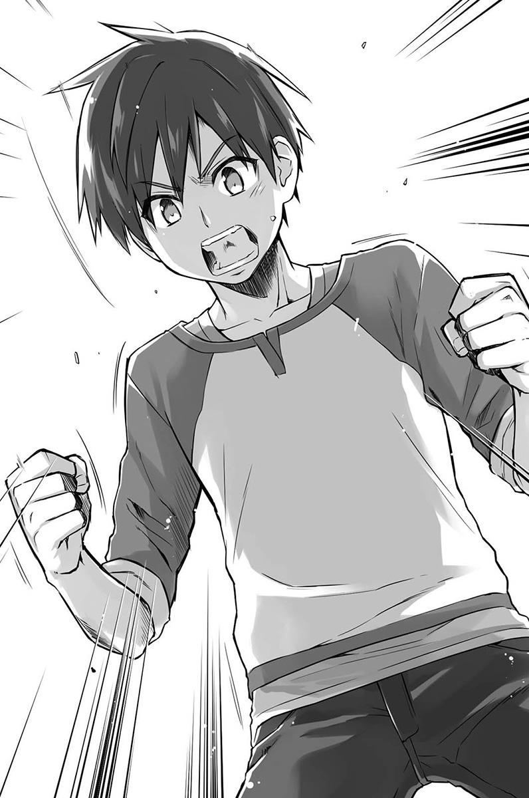

我用比刚刚更大的音量，激动地吼叫着。

「恭也……」

大概被我吓到了，贯之往后退了几步。

「我们可以的，相信我。只要贯之、奈奈子和志野亚贵愿意一起努力的话，我绝对会让这些死灰复燃的。」

过去勉强做出成人游戏宣传影片的往事，重新浮现脑海。

视讯特效软体After Effects、剪接软体Premiere以及修图软体Photoshop。

就算是十年前，这些东西还是有的。

声音只要之后再录就好了，画面的话……

脑中开始拼凑。

要构成这个故事，最少需要多少个画面？

从志野亚贵的分镜图，找出可说明故事情节的必要画面并串联起来。

……应该有办法解决才对。

我看着大家坚定地宣布：

「我们就用这个机器……来拍摄吧。」

「「「咦欸欸欸！？」」」

所有人异口同声地发出惊呼。

无视大家的反应，我打开借错的相机收纳盒。

找到型号之后，拿起手机拨号。

响了几声之后——

「你好啊，我是桐生————」

电话那端传来毫无紧张感的声音。

「……桐生学长，你是在喝酒吗？」

「喔喔！这不是阿桥吗！有空的话，你现在要不要过来啊？我打工那里啊，给了我很多中元节的啤酒，现在在我公寓这边开喝了咧。」

「桐生学长，事态紧急。」

「欸？」

「你上次不是有提过？我现在就想要拜托你那件事。」

我用力吸了一大口气。

「——请告诉我照相机的使用方式。」

电话的另一头，陷入数秒钟的短暂沉默。之后，听见一道非常冷静的声音说：「抱歉，我去外面讲一下」，然后又听到啪答啪答的脚步声，还有穿鞋子的声音。

「……现在吗？用电话讲？」

我听见严肃到不像本人的声音传来。

「是的，我来说明情况。」

我简单明了地说明了现场的状况。

以前也曾经写过电子邮件，指示摄影师要拍什么样的素材。现场是在户外，天气是大晴天，拍摄角度是从对面月台拍向这边月台。拍摄对象是人物，但画面要连风景一起进去……等等。

说完状况之后，我把照相机的型号和镜头类型也一并告知。

桐生学长也跟我确认了几个细节，总算将状况说明完毕。

「曝光和焦距之类的会处理吗？」

「可以，我这里掌镜的人有摄影相关知识。」

「那要注意的……首先应该是拍摄的量吧。」

「拍摄的量？」

「就是张数。用照相机的话，总之就是要尽量拍。不能说决定好一个画面，就拍那么一张，这样是不行的。如果想拍到很有情境的画面，那就要拍个一百张。」

「一百张啊……？」

「就算是专业摄影师也一样，这么多张里头，只有五、六张是可以拿得出来的喔。」

我将建议写在手边的笔记上。

「如果是大晴天的车站，向阳处和阴影处的亮度会差很多，处理曝光会比较棘手。由于数位单眼的亮度差异比相机底片微弱许多，所以看是要取调整过曝光的画面，还是看全部都用RAW格式来拍。」

跟在社办时懒洋洋看动画的社长比起来，简直是判若两人。

「很好，这样就大致解说完了，那我就回去继续喝酒……可以吗？」

「非常感谢！学长请尽量喝吧……」

「那你加油啦。」听我道过谢后，桐生学长便恢复往常的语气，干脆地结束通话。

「好，换下一个……！」

我继续拨出通讯簿里的另一个号码。

「噢，是桥场啊！竟然打电话给我，还真难得耶。」

「火川，你现在方便讲话吗？」

「可以啊，今天就一样也是要教空手道而已，怎么了吗？」

……太好了，正是我要的。

「不好意思，之前的人情可以现在马上跟你讨吗？……上次提到有需要的话，那不晓得现在能不能拜托你？」

「当然没问题啊！什么都可以，快说吧！」

重点式地向火川说明之后，他就只告诉我等等跟我联络。

「好，那就等一下再联络。」

「噢！」

接着还剩下一件事。我挂上电话，再次向大家询问：

「有谁带自己的数位相机过来吗？」

三人当中，就见奈奈子举手。

「我有……可是，画质不太行喔？」

「没关系，可以借我看一下吗？」

从奈奈子手上接过数位相机，迅速从后面查看。

然后在功能转盘上，发现到一个小小的影片功能选项。

「很好……至少有这个就可以拍了……！」

武器全都凑齐了。虽然只是身边现有的东西，但总算可以战斗了。

虽然我没有像他们那样耀眼的才能。

但是，我拥有可以应对，并加以整合的能力。

——所以，我才会身为制作啊。

「好了，那就来拍啰！」

大家都不可置信地瞪大着眼睛。

但是，我已经抱持着势不可挡的决心。

大家费尽心血做成的片段，就由我来组合成型。不，就让他们看看我的能耐。

我就是为了这个，才从十年后的世界穿越回来的。

◇

拜托志野亚贵重新规划每一幕，并按照顺序开始拍照。

我自己则是站在相机旁，负责确认奈奈子的表情。

「奈奈子，你这里再多一些犹豫的感觉，可以吗？」

「嗯、嗯，我试试看……」

实际透过相机的观景窗看就会明白，奈奈子实在是令人惊讶的「演员」。

就连我要求的细部动作，她也都能一一吸收、呈现。

即便是静态画面，都带有仿佛听得到声音般的情感。

「恭也！剧本的修正，我都改好了！」

贯之双手高举分镜图，朝我说着。

「好，那贯之可以先拜托你跑一趟吗？」

「跑一趟？」

「对，这里有写地址，麻烦你去这个地方找火川，看他怎么跟你说，可以吗？」

「说什么……？到底是什么事情啊？」

「反正，你就期待吧。啊，快点，电车来了喔。」

「等等，你就不能先告诉我啊！」

贯之就这样重新买了车票，搭上驶进月台的电车里离开。

停下来等电车离开的志野亚贵，错愕地看着贯之离去。

「恭也同学，贯之是要去哪里咩？」

「秘密。好了，志野亚贵，要赶快拍下一幕了。」

「啊，对捏。」

志野亚贵再次看向观景窗，捕捉奈奈子的表情。

安静的拍摄活动，就这样风平浪静地持续下去。

◇

「恭也我问你……」

趁着拍摄空档，奈奈子开口问着。

「什么事？」

「就是啊……你之前就有想到这些吗？怕到时候有突发状况，就先想好这些安排之类的。」

「噎？怎么可能啦，我当然不可能一开始就会想到这些。」

「……这、这样啊……」

奈奈子看我的目光，仿佛在看某种不可思议的东西。

……我的处理方式有这么糟糕啊。

虽然是抱着决心在做，但现在可能稍微失去了一点自信心。

◇

「……我回来啰。」

过了一会儿，贯之从电车上下来，还带着一名小女孩。

大概是小学生的年纪吧，书包上还插着一支直笛，活泼地跳来跳去。

「就惩罚游戏来说，这实在太残忍了……哈哈哈。」

贯之这么说着，并瘫坐在椅子上。

「你这副模样去带这么可爱的小朋友过来，根本就像诱拐犯一样……」

「我的确也受到警察盘查没错。」

「……那你竟然还能顺利回到这里呢。」

「我打电话给火川，请他向小孩子的爸妈说明了。我真的怕得要死……」

「毕竟，贯之也有当小偷的前科咩～」

「喂，我只是没问就吃掉你的拉面而已好吗！」

我走向被毫不留情挖苦的贯之。

「谢谢，这样我们就可以拍出幼童时期的画面了。」

「噎？可是这小朋友不是演员，只是普通小学生喔？这样可以吗？」

「放心，这样就可以了。」

「……可、可以吗……」

贯之难以置信地喃喃说着。

接下来……就让我想办法展现本领了。

◇

七月已经过了中旬，大学校园也进入学生们三两成群聚集，等着放暑假的时期。

至于映像学科，总会在这个时候举办以一年级生为对象的放映会。

放映会场就是位在大学门口附近的艺术资讯中心，所有二〇〇六年度入学的学生，几乎都在这天齐聚一堂。

「呼～终于要上映了。」

「不晓得看起来会是怎样，有点担心……」

「对啊，到底会是怎样的作品……」

每个人嘴里说着的，听起来都是不安的心情。

「因为赶在最后一刻才交出去，抱歉啊……」

事实上，缴交期限当天才剪接完成的。

而且因为不小心把完成的原档DVD交出去，导致最后没能放给大家看。

「还好啦，都到这个地步了，我相信恭也会处理好的。」

「我也是。而且要不是有恭也的话，说不定我们根本交不出来……」

「嗯，我也是一样捏～」

……光是能听到大家这么说，我就有努力的价值了。

「啊，老师来了。」

听到这句话转头一看，正好看到加纳老师从容不迫地走了进来。

教室中响起了铃声，嘈杂声顿时平息下来。

「好了，大家注意我这边！」

老师拍拍手，让众人的目光转向教室前方。

「从今天开始，将举办综合实习一的成果放映会。这个放映会呢……」

老师操作遥控器把萤幕降下，上头投影出写有「注意事项」的图像。

「呃，就像刚才所说的，这个放映会也是映像学科实习课的课程内容之一……但是呢！」

学生们全都吓了一跳。

因为大家都对新生说明会留下了阴影。

「既然开始成为制作影像的那一方，就得时时注意观众们的反应。换句话说，现在在这里的每一个人，身为创作者的同时，也是一名严厉的观众。」

用力地吞了口口水。

「觉得有趣的话就哈哈大笑，无聊的话也可以就默默地欣赏，觉得精彩的话，要拍手也没有关系。简单来说，就是请你们给出最直接的反应。不要想说你们是朋友，或觉得对方很努力什么的，拜托你们不要抱着这种无聊的心情！」

会场内扬起了笑声。

但老实说，我觉得现在不是笑的时候。

（……如果放映之后，现场无声无息怎么办？）

反而被嘘的话，我还觉得比较好一点。

要是在一片沉默中换下一部作品播出的话，可能无法重新振作了。

……不，就这样默默地继续进行下去，或许还比较庆幸……

「还有，每部作品放映完之后，可能会有问题想问工作人员，大家先做好心理准备。」

就不能饶了我们吗！

（只能祈祷不要接在出色的作品之后播映……）

司仪兼操作机器的助理小姐，拿着麦克风说：

「那么接下来，将按照顺序开始播放影片。」

会场顿时变得一片漆黑，萤幕开始发出光芒。

（原来是这样子播放啊……）

如此一来，就算不想，注意力也会全集中到画面上。

希望能好好度过这一关……我如此全心祈祷着。

影片开始播映了。

希望平均的水准是偏低下的，这样才能逃过这一劫。

然而，仿佛在嘲笑我这没出息的期待一样。

（大家都做得很认真耶……！）

原本我还以为，会看到很多只比家庭影像好一点的作品。

但几乎所有播出的作品，都具有禁得起从艺术角度欣赏的一定水准，让我相当惊讶。

厉害的不只是作品本身，还有那三分钟的长度限制也是，这样的时间刚好让影片不至于拖泥带水。

这部分可以看出老师精准的判断。

终于，轮到那位河濑川英子所属组别的作品播映。

「好厉害……这什么啊……」

毫无疑问，「果然就是厉害」的一部作品。

跟我们这组不同，他们的作品是以都市的车站为主题。

在三分钟的时间内，寂静描绘出男性与女性从相遇到分手的故事。

完全没有失焦或曝光问题等新手等级的错误，台词容易理解，画面的连贯性也相当出色。

就连不是很懂电影的我，都敢肯定这是绝对不同等级的成品。

片头标题完整呈现，就连片尾也有演职人员名单。

片尾名单一播完，每个人都纷纷鼓掌，持续到下一组的作品开始之前。

（惨了，要是在这部之后播出……一切就完了。）

但是接着发生的事情，仿佛还要继续对无力的身体穷追猛打。

「接下来播放的是，北山团队的作品。」

（呜噎噎噎噎！！不会吧！！）

偏偏就是如此。

在河濑川他们那部，恐怕会被认为是最佳作品的影片之后……

竟然是要播出我们的作品。

「…………！」

仔细一看，其他三人也都一脸僵硬的表情。

「拜托……！」

我开始祈祷，只求不要给出太残酷的批评。

影片开始播映。

一开始的画面，是从车站长椅开始。

以构图来说，采取正侧面的角度，从对向月台拍来的形式。

一名女童独自坐在该处，背着小学生书包，拿着直笛。

电车从左到右，自画面中驶过。

驶离后，长椅上的女童变成是穿着水手服的奈奈子。

画面构图始终维持固定角度，奈奈子从水手服变成高中制服，然后再变成穿着套装的大人。

◇

那一天。

在发现器材借错之后，我提出了一个最大方向的调整。

「几乎每一幕都用静态图像来呈现。」

大家听了都发出「咦？」的声音。

「我或志野亚贵都不太会用照相机，所以照相机的位置决定好之后就不动了，改由演员来动作。」

我的想法是利用入镜、出镜，还有偶尔电车穿过的画面来串联每一幕。

如果太长的时间就不适合这样的作法，但如果是三分钟的话，大概可以勉强做出像样的成品吧。

「穿过画面的电车……要怎么拍？用连拍的方式吗？」

「这里就要靠奈奈子数位相机的摄影模式了。」

「啊，你这么一说，我才想起来有那种东西。」

那台相机的摄影功能，的确是只能说「那种东西」的程度而已。

而且，内建的记忆体最多只能拍十五秒左右的影片。

「所以，那一幕珍贵的动态影像就放在这里。然后……」

我再次环顾众人。

「首先是奈奈子。」

「唔、嗯。」

「表情的部分我们会连续拍很多张，然后从里面挑，所以我希望你一打板，就当作是在拍影片，持续表演两到三秒钟。」

「我知道了。」

「然后是贯之。」

「……嗯。」

「这次的台词我会用配音的方式来做。」

「真的啊？」

「嗯，画面都拍完之后，我会把需要台词的画面和秒数都给你，你再按照这些去调整原本的台词。」

「可以啊，但这不是恭也你来做就好了吗？」

「不行，这一定要是贯之你写的台词才行。所以……拜托了。」

我直视着贯之的眼睛。

「好，那我就写写看。」

贯之以理解的表情点头答应。

「再来是……志野亚贵。」

「是！」

这次采用的手法当中，承受最大负担的就是摄影这一块。

「希望你可以拍出撑得起静态图像，构图独一无二的照片。我知道这很困难……」

我脑海中浮现志野亚贵以鬼气逼人的模样，拿着笔画图的身影。

「只有志野亚贵你做得到，拜托了。」

她在短暂思考了一会儿后。

「嗯，我试试看！得要回报恭也同学的期待才行咩！」

志野亚贵迅速掏出分镜图用纸，重新开始进行分镜的作业。

「谢谢……」

小小的背影，看起来跟那天一样可靠。

「欸，恭也。」

贯之有点不安的模样叫着我。

「……这样真的做得出来吗？」

就是现在。

就是现在这个时候得好好表态才行。

「我会让事情顺利进行的，我答应你。」

贯之拍拍我的肩膀。

「……我知道了，那就拜托你了。」

我一个深呼吸后说：

「好，那接下来……我们要重新开始拍摄了！」

◇

接着，几天后。

「……你一开始就打算来我家剪接吗？」

我到桐生学长家打扰，独占Mac进行剪接工作。

「不好意思，虽然可以借学科的剪接室做，但非线性剪辑的剪接室，已经都被高年级学长姊预约光了。」

所谓的非线性剪辑，就是线性剪辑的相对词，简单来说的话就是用电脑进行的剪接方式。映像学科也有以前传统的影带剪接室，虽然那边空着没人用，可是照我这次的拍摄方式，要用那种方式处理会很麻烦。

然后我就询问了美研的学长姊，得知桐生学长有Mac和Adobe多媒体应用软体，总之就是他有专业级的影像剪接软体，所以我才会来拜托他。

「无所谓，你可以尽管用没关系。反正我也因为这样得到这么多啤酒～」

我带来大量的啤酒送给桐生学长做为谢礼，毕竟拍摄时候他也给了很多建议。

「非常感谢。那么不好意思，可以帮我将这些RAW格式转档吗？如果可以的话，顺便也将档案做分类。」

「……你使唤人还使唤得真彻底啊。」

虽然嘴上这么说，却依然用另一台桌上型电脑，俐落地帮我进行转档的工作。

「不过，你竟然会想到这么高难度的作法。」

桐生学长半带点错愕地喃喃说道。

「几乎每一幕都是用相机拍的，台词也是配音后制，这要是没弄好的话，可是会惨不忍睹的作品喔。」

「或许吧，但是……」

「但是怎么样？」

「在那种情况下什么都没拍就回去，对我来说并没有这种选项。」

都已经确实地去勘了景，做好准备，一切都调整就绪了。

虽然因为最后的大失误，让情况与本来的假定有所出入，但如果有拍摄的可能，我就想赌赌看。

——所以，虽然说是在那当下想出来的，但不过就是选择用照片的方式保存下来。

「为了不让作品变得惨不忍睹，我死都会在这里奋战的。这样一来，应该多少可以变成能看的东西才对……！」

「不、不要这样，你要是死在这里我会很伤脑筋的……」

为了那些有才华的人，要我做多少牺牲都无所谓。对他们来说，以大学生的身份制作第一部作品的机会，就只有这么一次而已，我不想让这机会白白浪费，我不想让他们的心血白白浪费。

总指挥的角色、擦屁股的角色，或许是承受着各式各样的批评。

但就如同那个还未完成就上市的游戏一样，我不想让作品胎死腹中。

所以，我绝对不会放弃的。

「我想剪接声音的部分，借一下耳机喔。」

「喔，好啊。」

阻隔了外界的声音，我听到奈奈子后来才录制的台词。

贯之那照我指定的秒数调整的剧本，与奈奈子清楚的发音相辅相成，让所要表达的讯息能直接传达给观众。

「应该可以做出些什么来吧……！」

一边感受着效果，一边将每句台词剪下来一一分配好。

◇

最后，由前面的女童来演女儿，奈奈子扮演母亲的角色，两人一起坐在长椅上的画面呈现，然后打出完结的字幕。

（总之，算是有模有样了、吧……）

由于用数位单眼相机拍的影片，画质比想象还粗糙，所以整部影片都做黑白色调以淡化这件事。幸好相机拍的照片画质极佳，只要观众将注意力摆在这边，应该就没什么大碍……我是打这样的算盘。

只要看不出是当下的权宜之计就好了。

——然后，播放结束。

电灯打开，会场光亮了起来。

（啊啊，不行，我没办法承受大家的目光……！）

下意识地闭上了眼睛。

能不能就干脆地带过，开始下一个作品的播放呢？

我祈求的同时，仍一直闭着眼睛。

……但是。

啪啪啪啪……拍手的声音开始传入耳里。

「……咦？」

接着越来越大声。

「怎么……可能？」

情况令人难以置信。

在会场看到的所有学生，正热烈地拍着手。

「不会……吧？」

「太出色了，你们做得很好，做得很好。」

仔细一看，就连那位加纳老师都在用力地鼓掌。

「因为我从来就没有说过只能用摄影机拍摄。桥场，所以你才会做这样的安排吗？」

「咦？啊、啊啊，是的！」

在那瞬间，我下意识地说了谎话。

虽然这话不该由自己讲，不过再重新看过之后，的确成果似乎也没那么差。可是，几乎都不是影片的形式。如果以这堂课的宗旨来说，当然不可能期待有太正面的评价，然而……

「整部以黑白影片呈现，是代表着什么涵意吗？」

我怎么可能说出真正的原因。

「呃、呃——这个的话……」

我一边思考安排的用意，一边想办法掰出些东西。

在说话的同时，忽然与坐在前面转过来看我的河濑川四目相对。

我还以为自己又要被瞪了。

「……（呵！）」

却没想到对方竟露出了一个笑容，像是在说「还不错嘛」一样。

（啊……这样就可以了吧……）

我感觉到肩上的重担忽然消失了。

◇

「那么，所有的作品都播映完毕，接着在此将要公布，由老师们评选出的三个最佳作品。」

在致词过后，由老师宣布获得前三名的优秀作品。

第一名的，是如大家所预料的河濑川那一组的作品。

而我们北山团队这组的作品，竟然拿到第三名。真可以说是排除万难的奋战啊。

但是我内心的心情，却是相当地复杂。

如果那个时候所需的器材都通通在手，以万全的状态拍摄的话。

或许可以获得更好、更高的评价才对。

放映会结束后，学生们开始纷纷起身离席。

我则因为疲惫感也一下子涌上的关系，暂时还坐在椅子上。

志野亚贵、奈奈子和贯之也是，三人也都依然坐着。

「各位，结束了呢。」

本来想看看大家有没有什么想法才开口的。

「……」

但是。

坐在旁边的三人，全都陷入了沉默。

「你们怎么了？啊……对作品有不满也是理所当然的。」

我不解地问着。

「那个……」

大概是有不高兴的地方吧？我忽然紧张起来，试图再次跟大家说话的瞬间。

「我超————不甘心的！！！」

「哇！」

贯之率先打破沉默。

「那是怎么回事啊！真的令人吓一跳耶！拍摄的时候，完全不知道你想做什么，可是实际上做出来之后，不仅是完整的三分钟，还有结局耶。你真的很厉害耶，太了不起了！」

「咦？啊，贯之……？」

「可是啊！我一开始写好的那个剧本！现在想想，那个的确是超出时间太多了！但如果后来有好好听你的意见去做修改的版本，绝对可以变成精彩的作品，说不定……还比你做的这个更好！」

「嗯，我也是这么想的。」

「为什么我什么都没做，你还这么想！你也太平常心了吧！」

在我右边的贯之，将我的身体摇来晃去。

咦、咦？为什么？

「我也很不甘心！！！」

这次换成奈奈子了。

「这真的是太厉害了。在那种情况下，还可以急中生智，我只是照你说的做而已，却变成这么完整的内容，那个……不是一点而已，是非常感动。这还真的是……就是这样！」

奈奈子绕到我的左边继续说：

「可是啊！我也可以发挥正常的演技，那样的话会比较……就是……啊！算了，我还是说吧，那样的话绝对会是精彩的表现！不能再说很糗什么的了，我就是想要好好地再多演一点戏！」

「等、等等，好啦、我知道了啊！」

这次换成在左边的奈奈子，把我的身体摇来晃去。

「恭也。」

接着。

「志野、亚贵……」

她的表情跟我平常认识的志野亚贵不同。

是一脸认真又相当开心的表情。

「恭也同学很奸诈捏。」

「咦？呃……为、为什么？」

「你看嘛！平常一副和气、温柔的大哥哥模样，却在重要时刻，眼神突然发出锐利的光芒咩！害我在拍摄的时候，还有刚才影片播放的时候，都一直觉得心跳加速捏！」

志野亚贵的脸又凑得更近了。

「这下子呢，我就清楚知道恭也同学有多厉害了，我会好好学习相机和构图的知识，一定要正面迎击，让恭也同学大吃一惊！」

「呃、那个，所以是……你说什么？」

尽管充满疑惑，但我内心充满了喜悦。

没错，那个作品绝对无法令人满意。

大家确实努力过，但里面就只有一小部分的努力而已。

大家还可以做得更好的，正因为明白这一点，才会像现在这样即使作品被称赞了，还是显露出懊悔不甘的心情。

「你们怎么啦？还是说已经决定好下次的目标了吗？」

说巧不巧，加纳老师就在这时候出现并如此问道。

而不晓得是本来就打算那样回答，还是只是单纯想找个人来讲而已。

原因终究是不太清楚，但反正就事实来说——

我想差不多是同时。

还在思考那三个人是不是一起指向我的时候。

「这家伙！」

「恭也！」

「恭也同学！」

「「「我不想输给他！」」」

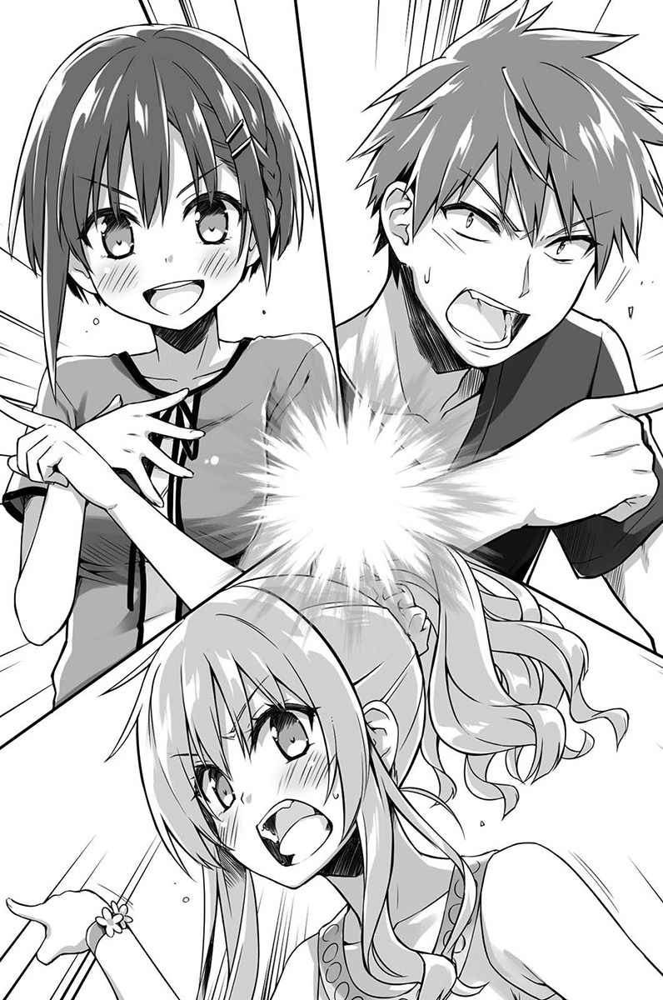

他们就这样放话了。

「哦——这样啊，那这样或许正合我意呢，嗯。」

老师小声笑着。

「暑假结束后，还有课程需要你们去拍其他作品，可以到时候再扳回一城。」

老师说完后，便离开了教室。

「喂，马上来开检讨会！我借错器材的失误，反正就先不用提！」

「那一定是第一个检讨的，那还用说！如果没有发生那个失误，我们就可以顺利地进行拍摄了！」

「下一次要制作的时候，不管是时间或什么的，通通都要先计算好才能画分镜图捏！」

「好！剧本当然也是如此！」

正当我对大家的魄力感到错愕不已时。

「欸，恭也！一定会让你瞧瞧我们的厉害，让你吓一跳！」

「我也会！」

「还有我！」

「很好，现在我们先去二食吧！到那边开会！」

「OK！！」

像是被大家拖着走出来的我，以半信半疑的心情，看着眼前发生的事情。

「应该多少……受到一点认同了吧……？」

如果这是事实的话。

曾经那么崇拜，想要再更靠近他们一点的白金世代。

如果多少能给他们带来一点压力的话。

（或许自己的重制人生也比较上轨道了。）

一边被抱持着无限敬意的他们拖着走，我一边思考着这些事情。

## 尾声一
### 河濑川英子的怒气

综合实习一上学期的期课程，就在前阵子举办完放映会后后宣告结束，下礼拜针对下学期课程做完说明之后，就预计开始放暑假。简单来讲，以上课来说的话，今天就是上学期课程的最后一天，并弥漫着之后老师们也会一起暂时喘口气的气氛。

……但唯独今年，有某一间研究室例外。

「……我没有办法接受！」

以一副要拍桌的气势顶撞加纳美早纪的人，是今年春天才刚入学的一年级生•河濑川英子。

「这样啊，怎么无法接受你说说看？」

面对这样的情况，加纳美早纪也毫无规矩地把双脚往桌上一放，呈现战斗姿态。

「关于今天的放映会总评，为什么那家伙的作品不是第一名？」

「你说的那家伙是谁？」

「不要装傻！这还用说吗……」

河濑川心有不甘地停了一秒。

「就是桥场恭也的作品啊。」

「哦，也是啦，只有可能在说他而已。」

加纳也是一脸能够理解的表情。

「原因很简单，就电影来说像是一颗过度的变化球，也不是这堂课要的作品。像这样的作品虽然令人觉得有趣，却无法得到高分。」

「可是，那也是获得最多掌声的作品啊。」

河濑川反驳。

「而且，虽然不知道他们是怎么想出来的，但我就无法做出那样的回答。是这次所有的作品当中，唯一一个我无法理解的灵感。」

「会吗？基本上就是因为器材借错了，才偶然做出来的不是吗？」

「你说是因为这么可笑的理由，才做出那么精彩的作品！？」

「嗯，应该是。」

加纳干脆地答道。

她拿起已经变温的咖啡。

「对于制作影像没有太多经验的人，忽然决定不拍动画影片，而是用相机拍的照片铺陈再加上录音后制？这恐怕是偶然或是意外状况一再发生所导致的结果，使得他们落入不得不这么做的窘境……我会这样想是很理所当然的吧？」

河濑川陷入沉默，老师这样的见解的确很有说服力。

「那个作品并不是经过深切的思考才做出来的。所以，跟作品的呈现不同的是，桥场恭也本身并没有获得特别高的评价。」

老师讲到这里，姑且先打住。

喝了口咖啡后，又继续说道：

「……不过，话是这么讲，还是看得出非比寻常的出色协调感和整合度，已经很久没挖到这么有趣的宝了。」

「……！你果然还是很欣赏嘛！」

「不然我不会说出赞美的话的。如果不是好的作品，我是绝对不会讲好话的，你也很清楚吧？」

河濑川又再次陷入沉默。

「可是，我还无法给那家伙好评。如果不是因为偶然，而是在拥有素养的情况下，展现出像这次的潜力时……到时候不管是满分或任何好评，我通通都会给。」

「这是就监制来说？还是就制作人员来说？」

「我不知道耶，如果这次的光芒是被逼急了所造就的结果，那或许可以说，那家伙解决问题的能力非比寻常。但其实并没有像他那么厉害的『制作人员』，可以那样明确地指挥剧本和导戏的。」

河濑川身体顿时一个打颤，她听懂加纳这番话的意思了。

「因为不管是剧本、导戏，或是任何像是摄影、音响，如果不卯足全力工作的话，都是随时可以被他人取代的。他们那一组的人应该也隐约察觉到了，像那样在拍摄现场面对他的微笑看看，可是会一点都不敢随便乱来的喔。」

加纳带着开心的表情，小声地笑着。

「不过，现在那家伙还没理解到自己的能力，等他跟知识丰富的人合作过之后才能下评断吧。到底是瞎猫碰上死老鼠，还是真的有实力……对吧。」

加纳一口气喝光剩下的咖啡。

「说得也是，这点我也赞成。希望可以再次见识到桥场恭也的能力。」

「很好，你可以理解就好了。」

加纳露出满意的笑容。

「所以下学期上课时，就拜托你跟桥场他们一组了。」

「咦……蛤、蛤啊？」

由于河濑川太过惊愕，发出了往常不会出现的声音。

「我说过了吧？希望他跟知识丰富的人合作，你也赞同这样的想法，最重要的是你也对他很好奇，不是吗？」

「那只是因为他把制作人员的角色做得很好，而且要说赞同的话，除了我之外，也还有其他人啊……」

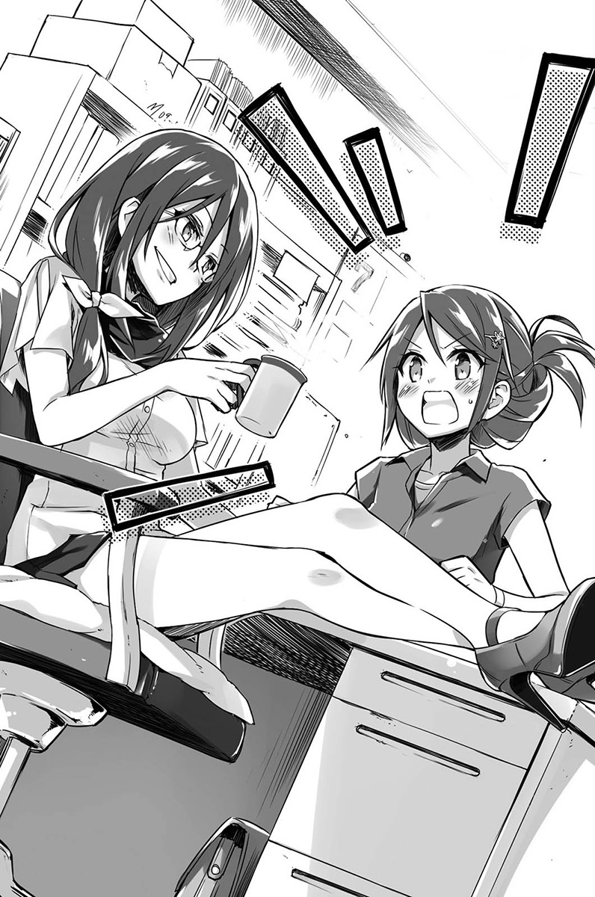

「这样很好不是吗？感觉他下次还会展现其他的能力。如果一起制作影像作品的话，说不定还可以在他身上，发现更多不同的魅力。」

「唔、唔唔……」

「……还是说你会怕他？怕桥场恭也。」

「我……！」

河濑川用力瞪了加纳一眼，最终仿佛压抑不住似地说：

「姊姊真是大笨蛋！我不管你了啦！！」

话一说完，河濑川便带着啪搭啪搭的剧烈脚步声，离开了研究室。

只留下拿着空杯子，哑口无语的加纳在那里。

「唉，英子，无论如何呢……」

乱七八糟的桌子上，可以看得到唯独一处有好好整理。

「身为姊姊的我，希望我们的姊妺关系不要曝光。」

莫名整齐的地方摆着一张照片，上面是看来融洽的姊妹俩，姊姊拿着一个上头写有大阪电影节大奖赛的奖杯。

            Misaki
      ——河濑川美早纪。

就算在学科内，也没有几个人知道名字的部分是这样写着的。

## 尾声二
### 志野亚贵的微笑

「哇！居然这么晚了。」

看了手机的时间才意识到。

在二食吵吵闹闹过一遍之后，我和志野亚贵前往美研社办露个脸，顺便道谢。

然后就在那边待上好一会儿，等意识到时天色已经昏暗，

「如果在社办看动画，时间会不知不觉就过去了捏。」

在身旁走着的志野亚贵，带着一如以往的柔嫩笑容回应。

「嗯……对啊。」

可是，我已经无法正面看待那副笑容了。

因为我再次明白了，她身为创作者那赤裸裸的渴望。

本来应该会在那个时候遭受迎头痛击的。

就在那天晚上，在没有人知道的情况下，在那专心埋头画画的时候。

被这个娇小而可爱的怪物击垮。

「恭也同学。」

志野亚贵忽然叫了我的名字。

「你已经知道……我有在画画的事情了呗？」

我感觉自己瞬间有点头晕目眩。

「你发现了喔？」

难道志野亚贵因为这件事在怪我吗？

「本来是打算当作秘密的咩，就只有那时候不知道为何忘记锁房间门了。」

口气还是一派悠哉……虽然人对于来历不明的事物，会本能地感觉恐惧，但老实说，从那个夜晚之后，我已经无法把志野亚贵看作是单纯的可爱女孩子了。

「抱歉，擅自偷看到了。」

虽然不知道是不是道歉就可以解决，但我还是坦率地道歉了。

我还不太清楚对她而言，画画这件事代表什么意义。可是，起码知道不是那么简单就能跟别人说出口的事情。

「你可以听我说一下吗？」

「……嗯，当然可以。」

「之前过贯之同学就有说过，我连普通的生活杂事，几乎都不太会处理。」

志野亚贵诉说着过去的人生经历。

似乎是什么都做不好。日常生活当中老是少根筋，学校成绩也不好，运动成绩也很难看。

可是她唯一喜欢的事情，可以说就是画画。

「但是，完全不是什么像样的东西捏。只是因为喜欢才画，所以也都没有长进。」

口吻听来若无其事，但志野亚贵的话语却是很沉重。

「虽然也有得过一些奖，但也不可能靠那样维生……我想说学习摄影、学会怎么用摄影器材的话，应该可以做一些电视台的工作吧，所以才来艺大念书。」

「难怪你没有去念美术或设计啊。」

「老实说……我没有勇气去美术学科。」

志野亚贵苦笑着。

「我只是画兴趣的，没有人会欣赏，我也没有自信，所以才一直偷偷画咩。」

沉默回荡在两人之间。路边的一个池塘，传来花嘴鸭啪沙地踢水的声音。

我应该回什么话才好呢？

「我一直在想，未来是不是也可以像恭也同学一样有发光的一天。可是，那种机会始终没有出现。」

「不，我……」

想开口说些什么，却又为之语塞。

在这时候说自己只是侥幸毫无帮助，也安慰不了她。

志野亚贵略显悲伤地笑着低语：

「我有点在想说，是不是干脆放弃画画还比较轻松。」

不晓得这话究竟说完了还是没说完，不，或许讲到一半就已经打断了也说不定。

我加快脚步绕到她面前。

双手用力地抓住她的肩膀说：

「不、不行，绝对不行喔！不可以放弃画画啦！」

「恭也……同学？」

志野亚贵错愕地讲不出话来。

看到她的反应，我才意识到自己大吼大叫。

「我……」

是因为你才挺过来的。

你在未来所创造的无数画作拯救了我。那些画作所指引的世界一切都拯救了我。

「志野亚贵……那个……」

我差点就要说出口了。

十年后，她会成为多么伟大的画家。

对我而言，是多么重要的存在。

我差点就要把这些说出来了。

「对我来说……那个……」

可是，我当然不能说。

说了之后，非但不会有什么效果，对方也一定不会相信……所以……

我只说现在最应该要说的话。

「我……很喜欢志野亚贵的画。」

因为这才是我想跟她的话。

打从心底，衷心想传达给她的话。

好不容易才能给孤军奋战的她这么一句话。

「……拍摄的时候，恭也同学是这么告诉我的。」

志野亚贵如此说着，代替她的回答。

「你说『只有我做得到，拜托了』。」

「嗯，我有说过。」

那时候也是衷心地这么想的。

当下只能用一个画面来叙述一切，能回应如此无理要求的，就只有拥有绘画能力的她而已。

「生平第一次有人这么告诉我捏，我好开心。然后，我的心脏真的跳得很厉害。这人怎么会有这种想法，于是想多了解一点。」

志野亚贵露出了笑容。她带着笑容，以闪闪发亮的眼睛凝视着我。

「我会以恭也同学为目标努力的。」

她把头又抬得更高，仰望着满天星斗的夜空。

「不管是摄影器材也好、构图也好，还有画画也好，我会尽量学习，画出恭也同学想看的世界，我想成为有那种能力的人。」

「志野亚贵……」

真正厉害的人是不会满足于现状，总是不断地往前进。

「恭也同学，你想做什么？」

「做什么……是指？」

「想做的东西，或是有没有目标什么的。」

志野亚贵的这么一句话，让十年后的记忆又再次复苏脑海。

我想做电玩游戏。就像那天失去所有逃回老家的半路上，看到得胜者软体公司做出新作品那样。向往工作人员每个人都有远大的目标，可以互相切磋琢磨的那种情况。当时这对我来说如同幻想故事，但现在稍微浮出了一点可能性。

「嗯，有啊。」

「你可以告诉我是什么吗？」

「……现在还不能告诉你。」

「那还真是可惜捏～不过我会努力，希望可以成为你的伙伴。」

志野亚贵小声窃笑着，一副开心的模样听我说着。

（……我会好好努力，让十年后的你可以对我说这种话。）

要产出一个作品，或身为创作者，其实是很痛苦的。

但是却又非常地刺激，挑战无止尽……

堪称最有趣的事情了。

「好了，我们赶快回去吧。奈奈子和贯之传简讯来说还没吃饭。」

「什么？那可糟糕啰，得赶快回去煮饭才行捏～」

迎着湿度偏高的晚风，两人一同赶着回家。

这个晚上志野亚贵的笑容，我绝对不会忘记。

不知不觉间，梅雨季节也结束了。对我而言，虽然是第二次上大学，但与大家一起度过的大学生活，将迎向第一次的夏天。

## 后记

我是在距今◎年前，进入到某艺大的映像学科就读。

离开九州乡下，对映像没有丝毫认识的小伙子，一点都不意外地，对于身边的人都充满干劲的模样感到惊恐。然后，宝贵的四年时光就花在打工和无聊的游戏上，结果就是一事无成地去到东京，接受惨痛的教训。

那么废的我，如果再重新回去当艺大生会怎样？还有，如果不是住在毫无吸引力可言，有如男性庙会的学生宿舍，而是住在梦幻的男女混居共享住宅，又会是怎么样的生活？这本书的内容，就是描写那样的大学生活。

那么，因为这部作品有很多人需要感谢，接着就让我借用大量的版面。

首先是绘制插画的Eretto老师！平常都是跟以设计师身份的木绪なち一起工作，但这回则是身兼设计师和作者。平常总是羡慕地咬着手指头欣赏的无数角色，如今能够活灵活现地出现在自己的作品中，对于这样的现实，我好几次都感动到不行。奈奈子很性感，贯之很帅气，还有我想恭也应该会很受大姊姊们欢迎。

谢谢在特别设置的网站专栏中，大力协助的各位老师，各位对我来说都是犹如耀眼繁星般的存在，真没想到能找来各位……直到现在我还是不敢相信。只不过，唯独有某位不起眼的老师，真的不能对他太轻忽，我已经做好心理准备了，可能哪天会被他拿去当素材。令人敬畏的丸户史明（省略敬称）！

这部作品在设定方面也得到许多人的帮忙，摄影相关部分接受我许多提问的R老师，还有火车方面给予我许多建议的V老师，以及跟我一起讨论很多事情的K桑，我要再次向各位致谢。

此外，对于已经离开轻小说，过着放逐生活的我，依然努力不懈喊话的MF文库J编辑部的T编辑，我终于做到以前答应的事情了，接下来也请多多指教。还有负责装订设计的木绪なち，接工作时再多考虑一下档期吧，今年一定要这么做。

最后，我要向购买这本书，并且拿起来阅读的各位读者，致上深深、深深的谢意。对我来说，这是第一本青春故事类型的轻小说。希望你们看得开心，那我也会很高兴的。

那么各位，期待下次再见面啰。保重。

- 木绪なち　敬上

【我在nico生社区的频道是『グッドデザデザ＠ニコ生』，里头有放一些与作品相关的影片，有兴趣的话，欢迎订阅！】

